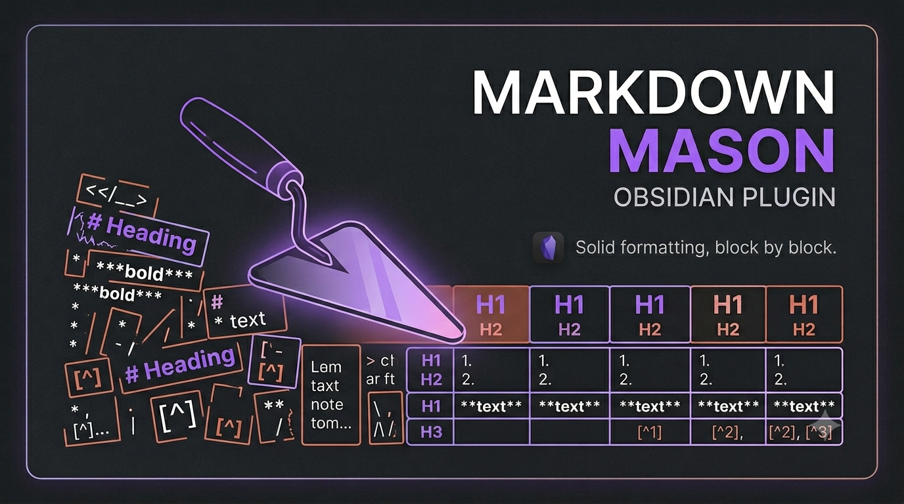

  

<h1 align="center">Markdown Mason</h1>

<strong>Solid formatting, block by block.</strong>

> Reshape pasted or whole-note Markdown to fit a note's structure — heading cascade,
> footnote renumbering and dedup — plus a runnable, consent-gated script library.

Markdown Mason is a desktop Obsidian plugin for the moment **after** you paste. When you drop
an answer from Perplexity (or another LLM or web source) into an existing note, the heading
levels rarely match and citation numbers restart from `[1]`, colliding with footnotes you
already have. Mason fits the incoming text into the target note instead: it cascades headings
relative to where the cursor sits, turns inline citations into real footnotes, renumbers and
deduplicates them against what's already there, and files them into a `Resources` section.

The transforms run as small **scripts** managed by the plugin — installed from a curated,
reviewed library or imported from your own vault — not as loose files scattered through your
notes.

> **Status:** early (`v0.0.1`). Desktop-only; requires Obsidian `1.6.6` or newer.

## Features

- **Paste and run scripts** — transform clipboard text with your enabled converter scripts
  and insert it at the cursor in one step, with a plain-paste fallback if anything goes wrong.
- **Paste and format** — paste the clipboard, then apply Mason's cleanup recipe to *just the
  pasted text* (7 steps: dewrap, dehyphenate, decompose ligatures and punctuation, tidy
  whitespace, normalize bullets and ordered lists, normalize headings) as a single undo step.
- **Format selection** — run the full 11-step recipe on a selection or the whole note (the 7
  cleanup steps plus cascade headings and the three footnote steps).
- **Run a script on a selection** — reformat text already in your note *in place*, or run a
  script across the whole note.
- **Curated script library** — install reviewed formatters (currently three Perplexity copy
  surfaces) from the in-plugin catalog, with update notifications when newer versions ship.
- **Bring your own scripts** — import scripts from your vault and bind any script to its own
  command and hotkey.
- **Consent-gated execution** — scripts run with full plugin permissions only after an
  explicit, per-version disclosure; a per-script kill-switch disables any of them instantly.

## Installation

Open **Settings → Community plugins → Browse**, search for **Markdown Mason**, then
**Install** and **Enable**. Markdown Mason is desktop-only and requires Obsidian 1.6.6 or
newer. For manual installation, updating, and verification steps, see
**[docs/installation.md](docs/installation.md)**.

## Quick start

1. Open **Settings → Community plugins → Markdown Mason → Scripts**.
2. Click **Browse official**, enable a script, and confirm the disclosure prompt.
3. Copy some text, place your cursor, and run **Markdown Mason: Paste and run scripts** from
   the command palette. To paste plain text and just clean it up, run **Markdown Mason: Paste
   and format** instead — no script needed.

The full walkthrough — common workflows, format-in-place, when to use which paste command,
and per-script commands — is in **[docs/usage.md](docs/usage.md)**.

## Commands

Three commands cover the paste-and-format workflows. Pick by what you need:

| Command | id | What it runs | Scope |
|---|---|---|---|
| **Paste and run scripts** | `mason.pasteAndRunScripts` | Runs your enabled paste-converter **scripts** on the clipboard (e.g. a Perplexity copy → structured Markdown) and inserts the result at the cursor; falls back to a plain paste if no script matches or one errors. | Clipboard → cursor |
| **Paste and format** | `mason.pasteAndFormatText` | Pastes the clipboard, then applies the **7-step** cleanup recipe scoped to just the pasted text — 4 cleanup steps, 2 list steps, and normalize headings — as one undo. No scripts, no cascade, no footnote steps. | Clipboard → pasted text |
| **Format selection** | `preset.formatSelection` | Runs the full **11-step** recipe on the selection (or whole note) — the same 7 cleanup steps plus cascade headings and the 3 footnote steps. | Selection + whole note |

The crisp distinction: **Paste and run scripts** is about converter scripts; **Paste and
format** (7 steps) and **Format selection** (11 steps) are about cleanup. The other built-in
commands (each footnote and heading step on its own, plus **Run script…**) are listed in the
[Commands Reference](docs/commands-reference.md).

No default hotkeys are registered — assign your own under **Settings → Hotkeys**.

## Scripts and trust

Mason's scripts are real JavaScript running with full plugin permissions — there is no
sandbox. Safety comes from policy, disclosure, and consent, in two tiers:

- **Official library (reviewed):** submitted by pull request, documented, and limited to
  editing Markdown in the current note — no network or cross-plugin access.
- **Imported / self-written (unreviewed):** brought in from your vault and run **at your own
  discretion and risk**, exactly like your own hand-written scripts.

To write your own, see **[docs/SCRIPT_AUTHORING.md](docs/SCRIPT_AUTHORING.md)**.

### Permissions and data access

Obsidian's automated review flags two capabilities this plugin uses. Both are
intrinsic to its features and disclosed here so you know exactly what they do:

- **Direct filesystem access** — Mason stores and runs its script library as real
  files in the plugin folder, using Node's `fs` module rather than the vault API.
  This is why the plugin is **desktop-only**: it can read and write files on the
  device outside the vault. Script execution is consent-gated (see above), and the
  reviewed official library is limited to editing Markdown in the current note.
- **Clipboard access** — the **Paste and run scripts** and **Paste and format**
  commands read the system clipboard to reshape what you paste. Content copied from
  outside Obsidian passes through the plugin only when you invoke one of those
  commands; nothing is sent anywhere.

## Support

If you find Markdown Mason useful, you can support development via
[Buy Me a Coffee](https://ko-fi.com/mmomm) or
[GitHub Sponsors](https://github.com/sponsors/MMoMM-org).

The original German design briefing for the project is preserved at
[`PROJECT_BRIEFING.de.md`](PROJECT_BRIEFING.de.md).

<!-- doc-product:documentation:start -->
## Documentation

- [Installation](docs/installation.md)
- [Configuration](docs/configuration.md)
- [Usage](docs/usage.md)
- [Troubleshooting](docs/troubleshooting.md)
- [Commands Reference](docs/commands-reference.md)
- [Release process](docs/RELEASE.md)
- [Writing a Markdown Mason script](docs/SCRIPT_AUTHORING.md)
<!-- doc-product:documentation:end -->

## License

[MIT](LICENSE) © Marcus Breiden
