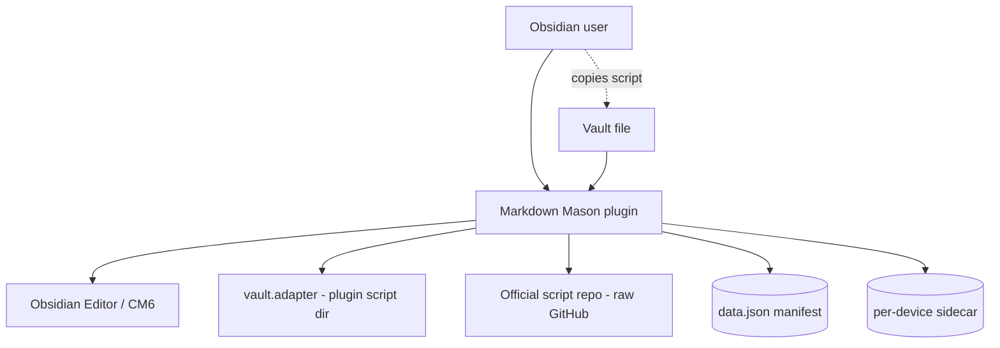
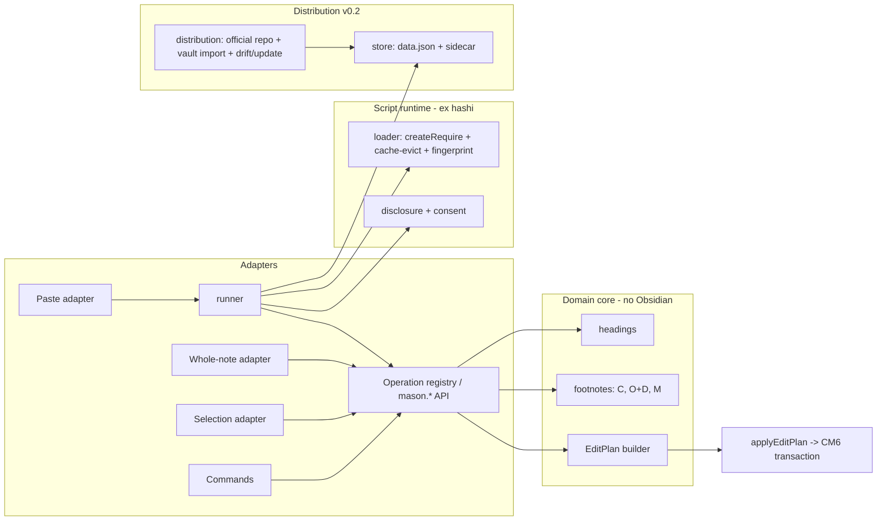
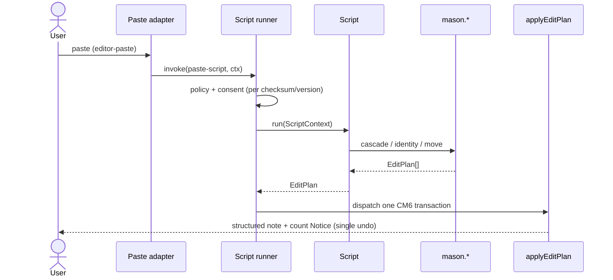

# Solution Design Document

## Validation Checklist

### CRITICAL GATES (Must Pass)

- [x] All required sections are complete
- [x] No [NEEDS CLARIFICATION] markers remain
- [x] Architecture pattern is clearly stated with rationale
- [x] **All architecture decisions confirmed by user**
- [x] Every interface has specification

### QUALITY CHECKS (Should Pass)

- [x] All context sources are listed with relevance ratings
- [x] Project commands are discovered from actual project files
- [x] Constraints → Strategy → Design → Implementation path is logical
- [x] Every component in diagram has directory mapping
- [x] Error handling covers all error types
- [x] Quality requirements are specific and measurable
- [x] Component names consistent across diagrams
- [x] A developer could implement from this design
- [x] Complex queries include traced walkthroughs with example data

---

## Output Schema

*(Status report rendered in chat; see workflow output, not duplicated here.)*

---

## Constraints

- **CON-1 — Platform/runtime:** Obsidian plugin, TypeScript, built with esbuild to a single `main.js` (ESM source, CommonJS bundle). Runs in Electron (desktop). **Desktop-only** (`manifest.isDesktopOnly = true`) — the script runtime needs Node `createRequire`/`require.cache`.
- **CON-2 — Testability:** Domain logic (operations, parsers, footnote identity) MUST be pure and unit-testable with Vitest **without importing `obsidian`**. Obsidian-touching code lives in thin adapters. Golden fixtures: `assets/sakura-in-tokyo-{app,web,web-download}.md`.
- **CON-3 — Community-submission compliance:** manifest id without "obsidian"; description ends with a period, omits "Obsidian"; `console.debug` only; no `innerHTML`/`outerHTML`/`insertAdjacentHTML` with external content; `requestUrl` (not `fetch`); `registerEvent`/`register` cleanup; release-asset attestation. Heightened reviewer scrutiny applies because the plugin downloads and executes scripts.
- **CON-4 — Trust/privacy:** No telemetry; no silent network. The only network call is a user-triggered pull from the official repo. The official repo accepts only Markdown-in-note scripts (no network/external/cross-plugin), enforced by PR review + required doc.
- **CON-5 — Extensibility is foundational:** The script runtime, the operations API, and paste/selection/command invocation are v0.1 architecture — not retrofittable. No design that would force a rewrite to add scripts.
- **CON-6 — Reuse:** The script execution model is ported from the in-house `MMoMM-org/miyo-tomo-hashi` `src/hooks/` (own code, MIT-family), not reinvented.

## Implementation Context

**IMPORTANT**: Read these before implementing.

### Required Context Sources

#### Documentation Context
```yaml
- doc: README.md
  relevance: HIGH
  why: "Canonical briefing; §2 fixtures, §5 algorithms, §7 extensibility/trust, §8 architecture, §9 Obsidian notes"
- doc: docs/XDD/specs/001-markdown-mason/requirements.md
  relevance: CRITICAL
  why: "PRD v1.1 — the 11 features and acceptance criteria this design must satisfy"
- url: https://github.com/MMoMM-org/miyo-tomo-hashi
  relevance: CRITICAL
  why: "src/hooks/ — the script execution model to port (loader, runner, disclosure, fingerprint, cache-evict, hooksDir-escape guard)"
- skill: tcs-patterns:obsidian-plugin
  relevance: HIGH
  why: "Manifest rules, lifecycle/cleanup, requestUrl, normalizePath, vault.adapter vs vault.process, SecretStorage, XSS, Sync-aware persistence"
```

#### Code Context
```yaml
- file: @manifest.json
  relevance: HIGH
  why: "Must flip isDesktopOnly -> true; description still has declarative-era wording to update"
- file: @package.json
  relevance: MEDIUM
  why: "Vitest + esbuild + tsc build chain; scripts: dev/build/test/lint"
- file: @versions.json
  relevance: LOW
  why: "plugin-version -> minAppVersion map for releases"
- file: assets/sakura-in-tokyo-app.md
  relevance: CRITICAL
  why: "Golden fixture — Perplexity app copy: bare [n] + Sources block, restart-per-answer"
- file: assets/sakura-in-tokyo-web.md
  relevance: CRITICAL
  why: "Golden fixture — web copy: inline [domain](url) links, no markers/block"
- file: assets/sakura-in-tokyo-web-download.md
  relevance: CRITICAL
  why: "Golden fixture — web download: existing [^a_b] footnotes + URL-only definitions + HTML cruft"
```

### Implementation Boundaries
- **Must Preserve:** the user's note structure invariants — alphabetic footnotes (`[^A]`) untouched; orphaned resources untouched; single-undo per command.
- **Can Modify:** everything under `src/` (greenfield), `manifest.json`, `tsconfig.json`, `esbuild.config.mjs`.
- **Must Not Touch:** the user's vault content beyond the active note's intended edit; never write transforms into the vault tree.

### External Interfaces

#### System Context Diagram


#### Interface Specifications
```yaml
inbound:
  - name: "Command palette / hotkey"
    type: Obsidian command
    data_flow: "User invokes an operation or a bound script on selection/note"
  - name: "editor-paste event"
    type: Obsidian workspace event
    data_flow: "Clipboard text intercepted before insertion (when a paste-script is active)"
outbound:
  - name: "Official script repo"
    type: HTTPS (requestUrl)
    format: raw files + index.json (commit-SHA pinned)
    authentication: none (public)
    data_flow: "User-triggered download of vetted scripts + version/checksum metadata"
    criticality: MEDIUM
data:
  - name: "Plugin data (data.json)"
    type: Obsidian plugin data API (loadData/saveData)
    data_flow: "Script manifest: {source, checksum, version, enabled-default}"
  - name: "Script files + per-device sidecar"
    type: vault.adapter (.obsidian/plugins/markdown-mason/{scripts,device.json})
    data_flow: "Script bodies; per-device enabled/consent state (NOT synced via data.json)"
```

### Project Commands
```bash
Install: npm install
Dev:     npm run dev      # esbuild watch
Test:    npm test         # vitest run   (npm run test:watch for watch)
Lint:    npm run lint     # eslint src/
Build:   npm run build    # tsc -noEmit + esbuild production
```

## Solution Strategy

- **Architecture Pattern:** **Hexagonal / ports-and-adapters.** A pure **domain core** (operations + parsers + footnote identity) with no Obsidian import, surrounded by thin adapters (editor, vault.adapter, network) and a **script runtime** that exposes the core to user scripts.
- **Integration Approach:** Operations are registered once in an **operation registry**, surfaced simultaneously as standalone `Mason:` commands and as a versioned `mason.*` API. Scripts (`.cjs`) are loaded/executed by a runtime ported from `miyo-tomo-hashi`, invoked on paste, on selection, or as a bound command. Distribution (official-repo download + vault import + manifest/integrity) wraps the runtime in v0.2.
- **Justification:** The core must be fixture-testable without Obsidian (CON-2) and reusable by every script (Feature 11); a registry gives one definition feeding both commands and API; the hexagonal split keeps Obsidian quirks out of the tested logic. Reusing the proven hashi runtime de-risks the highest-risk surface.
- **Key Decisions:** EditPlan return type + single CM6 transaction (ADR-1); fused footnote-identity (ADR-2); hashi-derived runtime (ADR-3); per-checksum/version consent (ADR-4); versioned operation registry/API (ADR-5); plugin-dir storage + per-device sidecar (ADR-6); desktop-only (ADR-7); official-repo distribution (ADR-8); three Perplexity scripts (ADR-9); explicit-invoke paste in v0.1 (ADR-10).

## Building Block View

### Components


### Directory Map
```
.
├── manifest.json                 # MODIFY: isDesktopOnly=true; description -> scripts/footnotes wording
├── esbuild.config.mjs            # NEW: bundle src/main.ts -> main.js (cjs)
├── tsconfig.json                 # NEW: strict TS config
├── src/
│   ├── core/                     # NEW — pure, no obsidian import (Vitest)
│   │   ├── types.ts              #   Edit, EditPlan, FootnoteRef, ParseResult, OperationContext
│   │   ├── headings.ts           #   H (cascade) + whole-note normalize
│   │   ├── footnotes.ts          #   C (citation->footnote), O+D (footnote-identity), M (move)
│   │   ├── url.ts                #   normalizeUrl
│   │   └── registry.ts           #   operation registry + mason.* API + version gate
│   ├── parsers/                  # NEW — Perplexity parser strategies (fixture-driven)
│   │   ├── types.ts              #   CitationParser { canParse, parse }
│   │   ├── perplexityApp.ts      #   [n] + Sources block, restart-per-answer
│   │   ├── perplexityWeb.ts      #   inline [domain](url) links
│   │   ├── perplexityWebDownload.ts  # [^a_b] footnotes + URL-only defs + HTML strip
│   │   └── detect.ts             #   format sniffer for the perplexity-auto dispatcher (ADR-9)
│   ├── sources/                  # NEW — thin Obsidian adapters
│   │   ├── apply.ts              #   applyEditPlan(editor, plan) -> one CM6 dispatch
│   │   ├── paste.ts              #   editor-paste interception
│   │   ├── selection.ts          #   selection -> OperationContext
│   │   └── note.ts               #   whole note -> OperationContext (vault.process when no editor)
│   ├── scripts/                  # NEW — runtime ported from miyo-tomo-hashi/src/hooks
│   │   ├── loader.ts             #   FsScriptLoader: createRequire, prefix cache-evict, fingerprint, escape-guard
│   │   ├── runner.ts             #   policy enabled|disabled|ask, kill-switch, timeout, error fallback
│   │   ├── context.ts            #   ScriptContext { input, editor-ctx, mason API, logger }
│   │   ├── disclosure.ts         #   ConsentModal; per-checksum/version acknowledgement store
│   │   ├── store.ts              #   data.json manifest + per-device sidecar (device.json)
│   │   └── distribution.ts       #   v0.2: official-repo fetch (requestUrl), vault import, drift/update
│   ├── ui/
│   │   └── settingsTab.ts        # NEW: ops settings + script list/enable + (v0.2) repo browse
│   └── main.ts                   # NEW: lifecycle, command + script binding registration, paste hook
└── assets/                       # committed Perplexity golden fixtures (app/web/web-download)
```

### Interface Specifications

#### Application Data Models
```typescript
// src/core/types.ts  (no obsidian import)
export interface Edit { from: number; to: number; insert: string; } // offsets vs ORIGINAL doc
export type EditPlan = Edit[];

export interface OperationContext {
  doc: string;                 // full current document text
  cursor: number;              // offset; for paste = insertion point
  selection?: { from: number; to: number };
  input?: string;              // paste/selection payload when source-scoped
  settings: MasonSettings;     // resourcesSectionName, numericOnly, ...
}

export interface FootnoteRef { incomingId: number; snippet: string; title: string; url: string; }
export interface ExistingRef { id: number; url: string; }            // numeric only; [^A] excluded
export interface ParseResult { body: string; inline: {marker:string; n:number}[]; sources: FootnoteRef[]; }

// Operation = the unit registered once, exposed as command AND mason.* API
export interface Operation {
  id: string;                  // "headings.cascade", "footnotes.identity", ...
  apiName: string;             // "mason.headings.cascade"
  command?: { name: string };  // "Mason: Cascade headings"
  run(ctx: OperationContext): EditPlan;
}
```

#### Internal API — the versioned `mason.*` operations API
```yaml
api_version: "1.0"             # semver; scripts declare requiredApiVersion
namespace: mason
operations:
  mason.headings.cascade(ctx) -> EditPlan          # H, relative to cursor heading
  mason.headings.normalize(ctx) -> EditPlan        # whole-note gap closing (distinct from cascade)
  mason.footnotes.fromCitations(ctx, ParseResult) -> EditPlan   # C
  mason.footnotes.identity(ctx, ParseResult) -> EditPlan        # O+D fused
  mason.footnotes.move(ctx) -> EditPlan            # M, two-line format into Resources
  mason.util.normalizeUrl(raw) -> string
version_gate: "registry rejects a script whose requiredApiVersion is not satisfied by api_version,
               surfacing 'requires API vX' Notice (additive = compatible; major bump = breaking)"
```

#### Script package format (self-describing, one file)
```yaml
# header block in the .cjs (parsed from a leading comment or a sibling metadata export)
id: perplexity-app
version: 3
description: "Format a Perplexity app copy: cascade headings, convert [n] citations, file footnotes."
changelog: ["v3: handle restart-per-answer", "v2: url dedup", "v1: initial"]
requiredApiVersion: "1.0"
invoke: ["paste", "selection", "command"]   # where it may run
# module.exports = async (ctx: ScriptContext) => void | {info?,warnings?,errors?}
```

#### ScriptContext (the stable contract scripts depend on)
```typescript
// src/scripts/context.ts
export interface ScriptContext {
  input: string;                 // clipboard text (paste) or selection text
  source: "paste" | "selection" | "command";
  op: OperationContext;          // doc/cursor/selection/settings
  mason: MasonApi;               // the versioned operations API (mason.*)
  logger: { info(s:string):void; warn(s:string):void; error(s:string):void };
  // scripts return an EditPlan (or mutate via mason.* and return plans) — runner applies atomically
}
```

#### Storage schema
```jsonc
// data.json (Obsidian plugin data — SYNCED byte-for-byte; metadata only)
{
  "settings": { "resourcesSectionName": "Resources", "numericOnly": true },
  "scripts": {
    "perplexity-app": { "source": "repo@<sha>:scripts/perplexity-app.cjs", "checksum": "sha256:…", "version": 3 }
  }
}
// device.json (per-device sidecar via vault.adapter — NOT synced via plugin data API)
{ "enabled": { "perplexity-app": true }, "consent": { "perplexity-app": { "checksum":"sha256:…", "version":3 } } }
```

## Runtime View

### Primary Flow: paste a Perplexity app copy via a bound paste-script
1. User pastes; `editor-paste` fires; paste adapter sees an enabled paste-script.
2. Runner checks policy (`enabled|ask|disabled`) and consent (per checksum/version); if `ask`/changed-fingerprint, shows the disclosure modal.
3. Runner loads the script fresh (createRequire + prefix cache-evict) and calls it with `ScriptContext`.
4. Script picks the `perplexityApp` parser → `ParseResult`; calls `mason.headings.cascade`, `mason.footnotes.identity`, `mason.footnotes.move`.
5. Operations return `EditPlan`s (offsets vs original doc); runner concatenates and the apply adapter dispatches **one** CM6 transaction.
6. `evt.preventDefault()` suppressed the default paste; one undo reverts everything; a Notice reports counts.



### Error Handling
- **Script throws / exceeds timeout:** paste/selection left raw (fallback to `editor.replaceSelection(rawText)` for paste); error surfaced as a Notice; never a partial edit.
- **Parser no-match:** operation is a no-op; Notice ("No citations found" / "No recognized format").
- **No heading above cursor (H):** insert unchanged + Notice (PRD decision).
- **No `## Resources` (M):** create at note end (configurable name; no callout); if nothing to file, do not create.
- **Drift (same version, different checksum):** **hard-block** — disable the script until explicit resolution; not a dismissable warning.
- **Network failure (v0.2 fetch):** log via `console.debug`, deferrable Notice; never blocks plugin load.

### Complex Logic — fused Footnote-Identity (traced walkthrough)
```
ALGORITHM resolveFootnoteIdentity(incoming: FootnoteRef[], existing: ExistingRef[])
1. maxExisting = max(existing.id) or 0           # [^A]/[^B] excluded by /^\[\^(\d+)\]:/
2. seenInPaste: normalizedUrl -> firstIncomingId  # intra-paste dedup
3. for ref in incoming (original order):
     norm = normalizeUrl(ref.url)
     if idMap has ref.incomingId: continue
     first = seenInPaste[norm]
     if idMap has first: idMap[ref.incomingId] = idMap[first]; continue       # dup in paste
     existingId = existingByUrl[norm]
     if existingId: idMap[ref.incomingId] = existingId                         # reuse existing
     else: idMap[ref.incomingId] = ++maxExisting; newRefs.push(...)            # genuinely new
4. return { idMap, newRefs }
```
**Traced example** — note already has `[^6]` (url A) and `[^A]` (alpha); paste (app sample, one answer) has `[1]`=urlB, `[2]`=urlA (dup of existing), `[3]`=urlB (dup in paste):
- maxExisting = 6 (alpha ignored).
- `[1]` urlB new → 7; newRefs += {7,urlB}.
- `[2]` urlA matches existing `[^6]` → reuse 6; no new def.
- `[3]` urlB already seen in paste (first was `[1]`→7) → 7.
- idMap = {1→7, 2→6, 3→7}; body `[^1][^2][^3]` becomes `[^7][^6][^7]`; one new definition `[^7]` filed. Inline + defs change in one transaction. ✓

### Per-surface parser strategies (from the committed samples)
- **perplexityApp:** split on `## Answer`/`Sources` pairs; inline `[\d+]`; `Sources` (no colon) block lines `[\d+]\s+<title>\s+<url>`; numbering restarts per answer → namespace per block before identity.
- **perplexityWeb:** inline `[<text>](<url>)` links, no block → convert each link to a footnote (C+identity), title = link text, url = href.
- **perplexityWebDownload:** strip HTML (``, hidden `<span>`, `⁂`); inline already `[^a_b]`; definition list `[^a_b]: <url>` (URL only, no title) → renumber `a_b`→sequential, derive title from URL host, then move/normalize. `---` separates answers.
- **detect (perplexity-auto dispatcher, ADR-9):** ordered checks on the clipboard — a `Sources`/`Citations:`/`Quellen` block ⇒ app; `^\[\^\w+_\w+\]:` definition lines ⇒ web-download; only inline `[text](url)` links and no markers/block ⇒ web; no match ⇒ Notice + no-op. The three explicit commands remain as overrides when detection is wrong.

## Deployment View

### Single Application Deployment
- **Environment:** Obsidian desktop (Electron). `isDesktopOnly: true`.
- **Configuration:** none required; settings live in `data.json`; scripts in the plugin dir.
- **Dependencies:** Obsidian API only at runtime; build-time esbuild/tsc/vitest. No server.
- **Release:** GitHub release with `main.js`/`manifest.json`/`styles.css`; `versions.json` maps plugin→minAppVersion; `actions/attest-build-provenance` on `main.js`.
- **Performance:** operations are single-pass string transforms; EditPlan computed once against the original doc (no re-scan between stages). No measurable latency target beyond "instant" for typical notes.

### Multi-Component Coordination
No change — single plugin. The official script repo is a separate, independently-versioned content repo (commit-SHA pinned), not a deploy dependency of the plugin binary.

## Cross-Cutting Concepts

### System-Wide Patterns
- **Security/Trust:** policy (`enabled|disabled|ask`) + disclosure modal + per-checksum/version consent + fingerprint re-prompt + kill-switch + fresh-load/prefix-cache-evict + hooksDir-escape guard. Official repo = Markdown-in-note only (PR-vetted). Per-device enable/consent in the sidecar, never `data.json`.
- **Error Handling:** atomic EditPlan per command; raw fallback on script/parse failure; descriptive Notices for no-ops; drift hard-block.
- **DOM safety:** all external strings rendered via `createEl`/`setText`; never `innerHTML`.
- **Logging:** `console.debug` only, gated by a debug setting.
- **Performance:** offsets computed once vs original doc; single CM6 dispatch.
- **i18n:** out of scope; UI text in sentence case (Obsidian convention).

### User Interface & UX
- Commands: `Mason: <operation>` (single ops) + bound scripts; presets registered first; **no default hotkeys**.
- Settings tab: General (Resources name, numeric-only), Scripts (list, enable/disable, import-from-vault, [v0.2] repo browse), Advanced (debug logging). All toggles keyboard-reachable; modals focus-trap; sentence case.
- Consent modal: title names the script; shows path/size/version; full-privilege disclosure; "Enable" / "Enable once" / "Cancel"; Esc = cancel/disable.

## Architecture Decisions

- [x] **ADR-1 — EditPlan return type + single CM6 transaction.** Core ops return `Edit[]` with offsets against the original document; the apply adapter dispatches one `EditorView.dispatch({changes})`.
  - Rationale: atomic two-place edit, single undo, core stays Obsidian-free and unit-testable.
  - Trade-offs: must reach the internal `editor.cm` (CM6 `EditorView`) for multi-range dispatch — untyped internal API.
  - User confirmed: _Yes (2026-06-16)_

- [x] **ADR-2 — Fused Footnote-Identity stage (O+D as one pass).** O and D are one numbering-owning stage; standalone "offset"/"dedup" commands are thin wrappers over it.
  - Rationale: sequential O-then-D produces gaps/contradictions (briefing §5).
  - Trade-offs: O and D are not independently composable internally.
  - User confirmed: _Yes (2026-06-16)_

- [x] **ADR-3 — Script runtime ported from `miyo-tomo-hashi/src/hooks/`.** `createRequire` fresh-load + prefix cache-evict; `.cjs`; policy `enabled|disabled|ask`; disclosure modal; fingerprint re-prompt; async timeout; hooksDir-escape guard.
  - Rationale: proven, reviewed, in-house; matches desktop-only full-privilege model (Templater-class).
  - Trade-offs: full privilege, no real sandbox (disclosed); sync infinite loops uninterruptible.
  - User confirmed: _Yes (2026-06-16)_

- [x] **ADR-4 — Consent persisted per checksum/version (not per session).** Acknowledge once per (script, checksum, version); re-prompt on fingerprint change; vetted-repo scripts get a lighter enable than vault-imported.
  - Rationale: usability + content-bound trust; matches user direction.
  - Trade-offs: a same-checksum already-approved script runs without re-prompt across restarts.
  - User confirmed: _Yes (2026-06-16)_

- [x] **ADR-5 — Versioned, extensible operation registry / `mason.*` API.** Each operation registered once; exposed as a `Mason:` command and an API method; scripts declare `requiredApiVersion`; additive = compatible, removal/rename = major bump.
  - Rationale: Feature 11; one definition, no duplication.
  - Trade-offs: API becomes a stability contract with migration burden.
  - User confirmed: _Yes (2026-06-16)_

- [x] **ADR-6 — Plugin-dir script storage; manifest in `data.json`; per-device enable/consent in a sidecar.** Scripts under `.obsidian/plugins/markdown-mason/scripts/` via `vault.adapter`; `data.json` holds metadata; `device.json` holds per-device enable/consent.
  - Rationale: no vault clutter; Sync replicates the whole plugin folder (research), so per-device state must not ride `data.json`.
  - Trade-offs: sidecar adds bookkeeping; depends on the Sync verification spike.
  - User confirmed: _Yes (2026-06-16)_
  - **Sync spike resolved (2026-06-18, [sync-spike.md](sync-spike.md)):** the "Sync replicates the whole plugin folder" premise was **wrong** — Sync carries only the plugin's own core files (`manifest.json`, `main.js`, `data.json`), not `device.json` or `scripts/*.cjs`. **v0.1 is unaffected and ships as-is** (the non-syncing `device.json` sidecar is a correct per-device store; imported `.cjs` files don't propagate, so local-import + per-device consent is consistent and fail-closed). **For v0.2 this ADR is superseded** by: enable/consent rides synced `data.json`, with code re-materialized per device via vetted-repo download (ADR-8) or vault-import, accepted only on `checksum`+`version` match. Gates v0.2.

- [x] **ADR-7 — Desktop-only (`isDesktopOnly: true`).**
  - Rationale: script runtime needs Node.
  - Trade-offs: no mobile audience.
  - User confirmed: _Yes (2026-06-16)_

- [x] **ADR-8 — Distribution: official commit-SHA-pinned repo is the only auto-download source; vault-import for community (user discretion); v0.2.**
  - Rationale: bound supply-chain + reviewer acceptance; v0.1 ships local/import only.
  - Trade-offs: no remote gallery in v0.1; TOFU on first import mitigated by SHA pinning.
  - User confirmed: _Yes (2026-06-16)_

- [x] **ADR-9 — Three independent Perplexity scripts (per surface) + an auto-dispatcher.** Ship `perplexity-app`, `perplexity-web`, `perplexity-web-download`, plus a `perplexity-auto` entry that sniffs the clipboard format and delegates: a `Sources` block → app; `[^a_b]` definition lines → web-download; inline `[text](url)` links only → web. The three remain individually invokable for when detection is wrong.
  - Rationale: the three committed samples are three grammars; the dispatcher gives a one-command happy path without sacrificing the explicit per-surface fallback.
  - Trade-offs: detection can mis-route on odd inputs → keep the three explicit commands as overrides; detection heuristics need their own fixtures.
  - User confirmed: _Yes (2026-06-16)_

- [x] **ADR-10 — Paste via `editor-paste`/`registerEvent`; explicit-invoke in v0.1, auto-on-paste deferred to v0.3.**
  - Rationale: predictability; avoid mutating every paste.
  - Trade-offs: one extra keypress for the happy path until v0.3.
  - User confirmed: _Yes (2026-06-16)_

## Quality Requirements
- **Correctness:** 100% of golden-fixture tests pass; the three samples round-trip through their scripts; invariants (alpha untouched, orphans untouched) covered by tests.
- **Atomicity:** every mutating command = exactly one CM6 undo step (integration-tested).
- **Security:** zero `innerHTML`-with-external-content; no script executes without policy+consent; drift hard-blocks; per-device consent not synced.
- **Compliance:** passes Obsidian submission lint; `console.debug` only; `requestUrl` only; attestation present.
- **Privacy:** zero network calls without explicit user action; zero telemetry.

## Acceptance Criteria (EARS)
**Operations (PRD F1–F4)**
- [ ] WHEN H runs with a heading above the cursor, THE SYSTEM SHALL shift pasted headings by `(ctxLevel+1 − minIn)`, clamping at H6.
- [ ] IF no heading is above the cursor, THEN THE SYSTEM SHALL insert headings unchanged and emit a Notice.
- [ ] WHEN O+D runs, THE SYSTEM SHALL reuse existing numbers for known URLs, dedup duplicates, and assign `max+1…` to new sources, updating inline and definitions together.
- [ ] THE SYSTEM SHALL never renumber, count, or move alphabetic footnotes; THE SYSTEM SHALL never modify orphaned resources.
- [ ] WHEN M runs without a `## Resources` section and definitions exist, THE SYSTEM SHALL create it at note end (configured name, no callout) and write two-line entries.

**Script runtime (PRD F8–F11)**
- [ ] WHEN an enabled script is invoked on paste/selection/command, THE SYSTEM SHALL run it with the `mason.*` API and apply its EditPlan as one undoable edit.
- [ ] WHILE a script's policy is `disabled`, THE SYSTEM SHALL NOT execute it.
- [ ] IF an imported script would run at a new checksum/version, THEN THE SYSTEM SHALL show the disclosure modal and require acknowledgement once per checksum/version.
- [ ] IF a script throws or times out, THEN THE SYSTEM SHALL leave the paste/selection intact and report via Notice.
- [ ] WHERE a script declares an unsatisfiable `requiredApiVersion`, THE SYSTEM SHALL refuse to run it with a "requires API vX" Notice.
- [ ] WHEN a new operation is registered, THE SYSTEM SHALL expose it as both a command and a `mason.*` API method from one registry.

**Trust/compliance (PRD F10)**
- [ ] THE SYSTEM SHALL be desktop-only and render all external text escaped.
- [ ] IF a source's checksum differs at the same version, THEN THE SYSTEM SHALL hard-block the script until explicit resolution.
- [ ] THE SYSTEM SHALL make no network call without explicit user action.

## Risks and Technical Debt

### Known Technical Issues
- `manifest.json` currently `isDesktopOnly:false` with declarative-era description — must be corrected at implementation.
- `tsconfig.json` / `esbuild.config.mjs` are empty stubs — must be authored.

### Implementation Gotchas
- Multi-range atomic edit requires the internal `editor.cm` `EditorView`; compute all `from/to` against the original doc, dispatch once (plus a `selection` spec for cursor).
- `editor-paste` `preventDefault()` suppresses default paste entirely — catch errors and restore raw text before rethrowing.
- `.cjs` (not `.js`) is required for CommonJS user scripts under Electron (hashi learned this).
- `require.cache` eviction must cover the script's directory subtree, not just the entry file (stale-helper bug).
- Whole-note edits via `vault.process` risk TOCTOU vs. an open editor — prefer the editor path when an editor is open.
- Mobile is excluded, but verify `vault.adapter` subdir write on desktop; verify the Sync replication assumption with the 2-device spike before v0.2.
- ReDoS: any regex a script runs is the script's responsibility (full privilege); official-repo review should reject pathological patterns.

## Glossary

### Domain Terms
| Term | Definition | Context |
|------|------------|---------|
| Operation (H/C/O+D/M) | A pure transform over (text, context) → EditPlan | core/ |
| Footnote identity | The fused O+D numbering-owning stage | footnotes.ts |
| Orphaned resource | A snippet+link in Resources with no `[^n]:` prefix | invariant: never touched |
| Script | A user `.cjs` transform bound to paste/selection/command | scripts/ |

### Technical Terms
| Term | Definition | Context |
|------|------------|---------|
| EditPlan | `{from,to,insert}[]` against the original doc | atomic CM6 dispatch |
| Fingerprint | `{size, mtimeMs}` of a script file | consent staleness re-prompt |
| Drift | same version, different checksum | hard-block |
| Sidecar | per-device state file outside synced `data.json` | device.json |

### API/Interface Terms
| Term | Definition | Context |
|------|------------|---------|
| `mason.*` | The versioned operations API scripts call | registry.ts |
| `requiredApiVersion` | Script's declared minimum API version | version gate |
| ScriptContext | Stable contract passed to every script | context.ts |
