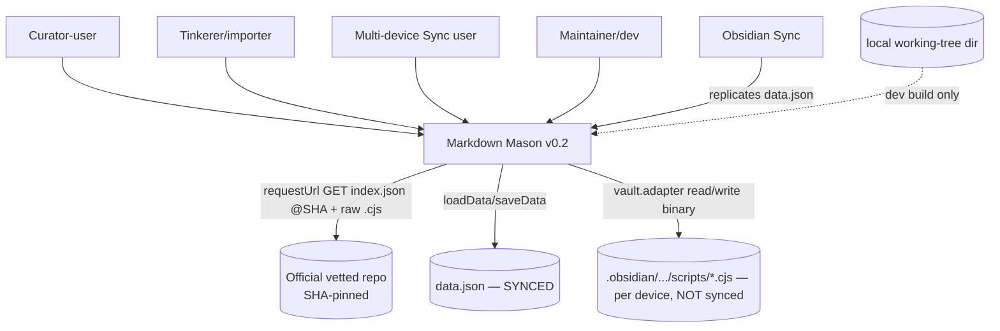
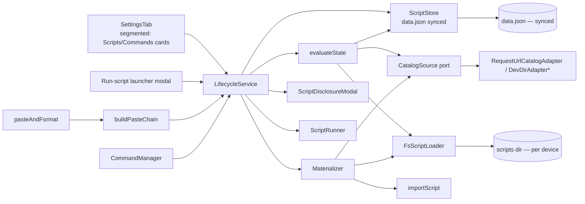
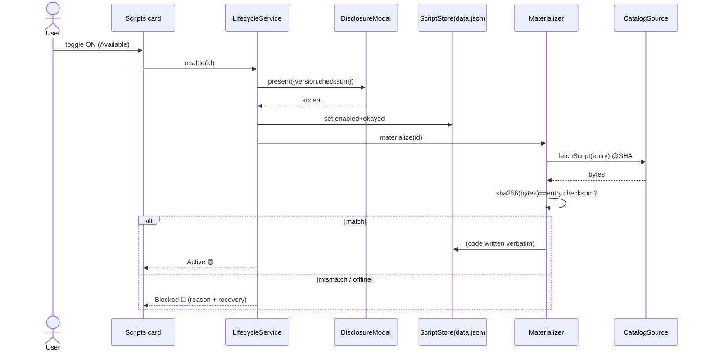
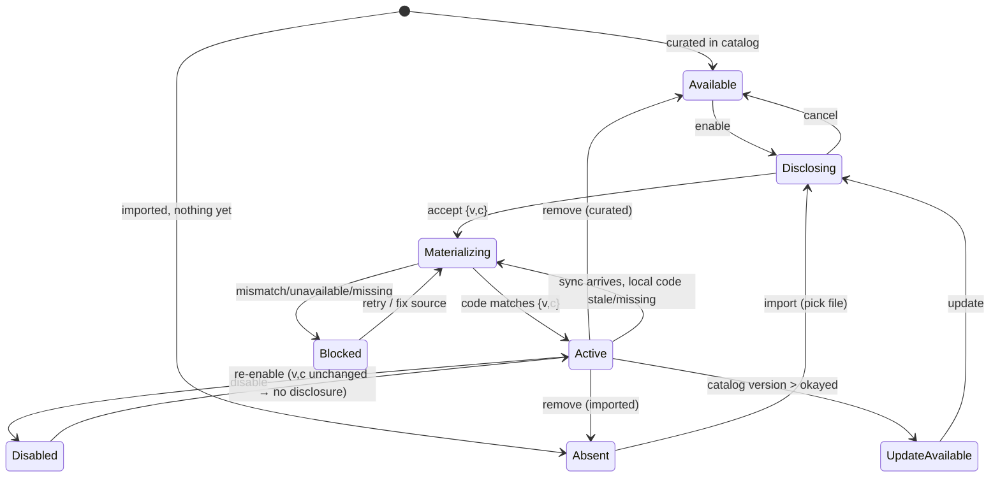

# Solution Design Document

## Validation Checklist

### CRITICAL GATES (Must Pass)

- [x] All required sections are complete
- [x] No [NEEDS CLARIFICATION] markers remain
- [x] Architecture pattern is clearly stated with rationale
- [x] **All architecture decisions confirmed by user** — ADR-11..ADR-17 confirmed 2026-06-23
- [x] Every interface has specification

### QUALITY CHECKS (Should Pass)

- [x] All context sources are listed with relevance ratings
- [x] Project commands are discovered from actual project files
- [x] Constraints → Strategy → Design → Implementation path is logical
- [x] Every component in diagram has directory mapping
- [x] Error handling covers all error types
- [x] Quality requirements are specific and measurable
- [x] Component names consistent across diagrams
- [x] A developer could implement from this design
- [x] Implementation examples use actual type/field names, verified against source files
- [x] Complex logic includes traced walkthroughs with example data

---

## Output Schema

### SDD Status Report

| Field | Value |
|-------|-------|
| specId | 002-script-distribution-and-settings |
| architecture.pattern | Hexagonal (ports & adapters) over a derived-state lifecycle machine; reuses v0.1 DI seams |
| architecture.keyComponents | ScriptStore (synced), CatalogSource port + requestUrl adapter, Materializer, LifecycleResolver (evaluateState), buildPasteChain, segmented SettingsTab (Scripts/Commands cards), CommandManager |
| architecture.externalIntegrations | Official vetted GitHub repo (SHA-pinned index.json + .cjs over requestUrl); Obsidian Sync (data.json replication) |
| adrs | ADR-11..ADR-17 (all CONFIRMED 2026-06-23) |
| validationPassed | 14 |
| validationPending | 0 |

---

## Constraints

- **CON-1 — Platform & language.** TypeScript, esbuild bundle to a single CJS `main.js`; Obsidian **Desktop only** (Electron/Node). Scripts are `.cjs` (Electron renderer cannot `require` bare `.js` — `loader.ts:39-43`). Target `es2020`; `obsidian`/`electron`/`@codemirror/*`/builtins are `external` (`esbuild.config.mjs:53-59`).
- **CON-2 — Community-submission compliance (heightened scrutiny because the plugin downloads & executes code).** Sentence-case UI text; DOM via `createEl`/`setText`/Setting helpers only — never `innerHTML`/`outerHTML`/`insertAdjacentHTML`; `console.debug` only; **`requestUrl`, never `fetch`** (enforced by `test/compliance.test.ts`); `register`/`registerEvent` cleanup; no default hotkeys; release-asset attestation.
- **CON-3 — Trust & sync.** Obsidian Sync replicates only the plugin's own core files (`manifest.json`, `main.js`, `data.json`) — not sidecars or `scripts/*.cjs` (T7.5, `sync-spike.md`). Consent must ride `data.json`; code must be re-materialized per device and run only on `{version, checksum}` match. The official source is **commit-SHA-pinned** and the only auto-download source (ADR-8). No background polling of a moving ref.
- **CON-4 — No installed base.** No released v0.1 users → **no data migration** required; the ADR-6 `device.json` sidecar can be replaced outright rather than migrated.

## Implementation Context

**IMPORTANT**: All listed sources were read and analyzed during research.

### Required Context Sources

#### Documentation Context
```yaml
- doc: docs/XDD/specs/002-script-distribution-and-settings/requirements.md
  relevance: CRITICAL
  why: "The PRD this design must fully cover (47 acceptance criteria)"

- doc: docs/XDD/ideas/2026-06-22-scripts-redesign.md
  relevance: CRITICAL
  why: "Converged design brief: state machine, module envelope, autodetect chain, edge cases"

- doc: docs/XDD/specs/001-markdown-mason/sync-spike.md
  relevance: CRITICAL
  why: "T7.5 — the Sync replication boundary that forces consent-rides-data.json + re-materialization"

- doc: docs/XDD/specs/001-markdown-mason/solution.md
  relevance: HIGH
  why: "ADR-6 (sidecar, superseded here), ADR-8 (vetted-repo distribution), SEC-006 (bundled bypass, removed here), DI seams"

- doc: tcs-patterns:obsidian-plugin (skill)
  relevance: HIGH
  why: "Manifest rules, lifecycle/cleanup, requestUrl, normalizePath, vault.adapter vs vault.process, XSS, Sync-aware persistence, segmented-UI residue"
```

#### Code Context
```yaml
- file: src/scripts/store.ts
  relevance: CRITICAL
  why: "ScriptStore + evaluateTrust precedence (1-6). v0.2 migrates device.json→data.json; collapses ConsentRecord into okayed {version,checksum}; extends to derived lifecycle state"

- file: src/scripts/runtime.ts
  relevance: CRITICAL
  why: "importScript: sha256 + path-traversal guards. v0.2 makes I/O byte-exact and reuses guards for imported provenance"

- file: src/scripts/loader.ts
  relevance: CRITICAL
  why: "FsScriptLoader realpath escape guard + loadScriptFresh (prefix cache-evict). v0.2 loads the module envelope; reuses the escape guard"

- file: src/scripts/context.ts
  relevance: HIGH
  why: "ScriptFunction contract (ctx.source, EditPlan|undefined, Promise allowed). The envelope's run is this exact type — unchanged"

- file: src/scripts/disclosure.ts
  relevance: HIGH
  why: "ScriptDisclosureModal + makeAskCallback. Reused for the Disclosing state; consent recording collapses to the okayed {v,c}"

- file: src/scripts/runner.ts
  relevance: HIGH
  why: "ScriptRunner (policy gate, timeout, atomicity). Unchanged; curated scripts stop using policy:enabled bypass"

- file: src/parsers/detect.ts
  relevance: HIGH
  why: "Hardcoded app→web-download→web order. RETIRED; logic moves into per-script paste.canHandle + buildPasteChain"

- file: src/parsers/perplexityApp.ts (and siblings)
  relevance: MEDIUM
  why: "canParse predicate shape → becomes paste.canHandle in each catalog script"

- file: src/main.ts
  relevance: CRITICAL
  why: "onload/_initStore wiring; pasteAndFormat (l.144) hardcoded perplexityAutoScript (l.326) + raw fallback (l.343-348); selection commands (l.172-191). Rewired to chain + catalog"

- file: src/ui/settingsTab.ts
  relevance: CRITICAL
  why: "Single-section tab. Becomes the segmented General·Scripts·Commands·Advanced shell with card rows"

- file: esbuild.config.mjs
  relevance: HIGH
  why: "No define block today; v0.2 adds a build-time constant for dev-override dead-code elimination"

- file: @package.json
  relevance: MEDIUM
  why: "Scripts: dev/build/test/lint/compliance; deps (esbuild 0.25.5, vitest 3, obsidian latest)"
```

#### External APIs
```yaml
- service: Official vetted script repo (GitHub)
  doc: ADR-8 (001/solution.md); brief "Distribution & updates"
  relevance: HIGH
  why: "SHA-pinned index.json catalog + raw .cjs fetched via requestUrl; the only auto-download source"
```

### Implementation Boundaries
- **Must Preserve:**
  - `ScriptFunction` contract (`context.ts:73`) — scripts' `run` is byte-identical to today's signature.
  - `ScriptRunner` atomicity/timeout/fallback semantics (`runner.ts`).
  - `FsScriptLoader` realpath escape guard (`loader.ts:114-133`) and `importScript` traversal guards (`runtime.ts:78-90`).
  - Paste raw-fallback behavior + "no recognized format" notice (`main.ts:343-348`).
  - Community-compliance invariants (compliance/xss tests).
- **Can Modify:**
  - `ScriptStore` storage model & schema (device.json → data.json); add `evaluateState`.
  - `settingsTab.ts` (rebuilt as segmented shell + card rows).
  - `main.ts` paste wiring, store init, command registration.
  - `esbuild.config.mjs` (add build-time `define`).
- **Must Not Touch:** `src/core/*` (footnotes/headings/registry/EditPlan engine), `src/sources/*` parser-independent of this feature except the paste entrypoint rewire.

### External Interfaces

#### System Context Diagram


#### Interface Specifications
```yaml
inbound:
  - name: "Settings UI (Scripts/Commands tabs)"
    type: in-process (Obsidian PluginSettingTab)
    format: DOM via Setting/createEl
    authentication: n/a
    data_flow: "User lifecycle actions: enable/disable/remove/import/update/retry/create-command"

  - name: "Command palette + Run-script launcher + Paste-and-format"
    type: in-process (Obsidian commands)
    format: editorCallback
    authentication: trust gate (evaluateState)
    data_flow: "Invoke a script's run against paste/selection/command source"

outbound:
  - name: "Official vetted repo"
    type: HTTPS via Obsidian requestUrl
    format: index.json (SHA-pinned) + raw .cjs bytes
    authentication: none (public, integrity by checksum + SHA-pin)
    data_flow: "Fetch catalog metadata + script code on enable/update"
    criticality: MEDIUM   # already-materialized scripts work offline

data:
  - name: "data.json (synced)"
    type: Obsidian plugin data (loadData/saveData)
    connection: PluginDataPort
    data_flow: "settings + per-script {enabled, okayed:{version,checksum}} + per-script command toggle"

  - name: "scripts dir (per-device, not synced)"
    type: vault.adapter binary I/O
    connection: VaultAdapterPort (+ readBinary/writeBinary)
    data_flow: "Materialized .cjs code; verbatim bytes; re-created per device"
```

### Cross-Component Boundaries
- **API Contracts (must not break):** the script **module envelope** (`{ run, paste? }`) and `ScriptContext` — these are the public contract third-party/community scripts depend on. The **catalog `index.json` schema** is a contract between the plugin and the vetted repo.
- **Team Ownership:** single maintainer; the vetted repo is a separate content repo (independently versioned, SHA-pinned).
- **Breaking Change Policy:** the envelope is the sole accepted script shape (envelope-only, ADR-16) — every curated/imported script must export `{ run, paste? }`; a missing `run` is a load error. Catalog schema changes ride pinned plugin releases.

### Project Commands
```bash
Install: npm install
Dev:     npm run dev          # esbuild watch → copies to test vault
Test:    npm test            # vitest run
Lint:    npm run lint        # eslint src/
Build:   npm run build       # tsc -noEmit && esbuild production
Compliance: npm run compliance   # vitest run test/compliance.test.ts
Manifest:   npm run check:manifest
# No DB / migrations.
```

## Solution Strategy

- **Architecture Pattern:** **Hexagonal (ports & adapters)** around a **derived-state lifecycle machine**. The plugin persists only *decisions* (`enabled` + okayed `{version, checksum}` + command toggle) in synced `data.json`; every lifecycle **state is computed on demand** from (decision × local-code presence × catalog) — no state field is persisted. This is the natural extension of the existing `evaluateTrust` precedence function (`store.ts:213-245`).
- **Integration Approach:** reuse v0.1 DI seams (`PluginDataPort`, `VaultAdapterPort` — `store.ts:44-58`) and add one new port, `CatalogSource` (fetch index / fetch script bytes), with a `requestUrl` adapter for production and a fake for tests. Reuse `ScriptRunner`, `disclosure`, `loader` escape guard, and `importScript` guards.
- **Justification:** the derived-state approach keeps the *only* synced data minimal (which last-write-wins safely) and makes the cross-device "enabled but not materialized" case fall out for free — exactly the T7.5 requirement. Ports keep everything unit-testable with no network, matching the proven v0.1 test style.
- **Key Decisions (ADRs below):** derived lifecycle (ADR-11); fold sidecar into synced data.json (ADR-12, supersedes ADR-6); CatalogSource port + SHA-pinned index (ADR-13); byte-exact checksum & verbatim materialization (ADR-14); dev-override via build-time DCE (ADR-15); module envelope + buildPasteChain + retire perplexity-auto (ADR-16); segmented settings + Templater-style commands (ADR-17).

## Building Block View

### Components

\* `DevDirAdapter` is compiled in only under the dev build flag (ADR-15).

### Directory Map

**Component**: markdown-mason plugin
```
.
├── esbuild.config.mjs                      # MODIFY: add define {__MASON_DEV__} for dev-override DCE (ADR-15)
├── src/
│   ├── main.ts                             # MODIFY: store init (data.json), rewire paste→buildPasteChain,
│   │                                       #         register Run-script launcher + per-script commands via CommandManager
│   ├── scripts/
│   │   ├── store.ts                        # MODIFY: data.json schema {enabled, okayed}; evaluateState (extends evaluateTrust)
│   │   ├── runtime.ts                      # MODIFY: byte-exact (binary) read/hash/write; reuse guards (ADR-14)
│   │   ├── loader.ts                       # MODIFY: loadScriptModule (envelope-only; missing run = load error); keep escape guard
│   │   ├── runner.ts                       # KEEP
│   │   ├── disclosure.ts                   # MODIFY: consent records okayed {version,checksum}; modal shows version/checksum
│   │   ├── context.ts                      # KEEP (ScriptFunction unchanged)
│   │   ├── lifecycle.ts                    # NEW: LifecycleState enum + evaluateState + transition helpers
│   │   ├── materializer.ts                 # NEW: fetch(curated)/copy(imported) → verify → write verbatim
│   │   ├── catalog/
│   │   │   ├── catalogSource.ts            # NEW: CatalogSource port + types (index.json schema)
│   │   │   ├── requestUrlAdapter.ts        # NEW: requestUrl adapter (SHA-pinned URLs)
│   │   │   └── devDirAdapter.ts            # NEW: dev-only adapter (guarded by __MASON_DEV__) (ADR-15)
│   │   ├── paste/
│   │   │   └── buildPasteChain.ts          # NEW: single ordering chokepoint (curated→imported, priority, id)
│   │   ├── commandManager.ts               # NEW: register/unregister per-script commands; Run-script launcher
│   │   └── library/                        # DELETE perplexityAuto.ts; the 3 concrete scripts move to the vetted repo
│   ├── parsers/
│   │   ├── detect.ts                       # DELETE (retired; replaced by buildPasteChain)
│   │   └── perplexity*.ts                  # MOVE canParse logic into repo scripts' paste.canHandle (then delete from plugin)
│   └── ui/
│       ├── settingsTab.ts                  # MODIFY: segmented shell (4 segments)
│       ├── scriptsTab.ts                   # NEW: card rows (badge/pill/⋯ menu/toolbar)
│       ├── commandsTab.ts                  # NEW: per-script Create-command toggles
│       └── runScriptModal.ts               # NEW: launcher modal (Active scripts only)
├── test/
│   ├── scripts/lifecycle.test.ts           # NEW
│   ├── scripts/materializer.test.ts        # NEW (fake CatalogSource)
│   ├── scripts/buildPasteChain.test.ts     # NEW
│   ├── scripts/commandManager.test.ts      # NEW
│   ├── scripts/store.test.ts               # MODIFY (data.json schema, evaluateState)
│   └── ui/scriptsTab.test.ts, commandsTab.test.ts  # NEW
└── (official vetted repo — separate)
    ├── index.json                          # NEW catalog: { schemaVersion, scripts:{ id:{version,checksum,path,name,desc} } }
    └── scripts/perplexity-*.cjs            # the migrated envelope scripts
```

### Interface Specifications

#### Data Storage Changes
No database. **`data.json` schema change** (synced; supersedes ADR-6 split):
```yaml
# data.json (loadData/saveData — SYNCED)
{
  settings: { ...unchanged MasonSettings... },
  scripts: {
    "<id>": {
      provenance: "curated" | "imported",
      enabled: boolean,                       # was: device.json
      okayed: { version: number, checksum: string } | null,   # collapses ManifestEntry.checksum/version + ConsentRecord
      source: string,                         # curated: catalog path/id ref · imported: vault-relative path
      command: boolean                        # "Create command" opt-in (Templater model); default false
    }
  }
}
# REMOVED: device.json sidecar (DeviceState.enabled / DeviceState.consent) — ADR-6 superseded.
# NEVER stored here: dev-override path (ADR-15), materialized code (lives per-device in scripts dir).
```
Migration: **none** (CON-4). `loadData()` returning a v0.1-shaped blob is impossible in the field; defensive defaults (`enabled:false`, `okayed:null`) apply to any unknown entry.

#### Internal API Changes (in-process ports/contracts — no HTTP)
```yaml
# CatalogSource port (NEW) — mirrors PluginDataPort/VaultAdapterPort DI style
CatalogSource:
  fetchIndex(): Promise<CatalogIndex>            # { schemaVersion, ref(SHA), scripts: Record<id, CatalogEntry> }
  fetchScript(entry: CatalogEntry): Promise<Uint8Array>   # raw bytes at the pinned ref
# CatalogEntry: { id, version, checksum, path, name, description }

# Materializer (NEW)
materialize(id): Promise<MaterializeResult>      # fetch|copy → verify checksum+version vs okayed → write verbatim
#   -> { ok: true } | { ok: false, reason: "drift"|"offline"|"source-missing"|"checksum-mismatch" }

# LifecycleService / evaluateState (NEW, extends evaluateTrust)
evaluateState(id): Promise<LifecycleState>
# LifecycleState = Available | Absent | Disclosing | Materializing | Active | Disabled | Blocked(reason) | UpdateAvailable

# buildPasteChain (NEW) — the single ordering chokepoint
buildPasteChain(enabled: LoadedScript[]): PasteHandler[]   # sorts curated→imported, priority desc, id asc

# Script module envelope (NEW public contract)
module.exports = {
  run(ctx): EditPlan | undefined | Promise<...>,     # === existing ScriptFunction (context.ts:73)
  paste?: { canHandle(input: string): boolean, priority: number }   # OPTIONAL; pure, sync, no I/O
}
```

#### Application Data Models
```pseudocode
ENTITY: ScriptRecord (NEW — replaces ManifestEntry + ConsentRecord + DeviceState)
  FIELDS:
    provenance: "curated" | "imported"
    enabled: boolean
    okayed: { version: number, checksum: string } | null
    source: string                # curated: catalog id/path · imported: vault-relative path
    command: boolean              # "Create command" opt-in

ENTITY: LifecycleState (NEW — DERIVED, never persisted)
  VALUES: Available | Absent | Disclosing | Materializing | Active | Disabled | UpdateAvailable | Blocked
  Blocked carries reason: "drift" | "offline" | "source-missing" | "checksum-mismatch"

ENTITY: CatalogIndex / CatalogEntry (NEW)
  CatalogIndex: { schemaVersion: number, ref: string(SHA), scripts: Record<id, CatalogEntry> }
  CatalogEntry: { id, version: number, checksum: string, path: string, name: string, description: string }

ENTITY: LoadedScript (NEW — runtime, per device)
  FIELDS: id, record: ScriptRecord, module: { run, paste? } | null, state: LifecycleState
```

#### Integration Points
```yaml
External_Service: Official vetted repo
  - integration: "requestUrl GET {rawBase}/{ref}/index.json and {rawBase}/{ref}/{entry.path}"
  - sections: [index schema, raw .cjs]
  - critical_data: [version, checksum, path]
  - notes: "ref is the SHA embedded in this plugin release; never a moving branch"
Obsidian Sync:
  - integration: "replicates data.json only; code re-materialized per device"
  - critical_data: [enabled, okayed{version,checksum}, command]
```

### Implementation Examples

#### Example: evaluateState — the derived lifecycle (extends evaluateTrust)
**Why this example:** the lifecycle machine is the spine; this shows it is a *pure function of persisted decision + local presence + catalog*, so cross-device behavior needs no extra state.

```typescript
// Field names verified against store.ts (TrustStatus) + brief state machine.
// Inputs: record (from data.json), codePresentAndChecksum (from FsScriptLoader+hash),
//         catalogVersion (from CatalogSource; undefined if offline/unknown).
async function evaluateState(id: string): Promise<LifecycleState> {
  const rec = (await store.getScripts())[id];
  if (rec === undefined) return rec /* curated catalog has it */ ? "Available" : "Absent";

  if (!rec.enabled) return "Disabled";
  if (rec.okayed === null) return rec.provenance === "curated" ? "Available" : "Absent";

  // Enabled + consented: reconcile against locally materialized code.
  const local = await loadLocalChecksum(id);            // null if code absent on this device
  if (local === null) {
    // Decision synced but code not materialized here yet → must (re)materialize.
    return navigator.onLine === false ? blocked("offline") : "Materializing";
  }
  if (local.version !== rec.okayed.version) return "Materializing"; // stale → re-fetch
  if (local.checksum !== rec.okayed.checksum) return blocked("drift");  // evaluateTrust rule 5

  // Code matches consent. Is there a newer curated version available?
  if (rec.provenance === "curated" && catalogVersion !== undefined
      && catalogVersion > rec.okayed.version) return "UpdateAvailable";
  return "Active";
}
```

**Traced walkthrough (the T7.5 device-B case):**
- Device A: user enables `perplexity-app`; `okayed = {version:1, checksum:"sha256:AA"}`; code at AA written locally; state `Active`.
- `data.json` syncs to Device B. On B: `rec.enabled=true`, `okayed={1,"sha256:AA"}`, but `loadLocalChecksum` → `null` (code never fetched on B).
  - B online → `Materializing` → Materializer fetches `.cjs`, hashes bytes → `"sha256:AA"` matches okayed → writes verbatim → next eval → `Active`. **No disclosure shown.**
  - B offline → `Blocked("offline")` with retry. Never runs.
- Drift case: repo author force-pushes new bytes under version 1 → fetched hash `"sha256:BB"` ≠ okayed `"sha256:AA"` → Materializer returns `checksum-mismatch`; eval → `Blocked("drift")`. SHA-pinning makes this near-impossible in production, but the fail-closed path exists regardless.

#### Example: byte-exact checksum & verbatim materialization (ADR-14)
**Why this example:** v0.1 hashes the *decoded* string (`runtime.ts:96`), risking CRLF/encoding false-drift. v0.2 must hash and write the exact bytes for both fetch and import.

```typescript
// Curated fetch:
const bytes: Uint8Array = await catalog.fetchScript(entry);      // requestUrl arrayBuffer → Uint8Array
const checksum = "sha256:" + sha256Hex(bytes);                   // hash RAW bytes
if (checksum !== entry.checksum) return { ok:false, reason:"checksum-mismatch" };
await vault.writeBinary(destPath, bytes);                        // write VERBATIM (no string round-trip)

// Import (reuses runtime.ts guards, switched to binary):
const bytes = await vault.readBinary(vaultPath);                 // not .read() (which decodes UTF-8)
const checksum = "sha256:" + sha256Hex(bytes);
await vault.writeBinary(destPath, bytes);
// loadScriptFresh still requires() the .cjs file from disk — unchanged.
```

#### Example: buildPasteChain — single ordering chokepoint (ADR-16)
**Why this example:** all paste ordering must flow through one function so the future `pasteOrder` overlay is a pure additive change (no contract change, no migration).

```typescript
function buildPasteChain(enabled: LoadedScript[]): PasteHandler[] {
  return enabled
    .filter(s => s.module?.paste)                 // only scripts opting in
    .sort((a, b) =>
      rank(a.record.provenance) - rank(b.record.provenance)   // curated(0) before imported(1)
      || b.module!.paste!.priority - a.module!.paste!.priority // higher priority first
      || a.id.localeCompare(b.id))                             // stable by id
    .map(s => ({ id: s.id, canHandle: s.module!.paste!.canHandle, run: s.module!.run }));
}
// pasteAndFormat: for (h of chain) if (h.canHandle(input)) return runViaRunner(h);  else rawFallback()
// Perplexity priorities preserve detect.ts order: app 300 / web-download 200 / web 100.
```

#### Test Examples as Interface Documentation
```typescript
// Materializer with a fake CatalogSource — no network (matches v0.1 DI test style).
it("blocks on checksum mismatch, never writes", async () => {
  const fake: CatalogSource = {
    fetchIndex: async () => ({ schemaVersion:1, ref:"abc", scripts:{ "x": entryV1 } }),
    fetchScript: async () => new TextEncoder().encode("tampered bytes"),
  };
  const r = await materialize("x", { catalog: fake, okayed: entryV1.checksum });
  expect(r).toEqual({ ok:false, reason:"checksum-mismatch" });
  expect(vault.writeBinary).not.toHaveBeenCalled();   // fail-closed
});
```

## Runtime View

### Primary Flow: enable a curated script
1. User toggles a curated card on (Scripts tab).
2. System resolves state `Available` → shows **ScriptDisclosureModal** (Disclosing) with name + `{version, checksum}` + privileges text.
3. User accepts → store records `enabled:true`, `okayed:{version,checksum}` (from catalog entry).
4. Materializer fetches `.cjs` at pinned ref → hashes raw bytes → verifies vs catalog checksum → writes verbatim → (Materializing).
5. Next `evaluateState` → `Active`; the card pill turns 🟢; the script joins the paste chain (if it declares `paste`) and is available to the launcher.



### Error Handling
- **Repo unreachable / offline:** Materializer returns `offline`; state `Blocked("offline")`; card shows "Official source unreachable" + **Retry fetch**. Already-materialized scripts unaffected.
- **Checksum mismatch / drift:** `checksum-mismatch`/`drift` → `Blocked("drift")`; card shows "Code changed since you approved it" + **Re-review consent** (re-disclosure on accept). Never runs (fail-closed; evaluateTrust rule 5).
- **Imported source missing/moved:** `source-missing` → `Blocked("source-missing")`; card shows "Vault source not found" + **Re-import**.
- **Script throws/times out at run:** unchanged — `ScriptRunner` calls rawFallback + notify, never a partial edit (`runner.ts:187-201`).
- **Paste: no handler claims input:** unchanged raw-paste + "no recognized format" notice (`main.ts:343-348`).
- **Stale command invoked against non-Active script:** CommandManager checks `evaluateState`; if not `Active`, notify the Blocked/disabled reason; do not execute.

### Complex Logic — lifecycle transition resolution
```
ALGORITHM: evaluateState(id)
INPUT: data.json record, local materialized code (presence + version + checksum), catalog version (maybe)
OUTPUT: LifecycleState
1. no record        -> curated catalog has id ? Available : Absent
2. !enabled         -> Disabled
3. okayed == null   -> curated ? Available : Absent
4. local code absent-> online ? Materializing : Blocked(offline)
5. local.version != okayed.version -> Materializing       (stale; re-fetch)
6. local.checksum != okayed.checksum -> Blocked(drift)    (rule 5, hard-block)
7. curated & catalogVersion > okayed.version -> UpdateAvailable
8. else -> Active
# Disclosing/Materializing are transient (driven by an in-flight action), surfaced to UI during the op.
```

## Deployment View

### Single Application Deployment
- **Environment:** Obsidian Desktop (Electron renderer + Node). Single `main.js`.
- **Configuration:** none required by users. Maintainer release embeds the **pinned repo SHA** (build-time constant) and bumps it to ship curated updates. Dev-override path read from a gitignored dev config / env var, **dev build only**.
- **Dependencies:** the official vetted repo at the pinned SHA (only for enable/update fetches; not for offline run of already-materialized scripts).
- **Performance:** `buildPasteChain` runs per paste over only *enabled* scripts (small N); `canHandle` is pure/sync/cheap. Catalog `fetchIndex` only on Scripts-tab open / enable / update (not on every load; never polled).

### Multi-Component Coordination
- **Deployment Order:** publish the script to the vetted repo first, then cut a plugin release pinning that SHA so the catalog exposes the new version. (Repo is independently versioned; not a binary deploy dependency.)
- **Feature Flags:** `__MASON_DEV__` build-time constant gates the dev-only catalog adapter (dead-code-eliminated in prod).
- **Rollback Strategy:** revert the plugin release (re-pins the prior SHA); user data.json unaffected; already-materialized scripts keep working.

## Cross-Cutting Concepts

### Pattern Documentation
```yaml
- pattern: Hexagonal ports & adapters (PluginDataPort/VaultAdapterPort/CatalogSource)
  relevance: CRITICAL
  why: "Network-free unit tests; one storage model; swap requestUrl/dev adapters"
- pattern: Derived state (single source of truth = persisted decision)
  relevance: CRITICAL
  why: "Cross-device correctness with minimal synced data; last-write-wins is safe"
- pattern: Single chokepoint (buildPasteChain)
  relevance: HIGH
  why: "Future pasteOrder overlay is additive; no contract/migration churn"
- pattern: Fail-closed trust gate (evaluateTrust precedence, extended)
  relevance: CRITICAL
  why: "Never run unverified code; Blocked unifies all failure modes with reason+recovery"
```

### User Interface & UX

**Information Architecture:** one `PluginSettingTab`; a horizontal **segmented control** (no native Obsidian sub-tabs) selects `General · Scripts · Commands · Advanced`. General/Advanced retain v0.1 controls.

**Scripts tab — card row:**
```
┌──────────────────────────────────────────────────────────────┐
│ Perplexity app            [Official]            🟢 Active   v1 │
│ Formats Perplexity desktop-app copies into footnotes.   [⌄][⋯]│
└──────────────────────────────────────────────────────────────┘
┌──────────────────────────────────────────────────────────────┐
│ my-custom-script          [Imported]            🔴 Blocked  v3 │
│ Vault source not found: scripts/old.cjs  → [Re-import]   [⌄][⋯]│
└──────────────────────────────────────────────────────────────┘
  Toolbar:  [Import from vault]   [Browse official]
  ⋯ menu (only valid actions): View source · Re-review consent ·
            Update to vN · Retry fetch · Remove
```

**Commands tab (Templater model):**
```
┌──────────────────────────────────────────────────────────────┐
│ Create command for…                                          │
│   Perplexity app          [✓]   (bind keys in core Hotkeys)  │
│   Perplexity web          [ ]                                │
│ Built-in:  "Mason: Run script…"  → launcher lists Active only │
└──────────────────────────────────────────────────────────────┘
```

**Component States (Scripts card):**


**Accessibility:** disclosure modal keeps v0.1 safe-default (Disable first + focused, Esc/close → disable; `disclosure.ts:120-133`); segmented control keyboard-navigable; status conveyed by text label + icon (not color alone).

### System-Wide Patterns
- **Security:** one trust model for both provenances; **enable implies consent** (single okayed `{v,c}`); **match-gate at materialization** is the device-B safety; SEC-006 bundled bypass **removed** (curated scripts now disclose like any other); byte-exact integrity; dev-override physically absent from prod bundle; reuse path-traversal + realpath escape guards.
- **Error Handling:** fail-closed everywhere; `Blocked` always carries a human reason + recovery; atomicity preserved by `ScriptRunner`.
- **Performance:** no polling; chain built from enabled scripts only; catalog fetched on demand.
- **Logging:** `console.debug` only, gated by `debugLogging` (`context.ts:114-122`).
- **i18n/L10n:** none (English UI, sentence-case).

## Architecture Decisions

- [x] **ADR-11 — Derived lifecycle state (no persisted state field).** Persist only `{enabled, okayed:{version,checksum}, command}`; compute `LifecycleState` on demand via `evaluateState` (extends `evaluateTrust`).
  - Rationale: minimal synced surface → last-write-wins is safe; the "enabled but not materialized" cross-device case falls out for free; one pure, testable function.
  - Trade-offs: state recomputed on each render/invoke (cheap); transient `Disclosing`/`Materializing` surfaced by the in-flight action, not stored.
  - User confirmed: **Yes (2026-06-23)**

- [x] **ADR-12 — Fold device.json sidecar into synced data.json; collapse consent into okayed {v,c}. (Supersedes ADR-6.)** No migration (CON-4).
  - Rationale: T7.5 requires consent to ride `data.json`; one record per script removes the separate consent flag and the per-device sidecar.
  - Trade-offs: consent becomes per-vault not per-device (deliberate); safety shifts to the match-gate; `device.json` code deleted.
  - User confirmed: **Yes (2026-06-23)**

- [x] **ADR-13 — `CatalogSource` port + `requestUrl` adapter; SHA-pinned `index.json`.** `fetchIndex`/`fetchScript`; URLs built from a pinned SHA embedded at build time.
  - Rationale: CORS-safe, deterministic, ADR-8-consistent; mirrors existing DI ports → network-free tests.
  - Trade-offs: catalog schema becomes a plugin↔repo contract; updates ride pinned releases (no polling).
  - User confirmed: **Yes (2026-06-23)**

- [x] **ADR-14 — Byte-exact checksum & verbatim materialization.** Hash and write **raw bytes** (`readBinary`/`writeBinary`/arrayBuffer), not decoded strings; index generated from the same bytes.
  - Rationale: eliminates CRLF/encoding false-drift (current `runtime.ts:96` hashes decoded text); makes drift detection trustworthy.
  - Trade-offs: switch import/fetch I/O to binary; `loadScriptFresh` require() unchanged.
  - User confirmed: **Yes (2026-06-23)**

- [x] **ADR-15 — Dev-source override via build-time dead-code elimination.** A `__MASON_DEV__` esbuild `define` constant gates the dev-only `DevDirAdapter`; prod build physically omits it (tree-shaken). Override value from gitignored dev config/env; **never** in `data.json`.
  - Rationale: fastest local loop while closing both the sync-leak and arbitrary-local-code-load vectors; "physically omitted" beats "runtime-skipped".
  - Trade-offs: adds a build flag + a verifying test (assert prod bundle contains no dev-adapter path).
  - User confirmed: **Yes (2026-06-23)**

- [x] **ADR-16 — Script module envelope `{ run, paste? }` (envelope-only) + `buildPasteChain`; retire `perplexity-auto` & `parsers/detect.ts`.** The loader **requires** the envelope: a module without a callable `run` is a load error (no bare-function fallback). A script with no `paste` block is command-only. Ordering: curated→imported, priority desc, id asc, through one chokepoint.
  - Rationale: no installed base and no existing community scripts (CON-4), so there is nothing to be backward-compatible with — a single canonical shape is cleaner and removes a whole branch of loader/contract ambiguity. Generalizes compiled-in `detect()` to dynamically-pulled scripts without speculative execution; keeps the proven `canParse`/`parse` purity; future `pasteOrder` overlay is additive.
  - Trade-offs: the envelope is the *only* accepted shape from day one — every curated and imported script must export `{ run, paste? }`; three Perplexity parsers move to repo scripts; `detect.ts` + `perplexityAuto.ts` deleted.
  - User confirmed: **Yes (2026-06-23) — envelope-only; no bare-function fallback**

- [x] **ADR-17 — Segmented settings nav + Templater-style command management.** Four segments in one `PluginSettingTab`; per-script "Create command" opt-in decoupled from enable; one built-in "Run script…" launcher listing Active only; no default hotkeys.
  - Rationale: Obsidian has no native sub-tabs; Templater's model is familiar and reuses core Hotkeys; supports run-without-binding.
  - Trade-offs: settings tab rebuilt; command state rides `data.json` and must be cleaned up on disable/remove.
  - User confirmed: **Yes (2026-06-23)**

## Quality Requirements

- **Performance:** paste autodetect adds no perceptible latency — chain built over enabled scripts only; `canHandle` pure/sync. Catalog network calls only on explicit enable/update/tab-open; **zero** background polling.
- **Usability:** every Blocked state shows a human-readable reason + a single recovery action; sentence-case UI; status not by color alone; disclosure safe-default preserved.
- **Security:** no code path runs a script whose materialized bytes don't match the okayed `{version, checksum}`; prod bundle contains no dev-override read path (asserted by test); path-traversal + realpath escape guards retained; consent shown on first-enable and every `{v,c}` change.
- **Reliability:** fail-closed on every failure mode; atomic edits (no partial application); already-materialized scripts work fully offline; `data.json` writes preserve unrelated keys (as `setManifestEntry` does today, `store.ts:150-158`).

## Acceptance Criteria

**Lifecycle & consent (PRD F1/F2/F3)**
- [ ] WHEN a user enables a never-consented script, THE SYSTEM SHALL show the disclosure modal with its `{version, checksum}` before any code runs.
- [ ] WHEN a user re-enables a script whose `{version, checksum}` is unchanged, THE SYSTEM SHALL NOT show the disclosure modal.
- [ ] WHILE no script's `okayed` matches local code, THE SYSTEM SHALL NOT execute that script.
- [ ] WHEN the plugin loads (install/upgrade/first-run), THE SYSTEM SHALL run no script until explicitly enabled.

**Distribution & updates (PRD F4)**
- [ ] WHEN a curated script is enabled, THE SYSTEM SHALL fetch its `.cjs` at the pinned SHA and verify the raw-byte checksum against the catalog before recording/materializing.
- [ ] IF a fetched curated script's checksum ≠ catalog, THEN THE SYSTEM SHALL enter Blocked and not run it.
- [ ] WHERE a plugin release pins a catalog with a higher version, THE SYSTEM SHALL mark the script UpdateAvailable.
- [ ] THE SYSTEM SHALL NOT poll any moving branch for updates.

**Cross-device & Blocked (PRD F5/F6)**
- [ ] WHEN an enabled script's decision syncs to a device lacking the code, THE SYSTEM SHALL re-materialize and run only on `{version, checksum}` match, with no re-disclosure.
- [ ] IF materialized code has the same version but a different checksum than okayed, THEN THE SYSTEM SHALL enter Blocked(drift).
- [ ] WHEN any Blocked state is entered, THE SYSTEM SHALL surface a human-readable reason and a matching recovery action.
- [ ] IF an imported script's recorded vault source is missing, THEN THE SYSTEM SHALL enter Blocked(source-missing) with a re-import recovery.

**Settings, commands, autodetect (PRD F7/F8/F9/F10/F11)**
- [ ] THE SYSTEM SHALL present a four-segment settings nav (General · Scripts · Commands · Advanced) within one settings tab.
- [ ] THE SYSTEM SHALL render each script as a card with provenance badge, status pill, version, toggle, and a ⋯ menu exposing only valid actions.
- [ ] WHEN a user toggles "Create command" on/off, THE SYSTEM SHALL register/unregister that command with no default hotkey.
- [ ] WHEN a script is disabled or removed, THE SYSTEM SHALL unregister its command and drop its command state.
- [ ] WHEN "Mason: Run script…" is invoked, THE SYSTEM SHALL list only Active scripts.
- [ ] WHEN "Paste and format" runs, THE SYSTEM SHALL try enabled paste handlers in order (curated→imported, priority desc, id) and run the first match; IF none match, THEN raw-paste with a "no recognized format" notice.
- [ ] THE SYSTEM SHALL ship the three Perplexity scripts as catalog entries and SHALL NOT compile `perplexity-auto`/`detect.ts` into `main.js`.

**Dev override (PRD Should)**
- [ ] WHERE a dev build has the override configured, THE SYSTEM SHALL read curated code from the local working-tree dir.
- [ ] THE SYSTEM SHALL NOT include any dev-override read path in a production build, and SHALL NOT write the override to `data.json`.

## Risks and Technical Debt

### Known Technical Issues
- `runtime.ts:96` hashes decoded UTF-8 text (not raw bytes) → latent CRLF/encoding false-drift. Resolved by ADR-14.
- `store.ts` still implements the ADR-6 `device.json` sidecar; the data.json migration (ADR-12) is the load-bearing change and touches every store consumer (`main.ts:93-94`, `settingsTab.ts:19,112-115`, `disclosure.ts:196,222`).
- `settingsTab.ts` "Import from vault…" is a placeholder Notice (`:141-153`) — import UX is greenfield.

### Technical Debt
- `evaluateTrust` and the new `evaluateState` overlap; implement `evaluateState` as the superset and have any remaining `evaluateTrust` callers route through it to avoid two precedence definitions.
- Three near-identical Perplexity scripts/parsers will be duplicated as repo envelope scripts during migration; delete the in-plugin copies once the catalog path is proven to avoid two sources of truth.

### Implementation Gotchas
- **`navigator.onLine`** is a hint, not a guarantee; treat fetch failure (not just `onLine===false`) as the authoritative "offline/unreachable" signal → Blocked(offline).
- **Binary I/O**: `vault.adapter.readBinary/writeBinary` return/accept `ArrayBuffer`; normalize to `Uint8Array` before hashing; do NOT route bytes through `read()`/`write()` (string) anywhere on the materialize path.
- **Command cleanup**: Obsidian has no public `removeCommand` in older APIs — verify the available unregister path; register via `this.addCommand` and track ids so disable/remove can tear down (use `register`-based teardown if needed). Confirm against current Obsidian API (claude-code-guide/obsidian-plugin skill).
- **`onLayoutReady` timing** (`main.ts:79,102`): command registration must run after layout ready; rebuilding commands on toggle must be safe to call repeatedly.
- **Dev-adapter DCE**: ensure the `__MASON_DEV__` constant is `define`d to a literal `false` in prod so esbuild tree-shakes the whole branch; add a test asserting the prod bundle string does not contain the dev-adapter marker.
- **Sentence-case + no innerHTML** in all new tabs/modals (compliance tests will fail otherwise).

## Glossary

### Domain Terms
| Term | Definition | Context |
|------|------------|---------|
| Curated script | Maintainer-published, pre-vetted, SHA-pinned script in the official repo | provenance="curated" |
| Imported script | User's own `.cjs` added from the vault at their discretion | provenance="imported" |
| Provenance | curated vs imported; decides re-materialization source + badge only | never affects trust gates |
| Materialize | Fetch (curated) or copy (imported) code locally so it can run on this device | per device |
| Disclosure | Consent modal shown on first enable / any `{v,c}` change | disclosure.ts |
| Okayed record | The `{version, checksum}` the user consented to | data.json; match-gate basis |
| Drift | Same version, different checksum than okayed → hard-block | evaluateTrust rule 5 |
| Catalog | SHA-pinned `index.json` listing curated `{version,checksum,path}` | official repo |

### Technical Terms
| Term | Definition | Context |
|------|------------|---------|
| Derived state | LifecycleState computed from decision×presence×catalog, never persisted | ADR-11 |
| Match-gate | Run only if materialized bytes match okayed `{v,c}` | device-B safety (T7.5) |
| DCE | Dead-code elimination (esbuild tree-shake behind a `define` flag) | ADR-15 |
| Chokepoint | Single `buildPasteChain` function all ordering flows through | ADR-16 |
| `__MASON_DEV__` | Build-time boolean constant; true in dev, literal false in prod | esbuild define |

### API/Interface Terms
| Term | Definition | Context |
|------|------------|---------|
| CatalogSource | Port: `fetchIndex()`, `fetchScript(entry)` | catalog/catalogSource.ts |
| Module envelope | `{ run, paste?:{canHandle, priority} }` script export shape | public contract |
| `run` | The existing `ScriptFunction` — `(ctx)=>EditPlan\|undefined\|Promise<...>` | context.ts:73 |
| `paste.canHandle` | Cheap, pure, sync predicate; opts a script into autodetect | mirrors canParse |
| requestUrl | Obsidian CORS-safe HTTP API (never `fetch`) | requestUrlAdapter.ts |
