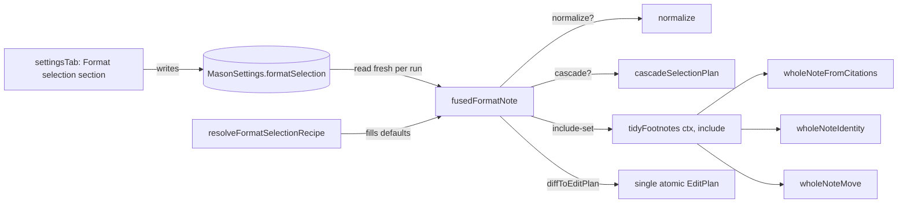
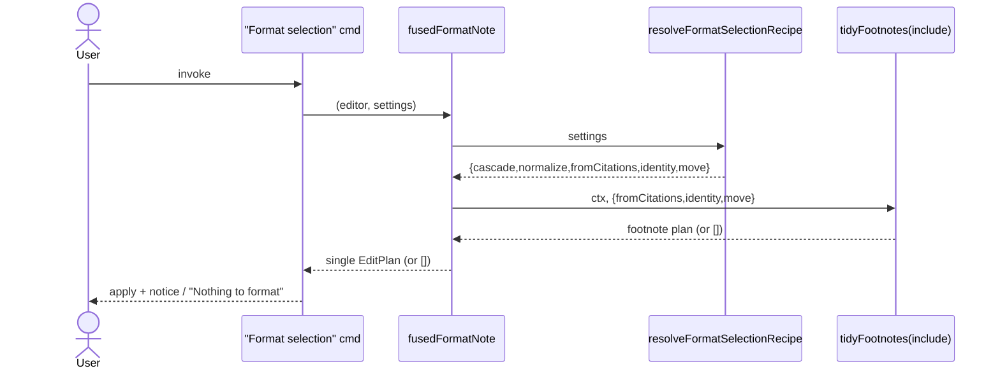

# Solution Design Document

## Validation Checklist

### CRITICAL GATES (Must Pass)

- [x] All required sections are complete (irrelevant sections marked N/A with reason)
- [x] No [NEEDS CLARIFICATION] markers remain
- [x] Architecture pattern is clearly stated with rationale
- [x] All architecture decisions confirmed by user (ADR-18, ADR-19 — confirmed in design dialogue)
- [x] Every interface has specification

### QUALITY CHECKS (Should Pass)

- [x] Context sources listed with relevance
- [x] Project commands discovered from package.json
- [x] Constraints → Strategy → Design → Implementation path is logical
- [x] Each modified component maps to a directory
- [x] Error handling covers the relevant cases (empty recipe, no-op)
- [x] Quality requirements are specific (byte-identity, single-edit invariant)
- [x] Names consistent across sections
- [x] A developer could implement from this design

---

## Constraints

CON-1 **TypeScript/esbuild Obsidian plugin.** No new runtime deps. Build via `node esbuild.config.mjs`; typecheck with `tsc -noEmit`.

CON-2 **Core purity.** `src/core/*` has ZERO obsidian imports and must stay pure/unit-testable. The recipe type + resolver and the parameterized `tidyFootnotes` all live in core and stay pure.

CON-3 **No unsupported-API surface.** The `Plugin.settings` typing already forces a Catalyst minAppVersion concern; this feature adds only standard `Setting`/`addToggle` UI and a plain settings field — no new API surface, no `addCommand`/`removeCommand` churn.

CON-4 **Behavior preservation.** Published 0.3.0 has an install base. Default-all-on means "Format selection" is byte-identical to the prior release unless the user opts in.

## Implementation Context

### Required Context Sources

#### Code Context
```yaml
- file: src/commands.ts            # fusedFormatNote (276), Tidy footnotes (351), Format selection cmd (385)
  relevance: CRITICAL
  why: "The composite command pipeline that will read the recipe"
- file: src/core/noteFootnotes.ts  # tidyFootnotes (592), diffToEditPlan (exported)
  relevance: CRITICAL
  why: "Offset-fused footnote pipeline to parameterize with an include-set"
- file: src/core/types.ts          # MasonSettings, DEFAULT_SETTINGS, OperationContext, EditPlan
  relevance: CRITICAL
  why: "Settings model extension + recipe types"
- file: src/ui/settingsTab.ts      # _render<Name>Section pattern, _renderSegmentNav, Setting.addToggle
  relevance: HIGH
  why: "Where the 5-checkbox section is added"
- file: src/main.ts                # settings load/save, command registration
  relevance: MEDIUM
  why: "saveSettings plumbing; fusedFormatNote reads plugin.settings fresh per run"
- file: @package.json
  relevance: LOW
  why: "Build/test/lint scripts"
```

#### External APIs
N/A — no external services. Local plugin only.

### Implementation Boundaries
- **Must Preserve:** "Tidy footnotes" command behavior; all individual built-in commands; the `mason.*` API; the compositional paste flow; single-atomic-edit (one undo) output of "Format selection"; byte-identical all-on output.
- **Can Modify:** `fusedFormatNote` (gate steps); `tidyFootnotes` signature (add optional include-set, default = today's behavior); `MasonSettings`/`DEFAULT_SETTINGS`; `settingsTab.ts` (new section + nav entry).
- **Must Not Touch:** `mason.*` registry/API; `buildPasteChain`; runner; scripts/catalog.

### External Interfaces
N/A — no inbound/outbound network interfaces. The only "interface" is the plugin settings store (Obsidian `loadData`/`saveData`) already in use.

### Project Commands
```bash
Install: npm ci
Build:   node esbuild.config.mjs            # prod: append "production"
Test:    npx vitest run
Lint:    npx eslint src/
Types:   npx tsc -noEmit -skipLibCheck
```

## Solution Strategy

- **Architecture Pattern:** Pure-core + thin command/UI shell (existing Mason layering). The recipe is data (5 booleans) read at command-invocation time; the composition logic stays in the pure scratch-string pipeline.
- **Integration Approach:** Additive. One new pure core module (recipe type + resolver), one widened core function signature (`tidyFootnotes`), gating inside the existing `fusedFormatNote`, and one new settings section. No new command, no dynamic command lifecycle.
- **Justification:** "Format selection" already reads `plugin.settings` fresh on every invocation, so toggles take effect live with zero re-registration. The scratch-string design (`applyToString` per stage) makes "skip a step" trivial: a skipped stage contributes `[]` and passes the prior string through. This preserves the single-`diffToEditPlan` atomic-edit guarantee for any subset.
- **Key Decisions:** ADR-18 (compositional paste — no auto-pipeline/veto), ADR-19 (Format selection is the only settings-driven composite).

## Building Block View

### Components



### Directory Map

```
.
├── src/
│   ├── core/
│   │   ├── formatSelection.ts      # NEW: FormatSelectionRecipe type + resolveFormatSelectionRecipe (pure)
│   │   ├── types.ts                # MODIFY: MasonSettings.formatSelection?, DEFAULT_SETTINGS
│   │   └── noteFootnotes.ts        # MODIFY: tidyFootnotes(ctx, include: FootnoteSteps = {})
│   ├── commands.ts                 # MODIFY: fusedFormatNote gates steps via resolved recipe
│   └── ui/
│       └── settingsTab.ts          # MODIFY: _renderFormatSelectionSection + segment nav entry
└── test/
    ├── core/formatSelection.test.ts        # NEW: resolver defaults
    ├── scripts/.../tidyFootnotes*.test.ts   # MODIFY/NEW: every include subset
    ├── commands/formatSelection.test.ts     # NEW: all-on byte-identity, per-step omission, all-off, isolation
    └── ui/settingsTab*.test.ts              # NEW/MODIFY: Format selection section renders + persists
```

### Interface Specifications

#### Data Storage Changes
Plugin settings only (Obsidian `saveData`). New optional field on `MasonSettings`:

```yaml
MasonSettings:
  ADD FIELD: formatSelection?: Partial<FormatSelectionRecipe>   # absent => treated as all-on
DEFAULT_SETTINGS:
  ADD: formatSelection = { cascade: true, normalize: true, fromCitations: true, identity: true, move: true }
```

No database; no migration. Older saved data with no `formatSelection` resolves to all-on via the resolver (back-compat safe).

#### Internal API Changes (in-process function signatures)

```yaml
NEW src/core/formatSelection.ts:
  interface FormatSelectionRecipe { cascade; normalize; fromCitations; identity; move : boolean }
  resolveFormatSelectionRecipe(settings: MasonSettings): FormatSelectionRecipe   # each field ?? true

MODIFY src/core/noteFootnotes.ts:
  interface FootnoteSteps { fromCitations?: boolean; identity?: boolean; move?: boolean }
  tidyFootnotes(ctx: OperationContext, include: FootnoteSteps = {}): EditPlan
    # the `= {}` default is load-bearing: each flag resolves `?? true`, so a no-arg
    # call (the "Tidy footnotes" command + existing tests) is byte-identical to today.
```

#### Application Data Models
```pseudocode
ENTITY: FormatSelectionRecipe (NEW, pure core)
  FIELDS: cascade, normalize, fromCitations, identity, move : boolean
  SEMANTICS: which steps "Format selection" runs; absence of a stored value => true (on)
```

#### Integration Points
N/A — single in-process plugin; no inter-component or external integration.

### Implementation Examples

#### Example: Pure resolver (missing => on)
```typescript
// src/core/formatSelection.ts (NEW, no obsidian import)
export interface FormatSelectionRecipe {
  cascade: boolean; normalize: boolean;
  fromCitations: boolean; identity: boolean; move: boolean;
}
export function resolveFormatSelectionRecipe(s: MasonSettings): FormatSelectionRecipe {
  const r = s.formatSelection ?? {};
  return {
    cascade:      r.cascade      ?? true,
    normalize:    r.normalize    ?? true,
    fromCitations: r.fromCitations ?? true,
    identity:     r.identity     ?? true,
    move:         r.move         ?? true,
  };
}
```

#### Example: Parameterized tidyFootnotes (offset-fused, subset-safe)
```typescript
// src/core/noteFootnotes.ts (MODIFY) — skipped stage contributes [] and passes the string through
export interface FootnoteSteps { fromCitations?: boolean; identity?: boolean; move?: boolean; }

export function tidyFootnotes(ctx: OperationContext, include: FootnoteSteps = {}): EditPlan {
  const inc = {
    fromCitations: include.fromCitations ?? true,
    identity:      include.identity      ?? true,
    move:          include.move          ?? true,
  };
  const original = ctx.doc;

  const cPlan  = inc.fromCitations ? wholeNoteFromCitations(ctx) : [];
  const afterC = applyToString(original, cPlan);

  const odPlan  = inc.identity ? wholeNoteIdentity({ ...ctx, doc: afterC }) : [];
  const afterOD = applyToString(afterC, odPlan);

  const mPlan  = inc.move ? wholeNoteMove({ ...ctx, doc: afterOD }) : [];
  const afterM = applyToString(afterOD, mPlan);

  if (afterM === original) return [];
  return diffToEditPlan(original, afterM);     // single atomic edit, ADR-1 offsets
}
```
**Why:** the existing fused order (C→O+D→M on scratch strings) is preserved; gating each stage keeps offsets correct because each stage still operates on the current scratch string. `tidyFootnotes(ctx)` with no arg is byte-identical to today (Tidy-footnotes command path unchanged).

#### Example: fusedFormatNote gating
```typescript
// src/commands.ts (MODIFY)
function fusedFormatNote(editor: Editor, settings: MasonSettings): EditPlan {
  const recipe = resolveFormatSelectionRecipe(settings);
  const ctx = selectionContext(editor, settings);
  const original = ctx.doc;

  const afterNormalize = recipe.normalize
    ? applyToString(original, normalize({ ...ctx, doc: original }))
    : original;

  let afterCascade = afterNormalize;
  if (recipe.cascade && ctx.selection !== undefined) {
    const cascadeEntry = buildRegistry().entries.find((e) => e.id === "headings.cascade");
    if (cascadeEntry) {
      // NOTE: cascadeSelectionPlan returns { plan: null } when there is no edit —
      // keep the existing null guard (commands.ts:302), do NOT read .length off null.
      const { plan: cascadePlan, noContextHeading } = cascadeSelectionPlan(cascadeEntry, { ...ctx, doc: afterNormalize });
      if (!noContextHeading && cascadePlan && cascadePlan.length > 0) {
        afterCascade = applyToString(afterNormalize, cascadePlan);
      }
    }
  }

  const tidyPlan = tidyFootnotes({ ...ctx, doc: afterCascade }, {
    fromCitations: recipe.fromCitations, identity: recipe.identity, move: recipe.move,
  });
  const afterTidy = applyToString(afterCascade, tidyPlan);

  return diffToEditPlan(original, afterTidy);   // empty => caller shows "Nothing to format"
}
```

#### Test Examples as Interface Documentation
```typescript
// all-on regression: byte-identical to legacy
expect(fusedFormatNote(ed, allOn)).toEqual(legacyFusedFormatNote(ed));
// move off: defs stay inline
const plan = fusedFormatNote(ed, { ...allOn, formatSelection: { ...on, move: false } });
expect(appliedDoc(plan)).not.toContain("## Resources");
// all off: no-op
expect(fusedFormatNote(ed, allOff)).toEqual([]);
// isolation: Tidy footnotes ignores recipe
expect(tidyFootnotes(ctx)).toEqual(tidyFootnotes(ctx, { fromCitations: true, identity: true, move: true }));
```

## Runtime View

### Primary Flow: Run "Format selection"
1. User selects text, invokes "Format selection".
2. `fusedFormatNote` resolves the recipe from `plugin.settings` (fresh).
3. normalize stage runs iff `recipe.normalize`, else string passes through.
4. cascade stage runs iff `recipe.cascade` and a selection exists.
5. `tidyFootnotes` runs with the `{fromCitations, identity, move}` subset.
6. `diffToEditPlan(original, final)` → one Edit (or `[]`).
7. Command applies the edit (one undo) + count notice, or shows "Nothing to format" on `[]`.



### Error Handling
- **Empty recipe / no applicable edits:** returned plan is `[]` → existing "Nothing to format" notice; no document mutation.
- **No selection:** cascade stage is skipped (as today); footnote/normalize steps still operate whole-note per current semantics.
- **No invalid-input path:** settings are booleans; resolver coerces missing → true; no throwing path introduced.

### Complex Logic
The only subtlety is offset-fusion: footnote steps must run sequentially on scratch strings (not concatenated against the original), because `fromCitations` changes text length. The parameterization preserves this exactly — it only chooses whether a stage emits a plan or `[]`.

## Deployment View
No change. Same single `main.js` bundle, same release pipeline (semantic-release). No env/config/feature-flag. New settings field is created on first save with defaults.

## Cross-Cutting Concepts

### System-Wide Patterns
- **Settings read freshness:** `fusedFormatNote` reads `plugin.settings` per invocation → live effect, no re-registration (consistent with how `resourcesName` etc. are read).
- **Pure core / offset convention (ADR-1):** all plans use original-doc offsets; the resolver and `tidyFootnotes` stay obsidian-free.
- **Error/UX:** reuse existing "Nothing to format" / count-notice paths; no new notice infrastructure.
- **Logging:** none required; existing `debug()` registration log already counts commands.

### User Interface & UX

**Entry point** — a NEW segment/tab "Format selection" in the segmented control.
Per existing convention, the active tab label IS the section heading (settingsTab.ts
comment: "The active tab labels the section") — sections render NO in-body
`setHeading`, so this one shouldn't either.
```
[ General | Scripts | Commands | Format selection | Advanced ]
┌──────────────────────────────────────────────┐
│  Choose which steps "Format selection" runs.  │  ← intro line (description-only Setting)
│   [✓] Cascade headings                        │
│   [✓] Normalize headings                      │
│   [✓] Convert citations to footnotes          │
│   [✓] Resolve footnote identity               │
│   [✓] Move footnotes to resources             │
└──────────────────────────────────────────────┘
```
- Adding the segment touches FOUR coupled spots (not just `_renderSegmentNav`):
  (1) the `Segment` union type (`settingsTab.ts:57`), (2) the `SEGMENTS` array
  (`:59`), (3) the `_renderSegment` switch (`:206`), and (4) the new
  `_renderFormatSelectionSection` method.
- Components: standard `new Setting(containerEl).setName(...).setDesc(...).addToggle(...)`
  rows. No `setHeading` (not used elsewhere in this tab). An optional intro line can be
  a description-only `Setting`.
- Labels: sentence case, matching the command names. Each `onChange` writes
  `settings.formatSelection.<key>` (initializing the object if absent) and calls the
  existing `saveSettings`.
- Accessibility: native Obsidian toggles (keyboard/AT supported by the platform).

## Architecture Decisions

- [x] ADR-18 **Paste flow is compositional — no auto-pipeline, no script veto**
  - Choice: built-ins never auto-run during paste; exactly one selected script wins and explicitly composes the `mason.*` built-ins it wants. "Suppressing" a built-in = not calling it.
  - Rationale: matches the verified single-handler dispatch (`chain.find(h => h.canHandle(rawText))`); keeps scripts deterministic and independent of user settings; avoids a veto/middleware mechanism.
  - Trade-offs: a "clean every paste by default" experience must ship as a curated catch-all script (overridable by provenance/priority), not as a core auto-stage.
  - User confirmed: **Yes** (2026-06-28 design dialogue)

- [x] ADR-19 **"Format selection" is the only settings-driven composite command**
  - Choice: the per-step recipe toggles are read ONLY by `fusedFormatNote`. "Tidy footnotes" stays fixed (C→O+D→M); individual built-in commands stay always-registered and ignore the recipe; the `mason.*` API ignores it.
  - Rationale: "Format selection" is the only command bundling otherwise-unpickable steps, so it is the only place a toggle adds value; per-command disable would be redundant (running a command is the opt-in).
  - Trade-offs: "Tidy footnotes" is not configurable (intentional — it is a named, all-three footnote operation).
  - User confirmed: **Yes** (granularity=5, Tidy fixed, default all-on — 2026-06-28)

## Quality Requirements
- **Correctness:** with all toggles on, `fusedFormatNote` output is byte-identical to the pre-feature implementation (regression test).
- **Atomicity:** any subset of enabled steps yields at most one Edit (single undo) — invariant asserted in tests.
- **Isolation:** "Tidy footnotes" and every individual command produce identical results regardless of toggle state.
- **Purity:** new core module + widened `tidyFootnotes` import nothing from obsidian (compliance sweep).
- **Performance:** negligible — same scratch-string passes; skipped stages do strictly less work.

## Acceptance Criteria (EARS)

**Main flow [PRD Feature 1]**
- [ ] WHERE all five steps are enabled, THE SYSTEM SHALL produce "Format selection" output byte-identical to the prior release.
- [ ] WHERE a step is disabled, WHEN the user runs "Format selection", THE SYSTEM SHALL omit exactly that step's edits and apply the rest as a single Edit.
- [ ] THE SYSTEM SHALL read the recipe fresh on each invocation (no reload required).

**Default behavior [PRD Feature 2]**
- [ ] IF no `formatSelection` value is stored, THEN THE SYSTEM SHALL treat every step as enabled.

**Settings UI [PRD Feature 3]**
- [ ] WHEN the user opens the Format selection settings section, THE SYSTEM SHALL render five labeled toggles reflecting current state.
- [ ] WHEN the user toggles a step, THE SYSTEM SHALL persist it across reload.

**Isolation [PRD Feature 4]**
- [ ] WHILE any recipe is active, THE SYSTEM SHALL leave individual built-in commands, "Tidy footnotes", and the `mason.*` API behavior unchanged.

**Empty recipe [PRD Feature 5]**
- [ ] IF all five steps are disabled, THEN THE SYSTEM SHALL apply no change and show "Nothing to format".

## Risks and Technical Debt

### Known Technical Issues
- `fusedFormatNote`'s cascade stage uses original selection offsets against the post-normalize string (existing v0.1 conservative behavior, commands.ts:286-292). This feature does not change that; disabling `normalize` actually removes the only pre-cascade mutation, making cascade offsets exact in that combination.

### Technical Debt
- None introduced. `tidyFootnotes` gains an optional param with a behavior-preserving default; no caller churn.

### Implementation Gotchas
- Settings may be shallow-merged on load → MUST go through `resolveFormatSelectionRecipe` (never read `settings.formatSelection.move` directly), else a partially-saved object yields `undefined` (falsy) and silently disables a step.
- Keep `tidyFootnotes`'s default `include = {}` (all-true) so the "Tidy footnotes" command and any other callers are untouched.

## Glossary

### Domain Terms
| Term | Definition | Context |
|------|------------|---------|
| Recipe | The set of enabled steps for "Format selection" | The 5 booleans the user configures |
| Step | One built-in transform run by the composite | cascade / normalize / fromCitations / identity / move |
| Composite command | A command fusing several core ops into one atomic edit | "Format selection", "Tidy footnotes" |

### Technical Terms
| Term | Definition | Context |
|------|------------|---------|
| Offset-fused | Stages applied to sequential scratch strings, then diffed vs original | `tidyFootnotes`, `fusedFormatNote` |
| Include-set | Optional `{fromCitations, identity, move}` param selecting footnote stages | parameterized `tidyFootnotes` |
| diffToEditPlan | Minimal single-Edit diff of original→transformed | guarantees one undo step |
