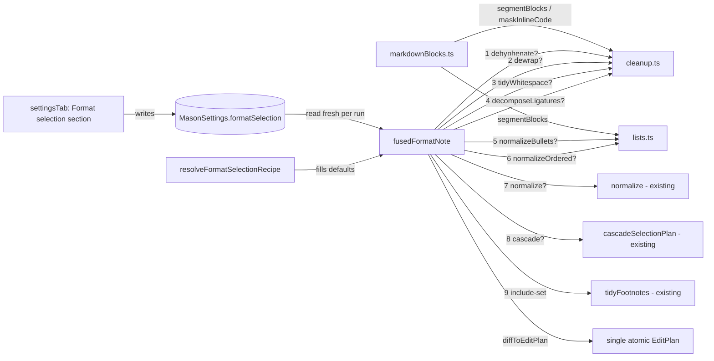
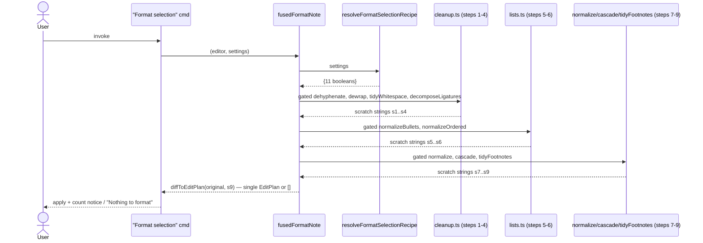

# Solution Design Document

## Validation Checklist

### CRITICAL GATES (Must Pass)

- [x] All required sections are complete (inapplicable subsections marked N/A with reason)
- [x] No [NEEDS CLARIFICATION] markers remain
- [x] Architecture pattern is clearly stated with rationale
- [x] All architecture decisions confirmed by user (ADR-20 through ADR-24 — confirmed 2026-06-28)
- [x] Every interface has specification

### QUALITY CHECKS (Should Pass)

- [x] Context sources listed with relevance
- [x] Project commands discovered from package.json
- [x] Constraints → Strategy → Design → Implementation path is logical
- [x] Each modified component maps to a directory
- [x] Error handling covers the relevant cases (no-op, all-off, markdown-safe pass-through)
- [x] Quality requirements are specific (idempotency, byte-identity, single-edit invariant)
- [x] Names consistent across sections
- [x] A developer could implement from this design

---

## Constraints

CON-1 **TypeScript strict; Obsidian plugin (Editor/Setting APIs); single-undo via one
EditPlan.** All new transforms produce an `EditPlan` applied via the existing
`diffToEditPlan` → one CM6 transaction → one undo step guarantee. No new runtime
dependencies.

CON-2 **Core purity.** `src/core/*` carries ZERO obsidian imports. The compliance sweep
(`test/compliance.test.ts`) enforces this statically. The three new core modules —
`markdownBlocks.ts`, `cleanup.ts`, `lists.ts` — are subject to this rule along with
the existing modules. Pure functions; unit-testable without an Obsidian environment.

CON-3 **No unsupported Obsidian API.** The six new commands register via `plugin.addCommand`
(same pattern as existing built-ins). The settings UI uses `new Setting(containerEl).setName().setDesc().addToggle()` and `new Setting(containerEl).setName(<group>).setHeading()`. **`setHeading()` is a supported, standard Obsidian `Setting` method** — its absence from the spec-003 section was an aesthetic choice, not a compatibility constraint. Using it here for sub-group labels is safe and AT-friendly. No `removeCommand`, no Catalyst-beta fields.

CON-4 **Behavior preservation.** Default-all-on means "Format selection" on a note that
contains no pasted-text artifacts produces output byte-identical to a pre-004 release.
Each new transform returns `[]` when it finds nothing to do; the final
`diffToEditPlan(original, unchanged)` returns `[]`. Existing behavior for the five
spec-003 steps is untouched.

---

## Implementation Context

### Required Context Sources

#### Code Context

```yaml
- file: src/commands.ts
  relevance: CRITICAL
  why: "fusedFormatNote — the fused pipeline that receives six new gated steps"

- file: src/core/formatSelection.ts
  relevance: CRITICAL
  why: "FormatSelectionRecipe — gains six new boolean fields; resolveFormatSelectionRecipe updated"

- file: src/core/types.ts
  relevance: CRITICAL
  why: "MasonSettings.formatSelection shape (unchanged); DEFAULT_SETTINGS gains 6 new true fields"

- file: src/core/registry.ts
  relevance: CRITICAL
  why: "RegistryEntry pattern; buildEntries(); MasonApi interface — gains cleanup + lists namespaces"

- file: src/core/applyToString.ts
  relevance: CRITICAL
  why: "Offset model: edits carry original-doc offsets, applied RTL; used by every new transform"

- file: src/core/noteFootnotes.ts
  relevance: HIGH
  why: "tidyFootnotes + diffToEditPlan — the fused-pipeline tail; offset patterns to follow"

- file: src/ui/settingsTab.ts
  relevance: HIGH
  why: "_renderFormatSelectionSection grows from 5 to 11 toggles with setHeading sub-groups"

- file: test/compliance.test.ts
  relevance: MEDIUM
  why: "CON-2 purity sweep; new core modules must not import from obsidian"
```

#### External APIs

N/A — single in-process Obsidian plugin. No inbound or outbound network interfaces.

### Implementation Boundaries

- **Must Preserve:** "Tidy footnotes" command behavior; all five existing spec-003 recipe
  steps and their relative order (normalize → cascade → tidyFootnotes); every individual
  built-in command; the `mason.*` API contract; the compositional paste flow; single-atomic-edit
  output of "Format selection"; byte-identical all-on output for notes without pasted artifacts.
- **Can Modify:** `fusedFormatNote` (prepend six new gated steps); `FormatSelectionRecipe`
  (six new boolean fields); `resolveFormatSelectionRecipe` (six new `?? true` resolutions);
  `MasonSettings.DEFAULT_SETTINGS` (six new `true` entries); `buildEntries()` (six new factory
  calls); `MasonApi` (two new namespaces); `_renderFormatSelectionSection` (11 toggles + setHeading groups).
- **Must Not Touch:** `tidyFootnotes` signature; `buildPasteChain`; runner; scripts catalog;
  the `mason.*` API contract for the six EXISTING built-ins; offset model in `applyToString`.

### External Interfaces

N/A — single in-process plugin. The only "interface" is the Obsidian plugin settings
store (`loadData`/`saveData`) already in use. New fields are additive; absent fields
resolve to `true` via the resolver (backward-compatible with any previously persisted data).

### Project Commands

```bash
Install:   npm ci
Build:     node esbuild.config.mjs           # append "production" for prod bundle
Test:      npx vitest run
Lint:      npx eslint src/
Types:     npx tsc -noEmit -skipLibCheck
```

---

## Solution Strategy

- **Architecture Pattern:** Pure-core + thin command/UI shell — the existing Mason layering
  unchanged. Six new pure transform functions live in two new core modules; they are wired into
  the existing fused pipeline and registry in the same way the six existing built-ins are.
- **Integration Approach:** Additive. Three new pure modules (`markdownBlocks.ts`, `cleanup.ts`,
  `lists.ts`), six new recipe fields, six new registry entries, six new gated steps in
  `fusedFormatNote`, and eleven toggles (vs five) in the settings section. No existing
  function signatures change. No new commands are registered specially — they follow
  the identical `buildEntries` + `registerCommands` loop as all other built-ins.
- **Justification:** The scratch-string pipeline in `fusedFormatNote` makes "add a step"
  trivial: each new step follows `recipe.<key> ? applyToString(scratch, transform({...ctx, doc: scratch})) : scratch`.
  Skipped steps contribute `[]` and pass the string through. The final `diffToEditPlan(original, afterAll)`
  absorbs all stages into a single Edit — the single-undo guarantee holds for any subset.
- **Key Decisions:** ADR-20 (custom line-based block segmenter — no parser dependency);
  ADR-21 (step order within pipeline); ADR-22 (flat recipe keys + module split); ADR-23
  (setHeading sub-groups in UI); ADR-24 (full built-in exposure under ADR-19 isolation).

---

## Building Block View

### Components



### Directory Map

```
.
├── src/
│   ├── core/
│   │   ├── markdownBlocks.ts   # NEW: pure line-based block segmenter (ADR-20)
│   │   ├── cleanup.ts          # NEW: dewrap, dehyphenate, decomposeLigatures, tidyWhitespace
│   │   ├── lists.ts            # NEW: normalizeBullets, normalizeOrdered
│   │   ├── formatSelection.ts  # MODIFY: FormatSelectionRecipe + 6 fields; resolver + 6 ?? true
│   │   ├── types.ts            # MODIFY: DEFAULT_SETTINGS.formatSelection + 6 true entries
│   │   └── registry.ts         # MODIFY: 6 new RegistryEntry factories; MasonApi += cleanup + lists
│   ├── commands.ts             # MODIFY: fusedFormatNote += steps 1-6 (cleanup + lists)
│   └── ui/
│       └── settingsTab.ts      # MODIFY: _renderFormatSelectionSection — 11 toggles + setHeading
└── test/
    ├── core/
    │   ├── markdownBlocks.test.ts      # NEW: segmenter edge cases per block kind
    │   ├── cleanup.test.ts             # NEW: per-transform correctness + markdown-safety fixtures
    │   ├── lists.test.ts               # NEW: bullet/ordered correctness + nesting + idempotency
    │   └── formatSelection.test.ts     # MODIFY: 11-field resolver defaults
    ├── commands/
    │   └── formatSelection.test.ts     # MODIFY: all-11-on regression; per-step omission; isolation
    └── ui/
        └── settingsTab*.test.ts        # MODIFY: 11 toggles; 4 setHeading groups render + persist
```

---

## Interface Specifications

### Data Storage Changes

Plugin settings only (Obsidian `saveData`). The `MasonSettings.formatSelection` field
shape is `Partial<FormatSelectionRecipe>` — **unchanged**. Only `FormatSelectionRecipe`
grows; existing persisted data with no new keys resolves to `true` via the resolver.

```yaml
FormatSelectionRecipe — MODIFY src/core/formatSelection.ts:
  EXISTING: cascade, normalize, fromCitations, identity, move : boolean
  ADD:      dewrap, dehyphenate, decomposeLigatures, tidyWhitespace,
            normalizeBullets, normalizeOrdered : boolean
  # 5 → 11 total fields; all new fields resolve ?? true when absent

MasonSettings — MODIFY src/core/types.ts:
  FIELD formatSelection?: Partial<FormatSelectionRecipe>   # shape UNCHANGED
  DEFAULT_SETTINGS.formatSelection — ADD 6 new true entries:
    dewrap: true, dehyphenate: true, decomposeLigatures: true,
    tidyWhitespace: true, normalizeBullets: true, normalizeOrdered: true
  # No migration; absent persisted value → all-on via resolver (backward-compatible)
```

### Internal API Changes

```yaml
NEW src/core/markdownBlocks.ts:
  type BlockKind:
    | "paragraph" | "atxHeading" | "setextHeading"
    | "fencedCode" | "indentedCode" | "blockquote"
    | "listItem" | "tableRow" | "thematicBreak"
    | "frontmatter" | "blank"

  interface Block:
    kind:        BlockKind
    startLine:   number   # 0-based, inclusive
    endLine:     number   # 0-based, inclusive
    startOffset: number   # char offset of first character of first line
    endOffset:   number   # char offset just past trailing \n of last line (consistent with NoteDef.to)

  segmentBlocks(doc: string): Block[]
    # Scans doc line-by-line; returns contiguous block groups.
    # Detection priority order (first match per line wins):
    #   1. YAML frontmatter  — only when line 0 is "---"; extends to closing "---"
    #   2. Fenced code open  — /^(\s{0,3})(`{3,}|~{3,})/ when not already fenced
    #   3. Inside fenced     — any line between open and close fence
    #   4. Fenced code close — matching char + length >= open fence length
    #   5. ATX heading       — /^#{1,6}(\s|$)/
    #   6. Blank             — /^\s*$/
    #   7. Blockquote        — /^\s*>/
    #   8. List item         — /^\s*([-*+•–·]|\d+[.)]) /
    #   9. Table row         — /^\s*\|/
    #   10. Thematic break   — /^\s*([-*_]\s*){3,}$/
    #   11. Indented code    — /^    / (four leading spaces)
    #   12. Setext underline — /^(=+|-+)\s*$/ when previous line kind is "paragraph"
    #       → retroactively reclassifies the previous paragraph line as "setextHeading"
    #   13. Paragraph        — default

  maskInlineCode(line: string): string
    # Replace content of all `...` spans with U+0000 placeholder chars of same length.
    # Used by cleanup transforms to skip inline code regions during char-level passes.
    # Handles: single backtick, double backtick (`` `code` ``) spans.
    # Does NOT handle fenced code — callers use segmentBlocks for that.

NEW src/core/cleanup.ts:
  dewrap(ctx: OperationContext): EditPlan
  dehyphenate(ctx: OperationContext): EditPlan
  decomposeLigatures(ctx: OperationContext): EditPlan
  tidyWhitespace(ctx: OperationContext): EditPlan
  # All four: (ctx) → EditPlan; CON-2 pure; idempotent; use segmentBlocks internally.

NEW src/core/lists.ts:
  normalizeBullets(ctx: OperationContext): EditPlan
  normalizeOrdered(ctx: OperationContext): EditPlan
  # Both: (ctx) → EditPlan; CON-2 pure; idempotent; use segmentBlocks internally.

MODIFY src/core/formatSelection.ts:
  interface FormatSelectionRecipe — ADD 6 boolean fields (see Data Storage Changes)
  resolveFormatSelectionRecipe(s: MasonSettings): FormatSelectionRecipe
    # ADD: dewrap ?? true, dehyphenate ?? true, decomposeLigatures ?? true,
    #      tidyWhitespace ?? true, normalizeBullets ?? true, normalizeOrdered ?? true

MODIFY src/core/registry.ts:
  interface MasonApi — ADD cleanup and lists namespaces:
    cleanup: {
      dewrap(ctx: OperationContext): EditPlan;
      dehyphenate(ctx: OperationContext): EditPlan;
      decomposeLigatures(ctx: OperationContext): EditPlan;
      tidyWhitespace(ctx: OperationContext): EditPlan;
    };
    lists: {
      normalizeBullets(ctx: OperationContext): EditPlan;
      normalizeOrdered(ctx: OperationContext): EditPlan;
    };
  buildEntries() — ADD 6 factory calls (ids: cleanup.dewrap, cleanup.dehyphenate,
    cleanup.decomposeLigatures, cleanup.tidyWhitespace, lists.normalizeBullets,
    lists.normalizeOrdered)
  buildApi()     — ADD cleanup and lists namespace builders

MODIFY src/commands.ts:
  fusedFormatNote() — PREPEND steps 1-6 before existing step 7 (normalize)
  IMPORT: dewrap, dehyphenate, decomposeLigatures, tidyWhitespace from core/cleanup
  IMPORT: normalizeBullets, normalizeOrdered from core/lists
```

### Application Data Models

```pseudocode
ENTITY: FormatSelectionRecipe (MODIFY, pure core — src/core/formatSelection.ts)
  FIELDS (11 total after spec 004):
    cascade, normalize, fromCitations, identity, move : boolean   # spec-003 fields
    dewrap, dehyphenate, decomposeLigatures, tidyWhitespace,
    normalizeBullets, normalizeOrdered : boolean                  # spec-004 additions
  SEMANTICS: which steps "Format selection" runs; absent stored field → true (on)

ENTITY: Block (NEW, pure core — src/core/markdownBlocks.ts)
  FIELDS: kind: BlockKind; startLine, endLine: number; startOffset, endOffset: number
  SEMANTICS: a contiguous region of the document classified by its markdown block type;
             used by cleanup.ts and lists.ts to skip or scope transformations
```

### Integration Points

N/A — single in-process plugin. No inter-process or network integration.

---

## Implementation Examples

### Example 1: Block segmenter (`src/core/markdownBlocks.ts`)

The segmenter resolves all state in a single top-to-bottom line scan. Fenced code and
frontmatter take absolute priority; setext heading underlines require one step of
look-back to retroactively reclassify the preceding paragraph line.

```typescript
// src/core/markdownBlocks.ts  (NEW — no obsidian import, CON-2)

export type BlockKind =
  | "paragraph" | "atxHeading" | "setextHeading"
  | "fencedCode" | "indentedCode" | "blockquote"
  | "listItem" | "tableRow" | "thematicBreak"
  | "frontmatter" | "blank";

export interface Block {
  kind: BlockKind;
  startLine: number;   // 0-based, inclusive
  endLine: number;     // 0-based, inclusive
  startOffset: number; // char offset of first char of startLine
  endOffset: number;   // char offset just past trailing \n of endLine
}

export function segmentBlocks(doc: string): Block[] {
  const lines = doc.split("\n");

  // Pre-compute per-line start offsets
  const lineStart: number[] = [];
  let off = 0;
  for (const l of lines) { lineStart.push(off); off += l.length + 1; }

  // Phase 1: classify each line
  const kinds: BlockKind[] = new Array(lines.length);
  let fenceChar: string | null = null;
  let fenceLen = 0;
  let inFrontmatter = false;

  for (let i = 0; i < lines.length; i++) {
    const line = lines[i]!;

    // Frontmatter — only at document start
    if (i === 0 && line === "---") {
      inFrontmatter = true; kinds[i] = "frontmatter"; continue;
    }
    if (inFrontmatter) {
      kinds[i] = "frontmatter";
      if (line === "---" && i > 0) inFrontmatter = false;
      continue;
    }

    // Fenced code — track open/close; overrides all other classification inside
    const fenceM = /^(\s{0,3})(`{3,}|~{3,})/.exec(line);
    if (fenceM) {
      const ch = fenceM[2]![0]!; const len = fenceM[2]!.length;
      if (fenceChar === null) {
        fenceChar = ch; fenceLen = len; kinds[i] = "fencedCode";
      } else if (ch === fenceChar && len >= fenceLen) {
        kinds[i] = "fencedCode"; fenceChar = null; fenceLen = 0;
      } else {
        kinds[i] = "fencedCode"; // different char/shorter — still inside outer fence
      }
      continue;
    }
    if (fenceChar !== null) { kinds[i] = "fencedCode"; continue; }

    // Ordered classification (first match wins)
    if (/^#{1,6}(\s|$)/.test(line))         { kinds[i] = "atxHeading";    continue; }
    if (/^\s*$/.test(line))                  { kinds[i] = "blank";         continue; }
    if (/^\s*>/.test(line))                  { kinds[i] = "blockquote";    continue; }
    if (/^\s*([-*+•–·]|\d+[.)]) /.test(line)){ kinds[i] = "listItem";      continue; }
    if (/^\s*\|/.test(line))                 { kinds[i] = "tableRow";      continue; }
    if (/^\s*([-*_]\s*){3,}$/.test(line))   { kinds[i] = "thematicBreak"; continue; }
    if (/^    /.test(line))                  { kinds[i] = "indentedCode";  continue; }

    // Setext underline: ={1,} or -{1,} following a paragraph line
    if (/^=+\s*$/.test(line) && i > 0 && kinds[i - 1] === "paragraph") {
      kinds[i] = "setextHeading"; kinds[i - 1] = "setextHeading"; continue;
    }
    if (/^-+\s*$/.test(line) && i > 0 && kinds[i - 1] === "paragraph") {
      kinds[i] = "setextHeading"; kinds[i - 1] = "setextHeading"; continue;
    }

    kinds[i] = "paragraph";
  }

  // Phase 2: group consecutive same-kind lines into Block objects
  // (blank lines are always single-line blocks)
  const blocks: Block[] = [];
  let i = 0;
  while (i < lines.length) {
    const kind = kinds[i]!;
    let j = i;
    if (kind !== "blank") {
      while (j + 1 < lines.length && kinds[j + 1] === kind) j++;
    }
    const startOffset = lineStart[i]!;
    const endLine = j;
    // endOffset: past trailing \n of last line (clamped to doc length)
    const rawEnd = lineStart[endLine]! + lines[endLine]!.length + 1;
    const endOffset = Math.min(rawEnd, doc.length);
    blocks.push({ kind, startLine: i, endLine, startOffset, endOffset });
    i = j + 1;
  }
  return blocks;
}

/** Replace the content of inline `code` spans with U+0000 of equal length. */
export function maskInlineCode(line: string): string {
  return line.replace(/`[^`]*`/g, (m) => "`" + "\0".repeat(m.length - 2) + "`");
}
```

### Example 2: `dewrap` transform (`src/core/cleanup.ts` excerpt)

Dewrap iterates only `"paragraph"` blocks from `segmentBlocks`. It joins each
paragraph's internal lines with a single space and emits one Edit per paragraph
that has more than one line. Code fences, headings, lists, etc. are inherently
skipped because they have a different block kind.

```typescript
// src/core/cleanup.ts (NEW — no obsidian import, CON-2)
import type { EditPlan, OperationContext } from "./types";
import { segmentBlocks } from "./markdownBlocks";

export function dewrap(ctx: OperationContext): EditPlan {
  const blocks = segmentBlocks(ctx.doc);
  const plan: EditPlan = [];

  for (const block of blocks) {
    if (block.kind !== "paragraph") continue;

    const text = ctx.doc.slice(block.startOffset, block.endOffset);
    // text may end with "\n" if endOffset is past the last \n
    const hasTrailing = text.endsWith("\n");
    const raw = hasTrailing ? text.slice(0, -1) : text;
    const lineArr = raw.split("\n");
    if (lineArr.length <= 1) continue; // already a single line — no edit needed

    const joined = lineArr.join(" ");
    const insert = hasTrailing ? joined + "\n" : joined;
    plan.push({ from: block.startOffset, to: block.endOffset, insert });
  }

  return plan;
}
```

**Key properties:** idempotent (single-line paragraph → `lineArr.length <= 1` → no edit);
produces at most one Edit per paragraph block; all edits carry original-doc offsets
(ADR-1), applied by `applyToString` RTL without drift.

### Example 3: Extended `FormatSelectionRecipe` and resolver

```typescript
// src/core/formatSelection.ts (MODIFY)
export interface FormatSelectionRecipe {
  // spec-003 fields
  cascade:       boolean;
  normalize:     boolean;
  fromCitations: boolean;
  identity:      boolean;
  move:          boolean;
  // spec-004 additions (flat keys — ADR-22)
  dewrap:            boolean;
  dehyphenate:       boolean;
  decomposeLigatures: boolean;
  tidyWhitespace:    boolean;
  normalizeBullets:  boolean;
  normalizeOrdered:  boolean;
}

export function resolveFormatSelectionRecipe(s: MasonSettings): FormatSelectionRecipe {
  const r = s.formatSelection ?? {};
  return {
    // spec-003
    cascade:       r.cascade       ?? true,
    normalize:     r.normalize     ?? true,
    fromCitations: r.fromCitations ?? true,
    identity:      r.identity      ?? true,
    move:          r.move          ?? true,
    // spec-004
    dewrap:            r.dewrap            ?? true,
    dehyphenate:       r.dehyphenate       ?? true,
    decomposeLigatures: r.decomposeLigatures ?? true,
    tidyWhitespace:    r.tidyWhitespace    ?? true,
    normalizeBullets:  r.normalizeBullets  ?? true,
    normalizeOrdered:  r.normalizeOrdered  ?? true,
  };
}
```

### Example 4: Extended `fusedFormatNote` — complete 11-step pipeline

This is the central integration design. Steps 1–6 are prepended before the existing
normalize (step 7) → cascade (step 8) → tidyFootnotes (step 9) chain. Each step
follows the identical scratch-string gate pattern: `recipe.<key> ? applyToString(sN, transform({...ctx, doc: sN})) : sN`.

```typescript
// src/commands.ts (MODIFY)
import { dewrap, dehyphenate, decomposeLigatures, tidyWhitespace } from "./core/cleanup";
import { normalizeBullets, normalizeOrdered } from "./core/lists";

function fusedFormatNote(editor: Editor, settings: MasonSettings): EditPlan {
  const recipe = resolveFormatSelectionRecipe(settings);
  const ctx = selectionContext(editor, settings);
  const original = ctx.doc;

  // Step 1: dehyphenate — MUST precede dewrap (keys on `-\n` across line boundary)
  const s1 = recipe.dehyphenate
    ? applyToString(original, dehyphenate({ ...ctx, doc: original }))
    : original;

  // Step 2: dewrap — joins paragraph lines after split words are stitched
  const s2 = recipe.dewrap
    ? applyToString(s1, dewrap({ ...ctx, doc: s1 }))
    : s1;

  // Step 3: tidyWhitespace
  const s3 = recipe.tidyWhitespace
    ? applyToString(s2, tidyWhitespace({ ...ctx, doc: s2 }))
    : s2;

  // Step 4: decomposeLigatures
  const s4 = recipe.decomposeLigatures
    ? applyToString(s3, decomposeLigatures({ ...ctx, doc: s3 }))
    : s3;

  // Step 5: normalizeBullets
  const s5 = recipe.normalizeBullets
    ? applyToString(s4, normalizeBullets({ ...ctx, doc: s4 }))
    : s4;

  // Step 6: normalizeOrdered
  const s6 = recipe.normalizeOrdered
    ? applyToString(s5, normalizeOrdered({ ...ctx, doc: s5 }))
    : s5;

  // Step 7: normalize — close heading gaps (EXISTING; relative order preserved)
  const s7 = recipe.normalize
    ? applyToString(s6, normalize({ ...ctx, doc: s6 }))
    : s6;

  // Step 8: cascade — selection-scoped (EXISTING; relative order preserved)
  let s8 = s7;
  if (recipe.cascade && ctx.selection !== undefined) {
    const cascadeEntry = buildRegistry().entries.find((e) => e.id === "headings.cascade");
    if (cascadeEntry) {
      const { plan: cascadePlan, noContextHeading } = cascadeSelectionPlan(
        cascadeEntry, { ...ctx, doc: s7 }
      );
      if (!noContextHeading && cascadePlan && cascadePlan.length > 0) {
        s8 = applyToString(s7, cascadePlan);
      }
    }
  }

  // Step 9: tidyFootnotes C→O+D→M (EXISTING; relative order preserved)
  const tidyPlan = tidyFootnotes({ ...ctx, doc: s8 }, {
    fromCitations: recipe.fromCitations,
    identity:      recipe.identity,
    move:          recipe.move,
  });
  const s9 = applyToString(s8, tidyPlan);

  // Single diff → one atomic Edit → one CM6 transaction → one undo step.
  // Returns [] when nothing changed → caller shows "Nothing to format".
  return diffToEditPlan(original, s9);
}
```

**Why this order is correct (ADR-21):**
- dehyphenate before dewrap: dehyphenate detects `-\n` patterns; if dewrap joins lines
  first, the hyphen-newline is replaced by a space and OCR splits are missed permanently.
- tidyWhitespace before decomposeLigatures: double-space collapse happens on the raw
  text before any glyph substitution, avoiding any edge interaction.
- cleanup (1-4) before lists (5-6) before headings (7-8): structure normalization after
  content cleanup; the reverse would risk dewrap merging a list item into a heading.
- existing steps 7-9 keep their spec-003 relative order: the all-on byte-identity
  regression from spec 003 holds because steps 1-6 contribute `[]` on notes without
  pasted artifacts.

### Example 5: Registry entries + extended `MasonApi`

```typescript
// src/core/registry.ts (MODIFY — additions only shown)

// --- New RegistryEntry factories ---

function buildDewrapEntry(): RegistryEntry {
  return {
    id: "cleanup.dewrap",
    apiName: "mason.cleanup.dewrap",
    command: { name: "Dewrap paragraphs" },
    run(ctx: OperationContext): EditPlan { return dewrap(ctx); },
  };
}

function buildDehyphenateEntry(): RegistryEntry {
  return {
    id: "cleanup.dehyphenate",
    apiName: "mason.cleanup.dehyphenate",
    command: { name: "Dehyphenate words" },
    run(ctx: OperationContext): EditPlan { return dehyphenate(ctx); },
  };
}

function buildDecomposeLigaturesEntry(): RegistryEntry {
  return {
    id: "cleanup.decomposeLigatures",
    apiName: "mason.cleanup.decomposeLigatures",
    command: { name: "Decompose ligatures and punctuation" },
    run(ctx: OperationContext): EditPlan { return decomposeLigatures(ctx); },
  };
}

function buildTidyWhitespaceEntry(): RegistryEntry {
  return {
    id: "cleanup.tidyWhitespace",
    apiName: "mason.cleanup.tidyWhitespace",
    command: { name: "Tidy whitespace" },
    run(ctx: OperationContext): EditPlan { return tidyWhitespace(ctx); },
  };
}

function buildNormalizeBulletsEntry(): RegistryEntry {
  return {
    id: "lists.normalizeBullets",
    apiName: "mason.lists.normalizeBullets",
    command: { name: "Normalize bullets" },
    run(ctx: OperationContext): EditPlan { return normalizeBullets(ctx); },
  };
}

function buildNormalizeOrderedEntry(): RegistryEntry {
  return {
    id: "lists.normalizeOrdered",
    apiName: "mason.lists.normalizeOrdered",
    command: { name: "Normalize ordered list" },
    run(ctx: OperationContext): EditPlan { return normalizeOrdered(ctx); },
  };
}

// --- Extended MasonApi ---

export interface MasonApi {
  headings: {
    cascade(ctx: OperationContext): EditPlan;
    normalize(ctx: OperationContext): EditPlan;
  };
  footnotes: {
    fromCitations(ctx: OperationContext, parseResult: ParseResult): EditPlan;
    identity(ctx: OperationContext, parseResult: ParseResult): EditPlan;
    move(ctx: OperationContext, defs?: string[]): EditPlan;
  };
  // spec-004 additions
  cleanup: {
    dewrap(ctx: OperationContext): EditPlan;
    dehyphenate(ctx: OperationContext): EditPlan;
    decomposeLigatures(ctx: OperationContext): EditPlan;
    tidyWhitespace(ctx: OperationContext): EditPlan;
  };
  lists: {
    normalizeBullets(ctx: OperationContext): EditPlan;
    normalizeOrdered(ctx: OperationContext): EditPlan;
  };
  util: {
    normalizeUrl(raw: string): string;
  };
}
```

**Isolation (ADR-19, ADR-24):** each registry entry's `run(ctx)` delegates directly to
the pure transform. These paths do NOT read `MasonSettings.formatSelection`. Only
`fusedFormatNote` reads the recipe. The individual commands and `mason.*` API methods
execute fully regardless of toggle state — identical behavior to the existing six built-ins.

### Example 6: Test assertions as interface contracts

```typescript
// Regression: all-11-on output is byte-identical to all-on pre-004 behavior
// (new transforms contribute [] on clean notes — no pasted artifacts present)
expect(fusedFormatNote(edClean, allOn)).toEqual([]);

// Dewrap: disabled step is absent; enabled steps still apply
const plan = fusedFormatNote(edWrapped, { ...allOn, formatSelection: { ...on, dewrap: false } });
expect(appliedDoc(plan)).toContain("hard\nwrapped");  // lines NOT joined

// Isolation: individual command ignores recipe
const ctxOff = buildCtx(edWrapped, allOff);
expect(dewrap(ctxOff.doc)).not.toEqual([]);  // executes fully

// Idempotency: second pass on already-cleaned text produces []
const cleaned = applyToString(original, fusedFormatNote(edPasted, allOn));
const edCleaned = buildEditor(cleaned);
expect(fusedFormatNote(edCleaned, allOn)).toEqual([]);

// All-off: no-op
expect(fusedFormatNote(edAny, allOff)).toEqual([]);
```

---

## Runtime View

### Primary Flow: Run "Format selection"

1. User selects text (or leaves cursor), invokes "Format selection".
2. `fusedFormatNote` calls `resolveFormatSelectionRecipe(plugin.settings)` — live read,
   no reload required.
3. Steps 1-9 execute in order on sequential scratch strings. Each disabled step
   contributes `[]` and passes the scratch string unchanged; enabled steps emit their
   plan and the string advances.
4. `diffToEditPlan(original, s9)` produces a minimal single Edit, or `[]` if unchanged.
5. Caller: empty plan → `new Notice("Nothing to format")`; non-empty → `applyEditPlan(editor, plan)` + count notice.



### Error Handling

- **Empty plan (no artifacts found):** `diffToEditPlan` returns `[]` → caller shows
  "Nothing to format"; no document mutation. Covers all-off, all-on-clean-note,
  and any per-step no-match case.
- **No selection:** `selectionContext` produces `ctx.selection = undefined`. The cascade
  gate already skips when `ctx.selection === undefined`. New steps operate on the full
  `ctx.doc` regardless of selection (consistent with normalize/tidyFootnotes behavior).
- **Markdown-unsafe input:** the segmenter classifies every block kind before any
  transform runs. Code fences, headings, lists, and tables are never classified as
  `"paragraph"`, so dewrap never touches them. Other transforms check `segmentBlocks`
  output or use `maskInlineCode` before any char-level replacement.
- **No throwing path introduced:** segmenter and transforms are total functions; empty
  doc, single-line doc, and all-code-fence docs all return `[]`.

### Complex Logic

**Setext heading ambiguity (segmenter):** A line matching `/^-+\s*$/` could be a setext
heading underline OR a thematic break. The disambiguation rule: it is a `setextHeading`
underline iff the immediately preceding classified line is `"paragraph"`. In all other
cases (blank preceding line, heading, list item, etc.) it is a `thematicBreak`. This
retroactive reclassification must happen in the same phase-1 pass to be correct — the
`kinds[i - 1] === "paragraph"` check reads the already-classified predecessor.

**Dehyphenate false-positive avoidance:** The pattern `/([a-z])-\n([a-z])/` is
restricted to strictly `[a-z]` on both sides. The transform additionally skips:
(a) any match whose character position falls within a fenced code block (detected via
`segmentBlocks`), and (b) any match within an inline code span (masked via
`maskInlineCode`). A compound hyphen on a single line (`well-known`) contains no `\n`
and is therefore never matched.

**normalizeOrdered nesting:** The transform tracks a stack of `(indentWidth, counter)`
pairs. Each ordered list item's leading whitespace determines its nesting level; when
the indentation increases, a new level is pushed with counter 1; when it decreases, the
stack is popped to the matching level and that counter increments. Only `/^\s*\d+[.)]/`
markers are targeted — alphabetic (`a.`) and roman-numeral (`i.`) patterns are untouched.

**Offset fusion across 9 steps:** Each step receives `{ ...ctx, doc: sN }` where `sN`
is the current scratch string. This means each step's EditPlan offsets are valid against
the CURRENT scratch string, not the original. `applyToString(sN, plan)` produces `sN+1`.
The final `diffToEditPlan(original, s9)` produces a plan whose offsets are valid against
the original doc — the only offsets that `applyEditPlan(editor, plan)` will apply to
the live document. This is identical to the existing tidyFootnotes fusion pattern.

---

## Deployment View

No change. Same single `main.js` bundle; same release pipeline (semantic-release on
push to main; Node 22). No env vars, no feature flags. The six new recipe fields appear
in `plugin.data.json` after the user's first save with defaults; absent on first load,
the resolver materializes all-true transparently.

---

## Cross-Cutting Concepts

### System-Wide Patterns

- **Settings read freshness:** `fusedFormatNote` reads `plugin.settings` via
  `resolveFormatSelectionRecipe` on every invocation — live effect with no re-registration,
  consistent with the existing five recipe fields.
- **Pure core / offset convention (ADR-1, CON-2):** all six new transforms are obsidian-free,
  produce EditPlans with original-doc offsets, and compose via `applyToString` scratch strings.
  The `segmentBlocks` helper is also pure and carries no Obsidian import.
- **Idempotency invariant:** every transform is designed to converge in one pass. A
  transform applied to its own output returns `[]`. This must be verified by automated
  two-pass tests for every transform before ship (see Quality Requirements).
- **EMPTY_NOTICES map in commands.ts:** the six new entries follow the same pattern as
  the existing five. Command names are sentence-case; EMPTY_NOTICES keys are the registry
  id strings (`"cleanup.dewrap"`, etc.); messages are plain English, sentence-case.
- **Logging:** no new Notice infrastructure. Existing count notice
  (`Mason: N change / N changes`) applies when a step produces at least one edit.

### User Interface & UX

**Entry point** — the existing "Format selection" segment (already a named tab in the
segmented control; no change to the nav bar). `_renderFormatSelectionSection` grows from
5 to 11 toggles, organized into four labeled sub-groups via `setHeading`.

**Sub-group structure and toggle copy (sentence case, matching command names):**

```
[ General | Scripts | Commands | Format selection | Advanced ]
┌──────────────────────────────────────────────────────────────┐
│  Choose which steps "Format selection" runs.                  │
│                                                               │
│  Cleanup ————————————————————————————————————————————————     │
│   [✓] Dewrap paragraphs                                       │
│       Re-join hard-wrapped lines into full paragraphs,        │
│       skipping code, headings, lists, blockquotes, and        │
│       tables.                                                 │
│   [✓] Dehyphenate words                                       │
│       Remove end-of-line hyphens that split words across      │
│       lines (OCR and PDF artifacts), for lowercase-to-        │
│       lowercase splits only.                                  │
│   [✓] Decompose ligatures and punctuation                     │
│       Replace Unicode ligature glyphs (fi, æ, œ...) and       │
│       typographic punctuation (curly quotes, em dash,         │
│       ellipsis) with plain ASCII equivalents.                 │
│   [✓] Tidy whitespace                                         │
│       Collapse double spaces, remove trailing whitespace,     │
│       and squeeze three or more blank lines to one.           │
│                                                               │
│  Lists ——————————————————————————————————————————————————     │
│   [✓] Normalize bullets                                       │
│       Replace all unordered bullet markers (*, +, •, –, ·)   │
│       with a canonical dash (-), preserving nesting and       │
│       checkbox syntax.                                        │
│   [✓] Normalize ordered list                                  │
│       Renumber ordered lists sequentially (1. 2. 3.) per      │
│       nesting level.                                          │
│                                                               │
│  Headings ———————————————————————————————————————————————     │
│   [✓] Cascade headings                                        │
│   [✓] Normalize headings                                      │
│                                                               │
│  Footnotes ——————————————————————————————————————————————     │
│   [✓] Convert citations to footnotes                          │
│   [✓] Resolve footnote identity                               │
│   [✓] Move footnotes to resources                             │
└──────────────────────────────────────────────────────────────┘
```

**Implementation note — setHeading:** Each sub-group header is rendered as:
```typescript
new Setting(containerEl).setName("Cleanup").setHeading();
```
This produces a visually distinct group label using the standard Obsidian `Setting`
method — accessible to screen readers and keyboard users without any custom DOM
construction. The four calls (Cleanup, Lists, Headings, Footnotes) replace the
existing intro-only `Setting` and add structural hierarchy that 11 flat toggles
would lack (CON-3: `setHeading()` is standard, supported Obsidian API — see also
`settingsTab.ts` line 69 comment confirming this convention for section headings).

**UI order vs execution order (within Cleanup group):** The four Cleanup toggles
appear in the wireframe order (dewrap, dehyphenate, decompose, tidy) for conceptual
clarity — dewrap is the headline operation. The internal execution order (dehyphenate → dewrap → tidyWhitespace → decomposeLigatures) is an implementation
detail transparent to the user. Both orderings are documented; the `setDesc` for
"Dehyphenate words" notes that it runs before dewrap for correctness.

**Each `onChange` handler follows the existing pattern** (initialize the
`formatSelection` object if absent, set the field, call `saveSettings`):
```typescript
.addToggle((t) => {
  t.setValue(recipe.dewrap).onChange(async (v) => {
    if (!this._plugin.settings.formatSelection) {
      this._plugin.settings.formatSelection = {};
    }
    this._plugin.settings.formatSelection.dewrap = v;
    await this._plugin.saveSettings();
  });
});
```

---

## Architecture Decisions

- [x] **ADR-20: Markdown awareness via a custom pure line-based block segmenter (`markdownBlocks.ts`) — no parser dependency**
  - **Status:** accepted
  - **Context:** Every new transform needs to skip or respect fenced code blocks,
    headings, list items, blockquotes, table rows, frontmatter, and thematic breaks.
    The reference competitor (`benature/obsidian-text-format`) is markdown-blind and
    destroys structure indiscriminately; Mason's differentiator is precisely the inverse.
    Options: (a) a full markdown AST parser (remark/micromark), (b) a custom line-based
    segmenter, (c) ad-hoc per-transform regex guards.
  - **Decision:** Custom pure line-based segmenter (`segmentBlocks`) shared across all
    six transforms. No AST parser dependency.
  - **Rationale:** CON-2 purity is non-negotiable — no Obsidian import in `src/core/*`.
    A full AST parser would add bundle weight, introduce a dependency, and produce a
    richer AST than six text transforms need. Ad-hoc guards duplicate logic and diverge.
    A shared segmenter is the minimal correct abstraction: one place to get block
    detection right, exhaustively tested, used by all transforms. The transforms need
    only "which lines are inside a code fence / list / table", not a full syntax tree.
  - **Trade-offs:** Hand-maintained block detection; must cover all CommonMark/GFM
    block types correctly. Mitigated by exhaustive edge-case unit tests for every block
    kind (fenced vs indented code, setext vs thematic break, frontmatter only at doc
    start, nested blockquotes, lazy list continuations).
  - **User confirmed:** Yes (2026-06-28)

- [x] **ADR-21: Step order Cleanup → Lists → Headings → Footnotes, with dehyphenate before dewrap and existing steps' relative order preserved**
  - **Status:** accepted
  - **Context:** Nine active steps in `fusedFormatNote` (6 new + 3 existing). The new
    steps must be prepended in a correct order; the existing order (normalize → cascade →
    tidyFootnotes) is proven and must not change (spec-003 byte-identity regression).
  - **Decision:** Fixed execution order:
    1. dehyphenate, 2. dewrap, 3. tidyWhitespace, 4. decomposeLigatures,
    5. normalizeBullets, 6. normalizeOrdered, 7. normalize, 8. cascade, 9. tidyFootnotes.
  - **Rationale:** Dehyphenate must precede dewrap — it detects `-\n` across a line
    boundary; dewrap would erase that boundary. Cleanup (content-level) before Lists
    (structural-level) before Headings before Footnotes: clean raw text first, then
    normalize structural elements. This matches the UI group order (Cleanup / Lists /
    Headings / Footnotes), making the execution order cognitively predictable. TidyWhitespace
    before decomposeLigatures avoids any interaction between double-space collapse and
    multi-char glyph substitution. Existing steps 7-9 are untouched in relative order.
  - **Trade-offs:** List normalization sits before footnote processing (steps 5-6 before
    step 9) — these are independent and safe in either order. Step order is fixed and
    non-user-reorderable (PRD Won't Have).
  - **User confirmed:** Yes (2026-06-28)

- [x] **ADR-22: Flat recipe keys, two pure modules (cleanup.ts, lists.ts), and a shared segmenter (markdownBlocks.ts)**
  - **Status:** accepted
  - **Context:** Six new transforms need core homes (CON-2), recipe field names, and a
    shared block-detection utility. Options for module layout: (a) one combined
    `textTransforms.ts`, (b) one module per transform, (c) two family modules + one
    shared utility.
  - **Decision:** Three new modules — `markdownBlocks.ts` (shared segmenter), `cleanup.ts`
    (four char-level transforms), `lists.ts` (two structural transforms) — with six flat
    recipe keys (`dewrap`, `dehyphenate`, `decomposeLigatures`, `tidyWhitespace`,
    `normalizeBullets`, `normalizeOrdered`).
  - **Rationale:** Flat keys match the spec-003 recipe pattern (five flat booleans, not
    namespaced). Resolvers and settings UI code stay trivially consistent. The two-family
    module split mirrors the registry namespacing (`cleanup.*`, `lists.*`) and groups
    transforms by operation class without over-fragmenting the directory. The shared
    segmenter avoids duplicating block-detection logic across four cleanup transforms
    and two list transforms.
  - **Trade-offs:** Recipe key names diverge slightly from dotted registry ids
    (`decomposeLigatures` vs `cleanup.decomposeLigatures`) — documented here; the
    mapping is the six flat keys in `FormatSelectionRecipe` and the six dotted ids in
    `RegistryEntry`. This is the same pattern as `fromCitations` (recipe key) vs
    `footnotes.fromCitations` (registry id).
  - **User confirmed:** Yes (2026-06-28)

- [x] **ADR-23: Settings toggles grouped via `setHeading` into Cleanup / Lists / Headings / Footnotes**
  - **Status:** accepted
  - **Context:** The Format selection settings section grows from 5 to 11 toggles. Eleven
    flat toggles without structure are hard to scan (PRD Risk: "11-toggle settings section
    is visually overwhelming"). Spec 003 explicitly noted "`setHeading` not used elsewhere
    in this tab" — but that was an aesthetic omission, not a compatibility constraint.
  - **Decision:** Four `new Setting(containerEl).setName(<group>).setHeading()` calls
    precede the toggles for their group: Cleanup (4 toggles), Lists (2), Headings (2),
    Footnotes (3). Groups appear in execution order.
  - **Rationale:** `setHeading()` is a standard, supported Obsidian `Setting` method,
    used for sub-section labels in many community plugins and in Obsidian's own settings.
    It is accessible (screen-reader-compatible; produces a DOM structure that assistive
    technology can navigate). It requires no custom DOM construction (`createEl`, etc.)
    and produces no markup that could fail Obsidian's CSP. Four groups impose scannable
    visual hierarchy on what would otherwise be an overwhelming flat list.
  - **Trade-offs:** Evolves the spec-003 no-setHeading pattern. The change is local to
    `_renderFormatSelectionSection`; no other settings sections are affected.
  - **User confirmed:** Yes (2026-06-28)

- [x] **ADR-24: Full built-in exposure — each transform is an individual command, a `mason.*` API method, AND a recipe toggle, under ADR-19 isolation**
  - **Status:** accepted
  - **Context:** ADR-19 establishes that the recipe toggles affect ONLY `fusedFormatNote`.
    The six new transforms could be: (a) recipe-only (no individual commands, no API),
    (b) individual commands only (no API), or (c) full built-in exposure (command + API
    + recipe toggle), consistent with the existing six built-ins.
  - **Decision:** Full built-in exposure. Each transform appears in `buildEntries()` as
    a `RegistryEntry` (with `command.name` in sentence case), in `buildApi()` as a
    `mason.cleanup.*` or `mason.lists.*` method, and as a recipe toggle in
    `FormatSelectionRecipe`. The ADR-19 isolation rule applies: commands and API ignore
    the recipe.
  - **Rationale:** Consistency with the existing six built-ins is the strongest argument.
    Script authors (`mason.*` API users) expect to compose cleanup transforms independently
    in paste-flow scripts. Individual commands give power users direct access without
    running the full composite. The only cost is a slightly larger command palette (6 new
    entries); the benefit is a complete, composable API surface.
  - **Trade-offs:** Six new command palette entries. Mitigated by descriptive names and
    existing precedent (the palette already has 8 entries pre-004).
  - **User confirmed:** Yes (2026-06-28)

---

## Quality Requirements

- **Idempotency (fixpoint):** Each of the six transforms applied to its own output
  returns `[]`. Running "Format selection" twice on the same text with the same toggles
  produces identical output. Verified by automated two-pass tests for every transform
  and for the full composite.
- **Single atomic edit:** Any subset of enabled steps yields at most one Edit (one CM6
  transaction, one undo step). Invariant: `fusedFormatNote(...)` returns `EditPlan`
  of length 0 or 1. Verified by test assertion on returned plan length.
- **Markdown-structure preservation:** No transform corrupts, deletes, or reorders
  fenced code blocks, indented code, ATX headings, setext headings, thematic breaks,
  blockquotes, list items, table rows, or YAML frontmatter. Verified by structural
  fixture tests that run each transform against every block type and assert byte-identity
  for the structural lines.
- **All-on byte-identity (regression):** With all 11 toggles enabled, "Format selection"
  on a note containing no pasted-text artifacts produces `[]` (no change). The six new
  transforms each return `[]` when their trigger conditions are absent. Verified by a
  fixture that runs the full composite on a clean structured note.
- **Isolation (ADR-19):** Individual commands and `mason.*` API methods execute their
  full operations regardless of toggle state. Verified by tests that run each transform
  with `allOff` settings and assert a non-empty plan on a doc that has matching content.
- **Performance:** All six transforms are linear in doc length (one or two line scans,
  no quadratic loops). The segmenter runs in O(lines) and is shared; the overall
  overhead for a typical note (< 10 000 lines) is negligible compared to `applyToString`
  and `diffToEditPlan`.

---

## Acceptance Criteria (EARS)

**Feature 1: Dewrap**

- [ ] WHEN "Format selection" runs with dewrap enabled and the selection contains consecutive non-blank lines with no structural marker, THE SYSTEM SHALL join those lines into a single continuous paragraph line.
- [ ] WHERE dewrap is enabled and the selection contains a fenced code block, THE SYSTEM SHALL not join or alter any lines inside the opening and closing fences.
- [ ] WHERE dewrap is enabled and the selection contains an ATX heading (line starting with `#`) or a setext heading underline (`===` or `---`), THE SYSTEM SHALL not join the heading line to the line before or after it.
- [ ] WHERE dewrap is enabled and the selection contains list-item lines (starting with `-`, `*`, `+`, or a digit followed by `.` or `)`), THE SYSTEM SHALL not join list-item boundary lines to preceding lines.
- [ ] WHERE dewrap is enabled and the selection contains blockquote lines (starting with `>`), THE SYSTEM SHALL not merge lines across a blockquote boundary.
- [ ] WHERE dewrap is enabled and two or more paragraphs are separated by one or more blank lines, THE SYSTEM SHALL preserve the blank-line boundary and not join the two paragraphs.

**Feature 2: Dehyphenate**

- [ ] WHEN dehyphenate is enabled and the selection contains a word split by a hyphen at line end where both sides consist entirely of lowercase letters (e.g. `exam-\nple`), THE SYSTEM SHALL remove the hyphen and line break and produce the joined word on a single line (e.g. `example`).
- [ ] IF at least one side of a line-end hyphen split contains an uppercase letter or a digit (e.g. `PDF-\nconverter`), THE SYSTEM SHALL leave the split untouched when dehyphenate is enabled.
- [ ] WHERE dehyphenate is enabled and a genuine compound-hyphenated word appears on a single line (e.g. `well-known`), THE SYSTEM SHALL preserve the compound unchanged.
- [ ] WHERE dehyphenate is enabled and a hyphen-at-line-end falls inside a fenced code block or inline code span, THE SYSTEM SHALL not alter the code content.
- [ ] WHERE both dehyphenate and dewrap are enabled, THE SYSTEM SHALL apply dehyphenate before dewrap, resolving split words first so that dewrap subsequently joins the resulting lines into correct paragraphs.

**Feature 3: Decompose ligatures and punctuation**

- [ ] WHEN decompose ligatures and punctuation is enabled and the selection contains any of fi fl ff ffi ffl æ œ, THE SYSTEM SHALL replace each with its ASCII decomposition (fi→fi, fl→fl, ff→ff, ffi→ffi, ffl→ffl, æ→ae, œ→oe) and not alter any other characters.
- [ ] WHEN decompose ligatures and punctuation is enabled and the selection contains Unicode curly double quotes (“ ”) or curly single quotes (‘ ’), THE SYSTEM SHALL replace them with straight ASCII double-quote (") and apostrophe (') respectively.
- [ ] WHEN decompose ligatures and punctuation is enabled and the selection contains an em dash (—) or en dash (–), THE SYSTEM SHALL replace each with a single ASCII hyphen-minus (-).
- [ ] WHEN decompose ligatures and punctuation is enabled and the selection contains a Unicode ellipsis (…), THE SYSTEM SHALL replace it with three consecutive ASCII full stops (...).
- [ ] WHERE decompose ligatures and punctuation is enabled and content is inside a fenced code block or inline code span, THE SYSTEM SHALL not alter the code content.

**Feature 4: Tidy whitespace**

- [ ] WHEN tidy whitespace is enabled and a line's body (non-leading portion) contains two or more consecutive spaces, THE SYSTEM SHALL collapse the run to a single space.
- [ ] WHEN tidy whitespace is enabled and a line has one or more trailing spaces or tabs, THE SYSTEM SHALL remove the trailing whitespace.
- [ ] WHERE tidy whitespace is enabled and three or more consecutive blank lines appear in the selection, THE SYSTEM SHALL collapse them to a single blank line.
- [ ] WHERE tidy whitespace is enabled and content is inside a fenced code block, THE SYSTEM SHALL not modify whitespace inside the block.
- [ ] WHERE tidy whitespace is enabled and the selection contains a markdown table row that uses multiple spaces to align columns, THE SYSTEM SHALL not alter the table cell separators or column alignment.

**Feature 5: Normalize bullets**

- [ ] WHEN normalize bullets is enabled and the selection contains bullet items using any mix of `*`, `+`, `•`, `–`, or `·` as markers, THE SYSTEM SHALL replace every marker with `-` while leaving item text unchanged.
- [ ] WHERE normalize bullets is enabled and the selection contains a nested bullet list with multiple indentation levels, THE SYSTEM SHALL preserve the indentation of each level exactly and replace all markers at all levels with `-`.
- [ ] WHERE normalize bullets is enabled and the selection contains a task-list item in the form `- [ ] task` or `- [x] task`, THE SYSTEM SHALL preserve the checkbox syntax intact and not alter it.
- [ ] WHERE normalize bullets is enabled and the selection contains an ordered list, THE SYSTEM SHALL not alter the ordered list.
- [ ] WHERE normalize bullets is enabled and bullet item text contains a hyphen-like or bullet-like character mid-sentence, THE SYSTEM SHALL not rewrite mid-sentence characters; only line-start markers are targeted.

**Feature 6: Normalize ordered lists**

- [ ] WHEN normalize ordered lists is enabled and the selection contains an ordered list with non-sequential numbers or repeated counters, THE SYSTEM SHALL renumber the list 1. 2. 3. from the top.
- [ ] WHERE normalize ordered lists is enabled and the selection contains a nested ordered list with multiple indentation levels, THE SYSTEM SHALL renumber each nesting level independently starting from 1 and preserve indentation.
- [ ] WHERE normalize ordered lists is enabled and the selection contains a loose ordered list with blank lines between items, THE SYSTEM SHALL preserve the blank-line structure between items and alter only the numbers.
- [ ] WHERE normalize ordered lists is enabled and the selection contains a list using alphabetic markers (a. b. c.) or roman-numeral markers (i. ii. iii.), THE SYSTEM SHALL leave the list untouched.
- [ ] WHERE normalize ordered lists is enabled and the selection contains a bullet list, THE SYSTEM SHALL not alter the bullet list.

**Feature 7: Recipe integration and isolation**

- [ ] WHERE all 11 recipe toggles are enabled and the selected note does not trigger any new transform, THE SYSTEM SHALL produce output byte-identical to a pre-004 release running on the same note.
- [ ] WHEN any subset of the 11 toggles is disabled and "Format selection" is run, THE SYSTEM SHALL omit exactly the disabled steps' effects, apply all enabled steps, and produce the entire result as a single atomic edit.
- [ ] IF all 11 toggles are disabled, THE SYSTEM SHALL apply no document change and display the existing "Nothing to format" notice.
- [ ] WHILE any recipe toggle state is active, WHEN any of the six new transforms is invoked as an individual command, THE SYSTEM SHALL perform its complete operation regardless of recipe toggle state.
- [ ] WHILE any recipe toggle state is active, WHEN a `mason.*` API method for any of the six new transforms is called by a script, THE SYSTEM SHALL execute its full operation unaffected by recipe toggles.
- [ ] WHEN "Format selection" is run a second time on the same text with the same toggle state, THE SYSTEM SHALL produce output identical to the first run (each transform converges to a fixpoint in one pass; idempotency holds).
- [ ] WHERE "Format selection" is run with any combination of the six new transforms enabled and the note contains markdown structure — fenced code blocks, indented code, tables, ordered lists, bullet lists, ATX headings, setext headings, blockquotes, thematic breaks, or YAML frontmatter — THE SYSTEM SHALL not corrupt, delete, or reorder any structural markdown element.

---

## Risks and Technical Debt

### Known Technical Issues

- The existing cascade stage reads selection offsets from the pre-normalize scratch
  string (spec-003 conservative behavior, `commands.ts` line 294). The six new steps
  run before normalize, so `ctx.selection` offsets set by `selectionContext` may be
  slightly stale against `s6` when dewrap has joined lines and shifted positions. This
  is the same conservative behavior that existed in spec 003; it is not introduced by
  this spec. Accepted trade-off until a future offset-tracking pass.

### Technical Debt

- None introduced. The six new registry entries follow the identical pattern as the
  six existing ones. `fusedFormatNote` grows by 6 gated steps using the existing
  scratch-string pattern. No new abstractions are added that require future cleanup.

### Implementation Gotchas

**Segmenter edge cases (highest-risk area — ADR-20):**

1. **Nested fences:** A fenced code block inside a blockquote (`> ` ` ``` ` `) is NOT
   classified as `"fencedCode"` by the current line-based segmenter — the blockquote `>`
   prefix means the fence line starts with `>`, not with backticks. The segmenter
   classifies it as `"blockquote"`, which is conservative and safe: the blockquote block
   is skipped by all transforms. Test with a `> ```code``` >` fixture to confirm.

2. **Lazy list continuations:** In CommonMark, a list item continuation line may lack the
   list marker. The line-based segmenter classifies continuation lines as `"paragraph"`
   unless they have indentation. Dewrap must not join a list item continuation to the
   preceding non-list paragraph. Test: a list item followed by an indented continuation
   followed by a blank line followed by a new paragraph. The blank line boundary prevents
   the merge.

3. **Setext underline vs thematic break:** A line of three or more hyphens (`---`)
   following a blank line is a thematic break, not a setext underline. The segmenter's
   retroactive rule (`kinds[i - 1] === "paragraph"`) correctly distinguishes these, but
   the edge case of `---` following a list item, heading, or blockquote line must be
   covered by a fixture test.

4. **Frontmatter only at document start:** If a `---` line appears elsewhere in the
   document (not at line 0), it is NOT frontmatter. The segmenter checks `i === 0`
   strictly. A document that opens with a blank line before `---` has no frontmatter.

**Dehyphenate false positives:**

5. **Restrict to `[a-z]` both sides:** The pattern is deliberately narrow. Any character
   outside `[a-z]` on either side of the `-\n` gap (uppercase, digit, punctuation)
   suppresses the join. This conservatively avoids stitching compound technical terms,
   proper nouns, or units that legitimately break across lines.

6. **Skip code regions:** The dehyphenate transform must call `segmentBlocks` first and
   skip any line pair where either the hyphen line or the continuation line falls inside
   a `"fencedCode"` block. For inline code spans, mask the line with `maskInlineCode`
   before running the hyphen detection regex.

**Decompose ligatures — W/VV homoglyph trap:**

7. The decomposition table is explicitly restricted to the seven canonical ligatures
   (fi fl ff ffi ffl æ œ) and the standard punctuation set (" " ' ' — – …). ASCII letters
   W and w are NEVER touched. No mapping in the table produces "W" or "VV" as output.
   The table is a closed, enumerated constant — no algorithmic Unicode decomposition
   that might produce unexpected mappings.

**TidyWhitespace and table alignment:**

8. The double-space collapse logic (`/  +/g → " "`) must be gated behind a block kind
   check. Lines in a `"tableRow"` block are skipped entirely — table column alignment
   uses repeated spaces that are semantically significant. The test fixture must include
   a table with aligned columns and assert byte-identity after tidyWhitespace.

**Offset fusion ordering:**

9. Each step receives `{ ...ctx, doc: sN }` — a fresh context with the current scratch
   string. This is load-bearing: if a step is erroneously passed `{ ...ctx, doc: original }`
   after a prior step has changed text length, its offsets will be stale and produce
   garbled output. Every step call in `fusedFormatNote` must use `{ ...ctx, doc: sN }`.

**Idempotency proofs per transform:**

10. Dewrap: `lineArr.length <= 1` guard ensures a single-line paragraph emits no edit.
    After one pass, every paragraph in the output IS a single line → no edit on second pass.
    Dehyphenate: the pattern `/([a-z])-\n([a-z])/` finds no match after joins are applied.
    DecomposeLigatures: the substitution map contains no target that is itself a source.
    TidyWhitespace: after one pass, no line has `  +` runs or trailing spaces; no 3+ blank runs.
    NormalizeBullets: after one pass, all markers are already `-`.
    NormalizeOrdered: after one pass, numbering is sequential; second pass finds no change.

---

## Glossary

### Domain Terms

| Term | Definition | Context |
|------|------------|---------|
| Recipe | The 11 booleans controlling which steps "Format selection" runs | Stored in `MasonSettings.formatSelection`; resolved by `resolveFormatSelectionRecipe` |
| Cleanup transforms | The four char-level transforms: dewrap, dehyphenate, decomposeLigatures, tidyWhitespace | `src/core/cleanup.ts`; recipe steps 1-4 in fusedFormatNote |
| List transforms | The two structural transforms: normalizeBullets, normalizeOrdered | `src/core/lists.ts`; recipe steps 5-6 in fusedFormatNote |
| Block segmenter | `segmentBlocks(doc)` — line-based classification of markdown block types | `src/core/markdownBlocks.ts`; shared by all six new transforms |
| Block kind | Categorical type of a contiguous line group (paragraph, fencedCode, listItem, etc.) | `BlockKind` union in `markdownBlocks.ts` |
| Dewrap | Join hard-wrapped paragraph lines into single continuous lines | PRD Feature 1; cleanup.dewrap; recipe key `dewrap` |
| Dehyphenate | Remove end-of-line hyphens that split words (OCR/PDF artifact) | PRD Feature 2; cleanup.dehyphenate; recipe key `dehyphenate` |
| Decompose ligatures | Replace Unicode ligature glyphs + typographic punctuation with ASCII | PRD Feature 3; cleanup.decomposeLigatures; recipe key `decomposeLigatures` |
| Pasted-text artifacts | The cluster of formatting problems introduced by copy-pasting from PDFs, web pages, or OCR | The problem class motivating all six transforms |

### Technical Terms

| Term | Definition | Context |
|------|------------|---------|
| Scratch string | Intermediate `doc` value produced by `applyToString(sN, plan)` between pipeline steps | The fusion pattern in `fusedFormatNote`; each step receives `{ ...ctx, doc: sN }` |
| Offset fusion | Composing multiple transforms by chaining scratch strings, then diffing original→final | Avoids offset drift across length-changing operations; same pattern as `tidyFootnotes` |
| Fixpoint | The state where a transform applied to its own output returns `[]` | Idempotency invariant; must hold for each transform independently and for the composite |
| maskInlineCode | Helper that replaces inline `` `...` `` content with null chars for safe regex scanning | `markdownBlocks.ts`; used by dehyphenate and decomposeLigatures to skip inline code |
| Flat recipe keys | Six `boolean` fields added directly to `FormatSelectionRecipe` (not namespaced) | ADR-22; `dewrap`, `dehyphenate`, `decomposeLigatures`, `tidyWhitespace`, `normalizeBullets`, `normalizeOrdered` |
| setHeading | Standard `Setting` method that renders a sub-group label in Obsidian settings UI | ADR-23; `new Setting(containerEl).setName("Cleanup").setHeading()` |
