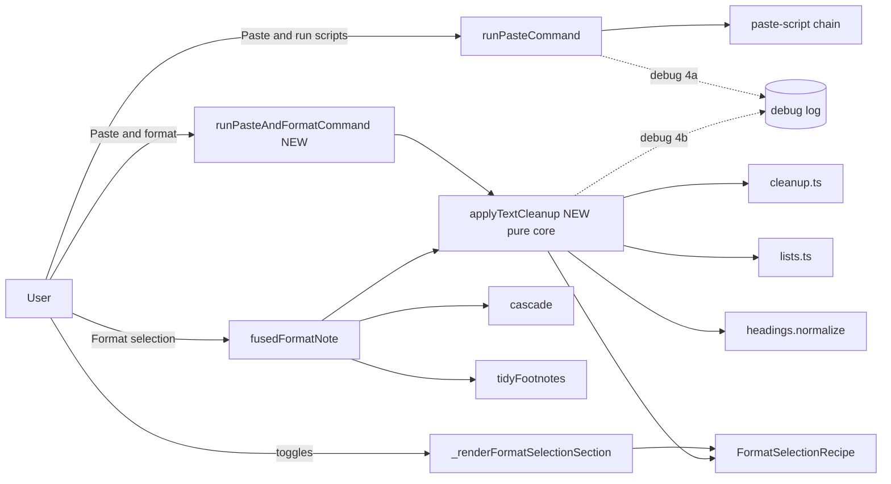
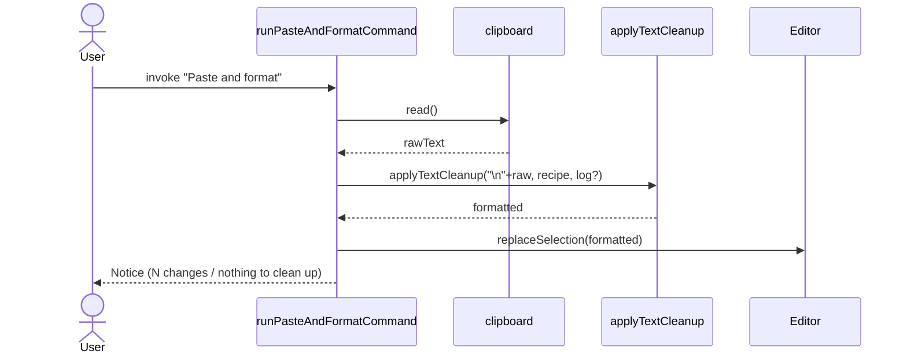

# Solution Design Document

## Validation Checklist

### CRITICAL GATES (Must Pass)

- [x] All required sections are complete
- [x] No [NEEDS CLARIFICATION] markers remain
- [x] Architecture pattern is clearly stated with rationale
- [x] All architecture decisions confirmed by user (ADR-25..28 — confirmed during brainstorm + gap review 2026-06-29)
- [x] Every interface has specification

### QUALITY CHECKS (Should Pass)

- [x] All context sources are listed with relevance ratings
- [x] Project commands are discovered from actual project files
- [x] Constraints → Strategy → Design → Implementation path is logical
- [x] Every component in diagram has directory mapping
- [x] Error handling covers all error types
- [x] Quality requirements are specific and measurable
- [x] Component names consistent across diagrams
- [x] A developer could implement from this design
- [x] Implementation examples use actual symbol names, verified against source
- [x] Complex logic includes traced walkthroughs

---

## Output Schema

### SDD Status Report

| Field | Value |
|-------|-------|
| specId | 005-paste-command-ux |
| architecture | Layered Obsidian plugin: pure core (`src/core`) + impure command/UI shells (`src/commands.ts`, `src/main.ts`, `src/ui`) |
| ADRs | ADR-25..28, all CONFIRMED |
| validationPassed | all critical gates |
| nextSteps | Continue to PLAN |

---

## Constraints

- **CON-1 (purity, inherited):** Modules under `src/core/` MUST NOT import from `obsidian`. The new shared cleanup helper lives in core and stays pure; statically enforced by `test/compliance.test.ts` (CON-2 sweep added in spec 004).
- **CON-2 (single edit / single undo):** Each command invocation produces exactly one editor transaction (one undo step), consistent with existing Mason commands.
- **CON-3 (supported Obsidian API only):** No Catalyst-beta APIs; settings use the standard `Setting`/`addToggle`/`setDesc` methods; UI text is sentence case; no custom DOM.
- **CON-4 (no telemetry):** No analytics. Diagnostics are local debug-log lines, gated by `settings.debugLogging`, and never include document or clipboard content.
- **CON-5 (byte-identity preservation):** Refactoring `fusedFormatNote` to share cleanup logic MUST NOT change its output (spec-004 "Format selection" behavior is frozen).

## Implementation Context

**IMPORTANT**: Read and analyze ALL listed context sources.

### Required Context Sources

#### Documentation Context
```yaml
- doc: docs/XDD/ideas/2026-06-29-paste-command-ux.md
  relevance: CRITICAL
  why: "Validated design + 10 resolved gap-review items — the source of this SDD"
- doc: docs/XDD/specs/004-text-format-transforms/solution.md
  relevance: HIGH
  why: "fusedFormatNote pipeline, FormatSelectionRecipe, transforms, ADR-19 isolation, CON-2 sweep"
- doc: docs/XDD/specs/005-paste-command-ux/requirements.md
  relevance: CRITICAL
  why: "The PRD this design must fully cover (5 features, 22 acceptance criteria)"
```

#### Code Context
```yaml
- file: src/main.ts
  relevance: CRITICAL
  why: "Paste command registration (_registerPasteCommand, id mason.pasteAndFormat, :549), runPasteCommand handler, CommandInjection (:91), buildGatedLogger usage, the no-match/rawFallback path"
- file: src/commands.ts
  relevance: CRITICAL
  why: "fusedFormatNote (the 9-stage pipeline) — steps 1-7 are extracted into applyTextCleanup; EMPTY_NOTICES; countNoticeMessage; the 'Format selection' command"
- file: src/core/cleanup.ts
  relevance: HIGH
  why: "dehyphenate, dewrap, tidyWhitespace, decomposeLigatures — pure transforms the helper chains"
- file: src/core/lists.ts
  relevance: HIGH
  why: "normalizeBullets, normalizeOrdered"
- file: src/core/headings.ts
  relevance: HIGH
  why: "normalize() — step 7; confirmed reads only ctx.doc (no settings/selection)"
- file: src/core/formatSelection.ts
  relevance: HIGH
  why: "FormatSelectionRecipe (11 keys) + resolveFormatSelectionRecipe — the toggle source of truth"
- file: src/core/applyToString.ts
  relevance: MEDIUM
  why: "RTL offset application used to chain transform EditPlans on scratch strings"
- file: src/core/debug.ts
  relevance: MEDIUM
  why: "debug() + buildGatedLogger — the logging seam (4a/4b); gated by debugLogging"
- file: src/ui/settingsTab.ts
  relevance: HIGH
  why: "_renderFormatSelectionSection — settings marker (Component 6) + section copy"
- file: test/ui/formatSelectionSection.test.ts
  relevance: MEDIUM
  why: "Settings-tab test harness to extend for the marker"
```

### Implementation Boundaries
- **Must Preserve:** `fusedFormatNote` / "Format selection" output (byte-identical, CON-5); the paste-script chain behavior of the existing command (only its name/id change); `mason.*` API; CON-2 core purity; the "Tidy footnotes" command.
- **Can Modify:** `src/main.ts` paste command registration + add a new command handler; `src/commands.ts` (extract helper, reuse it); `src/ui/settingsTab.ts` (markers + copy); docs.
- **Must Not Touch:** spec-004 transforms' behavior (cleanup.ts/lists.ts/markdownBlocks.ts internals); the recipe shape.

### External Interfaces
N/A — single in-process Obsidian plugin. No network, no external services, no inbound/outbound APIs, no database. The only OS boundary is the system clipboard (read), already handled by the existing paste command.

### Project Commands
```bash
Install: npm ci
Types:   npx tsc -noEmit -skipLibCheck
Lint:    npx eslint src/
Test:    npx vitest run
Build:   node esbuild.config.mjs            # prod: append "production"
```

## Solution Strategy

- **Architecture Pattern:** Layered — a pure functional core (`src/core`) wrapped by impure command/UI shells. This spec adds one pure core helper and two thin shell behaviors (a new command + a renamed command), plus a UI/settings touch-up and docs.
- **Integration Approach:** Additive and reuse-first. The new "Paste and format" command and the refactored `fusedFormatNote` both consume a single new pure helper `applyTextCleanup`. The renamed command keeps its handler (`runPasteCommand`) untouched.
- **Justification:** Extracting the 7 cleanup steps (already `fusedFormatNote` steps 1–7) into a pure helper removes duplication, keeps the new command scoped to the pasted string (no editor-range gymnastics), guarantees one-undo via a single insert, and preserves "Format selection" byte-for-byte.
- **Key Decisions:** ADR-25 (shared pure helper), ADR-26 (fresh command id), ADR-27 (7-step subset + reuse recipe toggles), ADR-28 (injected logger to keep core pure).

## Building Block View

### Components



### Directory Map

**Component**: markdown-mason (single plugin)
```
.
├── src/
│   ├── core/
│   │   ├── formatPipeline.ts      # NEW: applyTextCleanup(doc, recipe, logger?) — pure, the 7 cleanup steps
│   │   ├── cleanup.ts             # (unchanged) transforms chained by the helper
│   │   ├── lists.ts               # (unchanged)
│   │   ├── headings.ts            # (unchanged) normalize used as step 7
│   │   ├── formatSelection.ts     # (unchanged) recipe + resolver
│   │   └── debug.ts               # (unchanged) debug()/buildGatedLogger — logging seam
│   ├── commands.ts                # MODIFY: fusedFormatNote reuses applyTextCleanup (steps 1-7); recipe-path logging (4b)
│   ├── main.ts                    # MODIFY: rename paste-script command; NEW runPasteAndFormatCommand + registration; CommandInjection seam
│   └── ui/
│       └── settingsTab.ts         # MODIFY: settings marker on the 4 non-applicable toggles + section copy
├── test/
│   ├── core/formatPipeline.test.ts        # NEW: applyTextCleanup unit tests
│   ├── commands/formatSelection.test.ts   # MODIFY: byte-identity regression for fusedFormatNote
│   ├── (new paste-and-format command test) # NEW: under test/ (e.g. test/main.pasteAndFormat.test.ts)
│   └── ui/formatSelectionSection.test.ts  # MODIFY: settings-marker assertions
└── docs/
    ├── README.md, commands-reference.md, usage.md, configuration.md, troubleshooting.md  # MODIFY: 3-command table + rename
```

### Interface Specifications

#### Data Storage Changes
N/A — no schema. Settings shape is unchanged: `MasonSettings.formatSelection?: Partial<FormatSelectionRecipe>` (the same 11-key recipe drives both "Format selection" and "Paste and format"). No new persisted fields.

#### Internal API Changes

```yaml
NEW src/core/formatPipeline.ts:
  type StepLogger = (line: string) => void          # injected; no-op when absent (keeps core pure)
  applyTextCleanup(doc: string, recipe: FormatSelectionRecipe, log?: StepLogger): string
    # Runs the 7 gated cleanup steps IN ORDER on a scratch string, each gated by recipe.<key>:
    #   1 dehyphenate, 2 dewrap, 3 tidyWhitespace, 4 decomposeLigatures,
    #   5 normalizeBullets, 6 normalizeOrdered, 7 normalize (headings)
    # Each step: const sN = recipe.<key> ? applyToString(sPrev, transform({ doc: sPrev, cursor: 0, settings: <minimal> })) : sPrev
    # When a `log` is supplied, emits one line per step (skipped vs N edits). Returns the final scratch string.
    # Ignores the 4 non-cleanup recipe keys (cascade, fromCitations, identity, move).
    # Pure: NO obsidian import.

MODIFY src/commands.ts:
  fusedFormatNote(editor, settings) — steps 1-7 replaced by:
      const recipe = resolveFormatSelectionRecipe(settings)
      const s7 = applyTextCleanup(original, recipe, gatedLog?)   # byte-identical to the inline s1..s7 chain (CON-5)
      ... then existing cascade (step 8) + tidyFootnotes (step 9) unchanged ...
    # Recipe-path logging (4b): when debugLogging on, pass a StepLogger that emits per-step lines + a final result line.

MODIFY src/main.ts:
  _registerPasteCommand() — RENAME the existing command:
      id: "mason.pasteAndRunScripts"   (was "mason.pasteAndFormat")
      name: "Paste and run scripts"    (was "Paste and format")
      editorCallback unchanged → runPasteCommand(...)
  NEW _registerPasteAndFormatCommand():
      id: "mason.pasteAndFormatText"
      name: "Paste and format"
      editorCallback → runPasteAndFormatCommand(editor, settings, injection)
  NEW runPasteAndFormatCommand(editor, settings, injection):
      1. read clipboard (reuse the same reader + empty/unavailable guards as runPasteCommand)
      2. const recipe = resolveFormatSelectionRecipe(settings)
      3. const formatted = stripLeadingNewline(applyTextCleanup("\n" + rawText, recipe, gatedLog?))
         # "\n" prepend prevents a snippet whose first line is "---" from being read as YAML frontmatter (G4)
      4. insert via injection.replaceSelection?.(formatted) ?? editor.replaceSelection(formatted)  # single transaction → one undo
      5. notice: formatted !== rawText ? countNoticeMessage(changeCount) : "Mason: pasted (nothing to clean up)"
      # Does NOT run paste scripts.
  MODIFY CommandInjection:
      + replaceSelection?: (text: string) => void   # test seam to capture inserted text (G7)

MODIFY src/main.ts paste-script logging (4a) — in runPasteCommand, gated by debugLogging:
  for each enabled script: log `paste: <id> canHandle=<bool>`; on match: `paste: matched <id>`. Never log rawText.

MODIFY src/ui/settingsTab.ts:
  _renderFormatSelectionSection — append to setDesc of the 4 toggles NOT run by "Paste and format"
    (cascade, fromCitations, identity, move): " Format selection only — not applied by Paste and format."
    Update the section setDesc to name both commands. No marker on the 7 applied toggles.
```

#### Application Data Models
No new entities. `FormatSelectionRecipe` (11 booleans) is reused as the cleanup-step toggle source for both commands.

#### Integration Points
N/A — no inter-component or external integration. Sole OS boundary: clipboard read (existing).

### Implementation Examples

#### Example 1: `applyTextCleanup` (the shared pure helper)

**Why this example:** It is the core of the spec — both `fusedFormatNote` and the new command depend on it, and it must be byte-identical to `fusedFormatNote`'s current steps 1–7.

```typescript
// src/core/formatPipeline.ts (NEW — no obsidian import, CON-1)
import type { EditPlan, MasonSettings, OperationContext } from "./types";
import type { FormatSelectionRecipe } from "./formatSelection";
import { applyToString } from "./applyToString";
import { dehyphenate, dewrap, tidyWhitespace, decomposeLigatures } from "./cleanup";
import { normalizeBullets, normalizeOrdered } from "./lists";
import { normalize } from "./headings";

export type StepLogger = (line: string) => void;

export function applyTextCleanup(
  doc: string,
  recipe: FormatSelectionRecipe,
  log?: StepLogger,
): string {
  // Minimal context: the 7 transforms read only ctx.doc. settings is required by the
  // OperationContext type but unused by these steps; pass an empty-ish settings.
  const mk = (d: string): OperationContext => ({ doc: d, cursor: 0, settings: {} as MasonSettings });
  const step = (s: string, on: boolean, name: string, fn: (c: OperationContext) => EditPlan): string => {
    if (!on) { log?.(`format: ${name} skipped (toggle off)`); return s; }
    const plan = fn(mk(s));
    log?.(`format: ${name} ${plan.length} edit${plan.length === 1 ? "" : "s"}`);
    return plan.length ? applyToString(s, plan) : s;
  };

  let s = doc;
  s = step(s, recipe.dehyphenate,        "dehyphenate",        dehyphenate);
  s = step(s, recipe.dewrap,             "dewrap",             dewrap);
  s = step(s, recipe.tidyWhitespace,     "tidyWhitespace",     tidyWhitespace);
  s = step(s, recipe.decomposeLigatures, "decomposeLigatures", decomposeLigatures);
  s = step(s, recipe.normalizeBullets,   "normalizeBullets",   normalizeBullets);
  s = step(s, recipe.normalizeOrdered,   "normalizeOrdered",   normalizeOrdered);
  s = step(s, recipe.normalize,          "normalize",          normalize);
  return s;
}
```

> **Byte-identity (CON-5):** today `fusedFormatNote` chains `s1..s7` with the exact same gate pattern (`recipe.<key> ? applyToString(sPrev, transform({ ...ctx, doc: sPrev })) : sPrev`) in the same order. `applyTextCleanup` reproduces that chain. The only behavioral difference in `fusedFormatNote` is that its transforms received `{ ...ctx, doc: sPrev }` (full ctx incl. selection/cursor); since steps 1–7 read only `doc`, passing a minimal ctx is equivalent. A regression test (below) gates this.

#### Example 2: `fusedFormatNote` after refactor (steps 1–7 delegated)

```typescript
// src/commands.ts (MODIFY) — sketch
function fusedFormatNote(editor: Editor, settings: MasonSettings): EditPlan {
  const recipe = resolveFormatSelectionRecipe(settings);
  const ctx = selectionContext(editor, settings);
  const original = ctx.doc;
  const log = settings.debugLogging ? (l: string) => debug(`[MarkdownMason] ${l}`) : undefined;

  const s7 = applyTextCleanup(original, recipe, log);   // steps 1-7 (was inline s1..s7)

  // Step 8: cascade (EXISTING, selection-scoped, null-guard preserved) ... operates on s7
  // Step 9: tidyFootnotes (EXISTING) ... operates on s8
  // return diffToEditPlan(original, s9)  (UNCHANGED)
}
```

#### Example 3: new command handler + frontmatter guard

```typescript
// src/main.ts (NEW) — sketch
async function runPasteAndFormatCommand(editor: Editor, settings: MasonSettings, inj?: CommandInjection): Promise<void> {
  const raw = await readClipboard(inj);            // reuse reader + guards
  if (raw.trim() === "") { new Notice("Mason: clipboard is empty — nothing to paste."); return; }

  const recipe = resolveFormatSelectionRecipe(settings);
  const log = settings.debugLogging ? (l: string) => debug(`[MarkdownMason] ${l}`) : undefined;
  // Prepend "\n" so a snippet whose first line is "---" is NOT classified as frontmatter (G4),
  // then strip exactly that one leading newline back off.
  const formatted = applyTextCleanup("\n" + raw, recipe, log).replace(/^\n/, "");

  const insert = inj?.replaceSelection ?? ((t: string) => editor.replaceSelection(t));
  insert(formatted);                                // single transaction → one undo
  new Notice(formatted !== raw ? countNoticeMessage(countChanges(raw, formatted)) : "Mason: pasted (nothing to clean up)");
}
```

#### Test Examples as Interface Documentation

```typescript
// byte-identity regression (CON-5)
expect(applyTextCleanup(DIRTY, allOnRecipe)).toBe(appliedSteps1to7(DIRTY)); // pre-refactor capture
// scoped, toggle-respecting
expect(applyTextCleanup("a-\nb", { ...allOn, dehyphenate: false })).toBe("a-\nb");
// frontmatter guard
expect(runPasteAndFormat("---\ntitle: x  y\n", allOn)).toContain("title: x y"); // cleaned, not skipped
```

## Runtime View

### Primary Flow: "Paste and format"
1. User runs "Paste and format".
2. System reads the clipboard (guards on empty/unavailable).
3. System resolves the recipe and runs `applyTextCleanup` on `"\n" + raw`, stripping the leading newline.
4. System inserts the formatted text via `replaceSelection` (one transaction).
5. System shows a simple notice (change count or "pasted — nothing to clean up").



### Error Handling
- **Empty clipboard:** Notice "clipboard is empty — nothing to paste"; no edit.
- **Clipboard unavailable (read throws):** Notice "clipboard unavailable — <msg>"; no edit (same as existing paste command).
- **Cleanup produced no change:** still inserts raw text; Notice "pasted (nothing to clean up)" (never "Nothing to format").
- **`---`-first-line snippet:** the `\n`-prepend prevents frontmatter misclassification; content is cleaned.

### Complex Logic
The cleanup chaining/idempotency lives in the spec-004 transforms (unchanged). The only new logic is the `\n` prepend/strip guard and the step-by-step gated chaining (Example 1), which is a direct lift of `fusedFormatNote` steps 1–7.

## Deployment View
No change. Same single `main.js` bundle; semantic-release on merge to main. No env vars, no feature flags, no migration.

## Cross-Cutting Concepts

### User Interface & UX
**Settings marker (Component 6).** In `_renderFormatSelectionSection`, the four toggles that "Paste and format" does not run are marked in their description; the section description names both commands.

```
[ General | Scripts | Commands | Format selection | Advanced ]
┌───────────────────────────────────────────────────────────────┐
│  Choose which steps run. "Format selection" runs all of these; │
│  "Paste and format" runs the Cleanup, Lists, and Normalize-    │
│  headings steps only.                                          │
│                                                               │
│  Cleanup —  [✓] Dewrap paragraphs … (no marker)               │
│  Lists   —  [✓] Normalize bullets … (no marker)               │
│  Headings — [✓] Cascade headings                              │
│                 "… Format selection only — not applied by      │
│                  Paste and format."          ← MARK            │
│             [✓] Normalize headings  (no marker)               │
│  Footnotes—[✓] Convert citations to footnotes  ← MARK         │
│            [✓] Resolve footnote identity        ← MARK         │
│            [✓] Move footnotes to resources      ← MARK         │
└───────────────────────────────────────────────────────────────┘
```

### System-Wide Patterns
- **Logging:** `debug()` + `buildGatedLogger`, gated by `settings.debugLogging`. New lines: 4a (paste-script `canHandle`/match) and 4b (recipe per-step + result). Content is never logged (CON-4).
- **Error handling:** reuse the existing clipboard guards + Notice pattern.
- **Purity:** core stays pure via an injected `StepLogger` (ADR-28) — `applyTextCleanup` imports no logger.

## Architecture Decisions

- [x] **ADR-25: Extract a pure `applyTextCleanup` helper for the 7 cleanup steps**
  - Choice: a new pure core fn reused by `fusedFormatNote` (steps 1–7) and the new command.
  - Rationale: removes duplication; scopes the new command to the pasted string naturally; one-undo via single insert; preserves "Format selection" output.
  - Trade-offs: a refactor of `fusedFormatNote` (mitigated by a byte-identity regression test).
  - User confirmed: Yes (brainstorm 2026-06-29).

- [x] **ADR-26: Fresh command id for the new command**
  - Choice: existing → `mason.pasteAndRunScripts`; new → `mason.pasteAndFormatText` (name "Paste and format").
  - Rationale: a stale hotkey on the old `mason.pasteAndFormat` goes inert (no surprise behavior swap) rather than silently triggering the new command.
  - Trade-offs: the new command's id differs from its display name; acceptable (no install base).
  - User confirmed: Yes (gap review 2026-06-29).

- [x] **ADR-27: "Paste and format" runs the 7-step cleanup subset and reuses the recipe toggles**
  - Choice: 6 cleanup/list transforms + normalize headings; skips cascade + 3 footnote steps; honors the same `FormatSelectionRecipe`.
  - Rationale: cascade/footnotes are document-contextual and degenerate on an isolated paste; one source of truth for cleanup config.
  - Trade-offs: the 7-vs-11 difference must be documented + marked in settings (Features 3 & 5).
  - User confirmed: Yes (brainstorm 2026-06-29).

- [x] **ADR-28: Diagnostic logging via an injected `StepLogger`, debug-gated, content-free**
  - Choice: `applyTextCleanup` takes an optional logger; callers pass a `debugLogging`-gated logger. Paste-script path logs `canHandle`/match.
  - Rationale: keeps core pure (no logger import in `src/core`); makes both the recipe path and the script path diagnosable; never logs content (privacy, CON-4).
  - Trade-offs: log lines are coarse (counts + names), not full diffs — sufficient for diagnosis.
  - User confirmed: Yes (follow-up 2026-06-29).

## Quality Requirements
- **Correctness:** every PRD acceptance criterion has a passing test.
- **Regression:** `fusedFormatNote` output byte-identical pre/post refactor (gated test).
- **Purity:** `src/core/formatPipeline.ts` has zero `obsidian` imports (CON-2 sweep covers it).
- **Performance:** linear in pasted-text length (same transforms as spec 004); no added passes beyond the existing 7.
- **Usability:** one undo per command; sentence-case UI; honest command names.
- **Privacy:** logs never contain document/clipboard text.

## Acceptance Criteria (EARS)

**Naming (PRD F1)**
- [ ] THE SYSTEM SHALL register the paste-script command as "Paste and run scripts" (id `mason.pasteAndRunScripts`).
- [ ] WHEN "Paste and run scripts" runs, THE SYSTEM SHALL behave exactly as the prior command (script match → convert; no match → raw paste).

**Paste and format (PRD F2)**
- [ ] WHEN "Paste and format" runs on artifact-laden clipboard text, THE SYSTEM SHALL insert text with the 7 cleanup steps applied, scoped to the pasted text, as one undo step.
- [ ] WHERE a cleanup toggle is off, THE SYSTEM SHALL skip that step in "Paste and format".
- [ ] THE SYSTEM SHALL NOT run cascade, footnote steps, or paste scripts in "Paste and format".
- [ ] IF the cleanup changes nothing, THEN THE SYSTEM SHALL still insert the raw text and show "pasted (nothing to clean up)".
- [ ] IF the clipboard text begins with `---`, THEN THE SYSTEM SHALL clean it normally (not treat it as frontmatter).
- [ ] WHEN a selection is active, THE SYSTEM SHALL replace it with the formatted clipboard text.
- [ ] IF the clipboard is empty/unavailable, THEN THE SYSTEM SHALL show the guard notice and make no edit.

**Settings marker (PRD F3)**
- [ ] THE SYSTEM SHALL mark cascade + the 3 footnote toggles as not applied by "Paste and format", and leave the 7 applied toggles unmarked.

**Logging (PRD F4)**
- [ ] WHERE debug logging is on, THE SYSTEM SHALL log each enabled script's canHandle result + the matched handler (paste-script path) and per-step skipped/edit-count + result (recipe path).
- [ ] WHILE debug logging is off, THE SYSTEM SHALL log nothing for these commands.
- [ ] THE SYSTEM SHALL NOT log document or clipboard content.

**Regression / docs (PRD F5, CON-5)**
- [ ] THE SYSTEM SHALL keep `fusedFormatNote` output byte-identical after the helper extraction.
- [ ] THE SYSTEM SHALL document the three commands and what each runs.

## Risks and Technical Debt

### Known Technical Issues
- "Format selection" currently logs nothing (only a startup "registered N commands" line) — addressed by 4b.

### Technical Debt
- None introduced. The refactor reduces duplication (steps 1–7 chain previously inline in `fusedFormatNote`).

### Implementation Gotchas
1. **Byte-identity:** `applyTextCleanup` must thread the scratch string in the exact step order with the same gate semantics; capture `fusedFormatNote`'s current output on dirty fixtures BEFORE refactoring and assert equality after.
2. **`\n` prepend/strip:** strip exactly one leading newline (`replace(/^\n/, "")`); do not trim, or a legitimately leading-blank paste would change.
3. **Minimal ctx:** the 7 transforms read only `ctx.doc`; confirm `normalize` (headings) needs no settings/selection (verified — reads `ctx.doc` only) so the minimal context is safe.
4. **Test seam:** the new command uses `editor.replaceSelection`, not `applyEditPlan`; add `CommandInjection.replaceSelection` so tests capture the inserted text (G7).
5. **Id reuse avoided:** do NOT reuse `mason.pasteAndFormat`; both ids change (ADR-26). Grep all of `test/` for the old id and migrate references.

## Glossary

### Domain Terms
| Term | Definition | Context |
|------|------------|---------|
| Paste and run scripts | Renamed command that runs enabled paste-converter scripts | Was "Paste and format" |
| Paste and format | New command: paste + the 7-step cleanup, scoped to the paste | This spec |
| Format selection | Existing command: full 11-step recipe on the note/selection | Spec 004 |

### Technical Terms
| Term | Definition | Context |
|------|------------|---------|
| `applyTextCleanup` | Pure helper running the 7 gated cleanup steps on a string | NEW core fn |
| StepLogger | Injected `(line)=>void` for debug-gated per-step logging | Keeps core pure (ADR-28) |
| FormatSelectionRecipe | 11 boolean toggles; the cleanup-config source of truth | Spec 004; reused here |
| Byte-identity (CON-5) | The refactor must not change `fusedFormatNote` output | Regression-gated |
