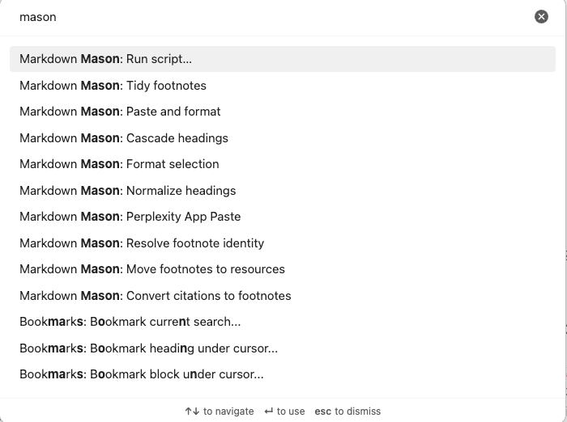
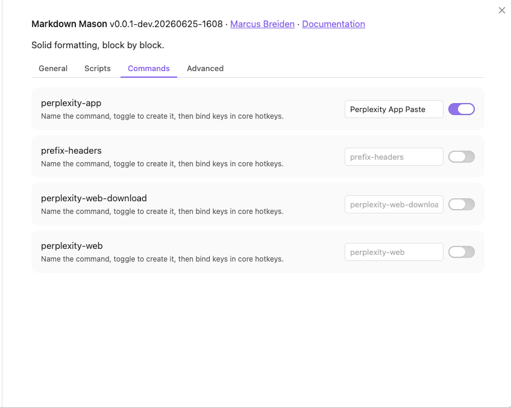

# Commands Reference

Markdown Mason contributes **ten built-in commands** to the Obsidian command palette, plus
one optional command per script you choose to expose. In the palette they all appear under
the plugin name — search **Markdown Mason** (or just "Mason") to find them. None ship with a
default hotkey; assign your own under Settings → Hotkeys.

## Built-in commands

All ten appear in the palette as `Markdown Mason: <name>` and require a focused editor.
Each shows a descriptive Notice when there is nothing to do (e.g. *No footnotes found to
tidy*, *Select text to cascade headings*). The internal command `id` is shown for the three
paste/format commands you most often choose between.

| Command | What it does | Scope |
|---|---|---|
| **Tidy footnotes** | Convert citations, renumber and de-duplicate, then file definitions under the Resources heading — fused into a single undo step. | Whole note |
| **Format selection** (`preset.formatSelection`) | Run the full **11-step** recipe on the selection (or whole note): the 7 cleanup steps (dewrap paragraphs, dehyphenate words, decompose ligatures and punctuation, tidy whitespace, normalize bullets, normalize ordered list, normalize headings) **plus** cascade headings and the 3 footnote steps (convert citations, resolve identity, move to resources) — one undo step. Individual steps can be toggled off in Settings → Format selection. | Selection + whole note |
| **Cascade headings** | Re-level the selected headings relative to the heading above the selection (the paste/selection operation). | Selection |
| **Normalize headings** | Close gaps in heading levels so they step by one (e.g. `H1 → H3` becomes `H1 → H2`). | Whole note |
| **Convert citations to footnotes** | Turn bare `[n]` citation markers into `[^n]` footnote references. | Whole note |
| **Resolve footnote identity** | Renumber numeric footnotes gap-free in first-reference order and de-duplicate by URL. | Whole note |
| **Move footnotes to resources** | Move numeric footnote definitions under the Resources heading — created at your configured level if absent, or an existing section reused at whatever level it has (see [Configuration](configuration.md)). | Whole note |
| **Paste and run scripts** (`mason.pasteAndRunScripts`) | Run your enabled paste-converter **scripts** on the clipboard and insert the result at the cursor; plain-paste fallback on error or if nothing matches. This is about converter scripts (e.g. Perplexity → Markdown), **not** the cleanup recipe. *(Previously named "Paste and format".)* | Clipboard → cursor |
| **Paste and format** (`mason.pasteAndFormatText`) | Paste the clipboard, then apply the **7-step** cleanup recipe scoped to just the pasted text: the 4 cleanup steps, 2 list steps, and normalize headings — one undo. It does **not** run any paste scripts, cascade headings, or the 3 footnote steps. Respects the same Settings → Format selection toggles for those 7 steps. | Clipboard → pasted text |
| **Run script…** | Open a picker of all Active scripts; run one on the current selection (format-in-place), or the whole note when nothing is selected. | Selection or whole note |

> **7 vs 11 steps:** *Paste and format* applies 7 cleanup steps to pasted text; *Format
> selection* applies all 11 (the same 7 plus cascade headings and the 3 footnote steps).
> *Paste and run scripts* is a different thing entirely — it runs converter scripts, not the
> cleanup recipe.

> `Normalize url` is an API-only operation (used by scripts) and is intentionally **not**
> registered as a command.

## Per-script commands

Beyond the built-ins, you can promote any script to its own command — `Markdown Mason:
<command name>` — which runs that one script directly, without the picker. It runs only while
the script is Active.

These are **opt-in**. In Settings → Markdown Mason → **Commands**, name the command (the
script's id is used if you leave it blank), then toggle it on. Toggling off removes the
command; renaming re-registers it so the palette and Hotkeys labels update immediately.

## Notes

- **No default hotkeys.** Assign keys for any command under Settings → Hotkeys (search
  "Mason") — Markdown Mason follows Obsidian's guidance against shipping default bindings.
- **State is re-checked at run time.** A per-script command whose script is no longer Active
  (disabled, blocked, materializing, or has a pending update) won't run; instead Mason shows
  a Notice explaining why — e.g. *`Mason: "<name>" is blocked (checksum-mismatch)`* or
  *`…has an update — update it in settings → scripts to run it`*.
- See [Usage](usage.md) for workflows and [Troubleshooting](troubleshooting.md) if a command
  is missing or a script won't run.
