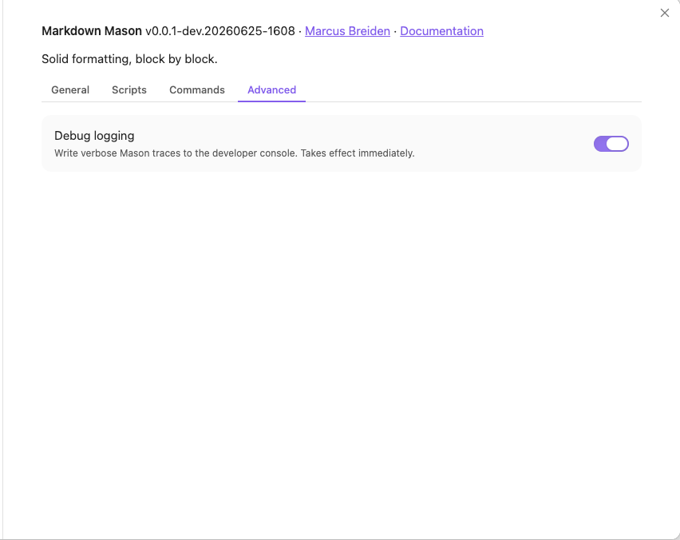

# Configuration

Markdown Mason is configured entirely from its settings tab inside Obsidian — there is no
separate config file to edit by hand. Changes you make to a control are saved immediately,
and most take effect right away.

## Where settings live

Open **Settings → Community plugins → Markdown Mason** (or click the options/gear icon next
to the plugin). The settings are organised into four segments:

- **General** — the everyday options: Resources section heading, Show update notes, and
  Numeric-only footnotes.
- **Scripts** — install, enable, disable, update, and remove curated or imported scripts
  (see [Usage](usage.md) for the script lifecycle).
- **Commands** — turn individual scripts into command-palette commands and launch a script
  on demand.
- **Advanced** — Debug logging.

Your choices are stored in the plugin's `data.json` file
(`<vault>/.obsidian/plugins/markdown-mason/data.json`), alongside the script library. You
should not normally need to edit this file directly — use the settings tab instead.

## Settings reference

Each row lists a setting's internal name (as stored in `data.json`), its type, default
value, and what it controls.

| Name | Type | Default | Description |
|------|------|---------|-------------|
| `debugLogging` | `boolean` | `false` | Enable verbose console.debug traces. Off by default. |
| `resourcesName` | `string` | `"## Resources"` | Heading where *Tidy / Move footnotes* collects footnote definitions. Carries an optional ATX level prefix (e.g. `## Resources`, `### Resources`) so you choose the heading level. An existing section with this name is reused at whatever level it already has. |
| `numericOnly` | `boolean` | `true` | When true (default), only numeric footnote references are processed; alpha markers such as [^A] are excluded. Optional to preserve backward compatibility with persisted data and existing test fixtures that do not include this field. Treated as `true` when absent. KNOWN LIMITATION (v0.1): this setting persists and threads into OperationContext.settings, but numericOnly=false is not yet honoured by the core footnote logic. The core already behaves as if numericOnly is always true (ExistingRef is defined as numeric-only; see types.ts). Wiring numericOnly=false to allow alpha markers is a planned follow-up. |
| `showUpdateSplash` | `boolean` | `true` | When true (default), a one-shot "what's new" splash is shown the first time the plugin runs after its version changes. Surfaces how many curated scripts have a newer catalog version waiting (scripts ride pinned plugin releases, so a plugin update is the only moment a script version can change). User-gated via General settings and the in-splash toggle. Optional for backward-compat with persisted data predating this field; treated as `true` when absent. |
| `lastSeenVersion` | `string` | `""` | The plugin version (manifest.version) last shown to the user. Compared against the current manifest.version on load to detect an update (mirrors Excalidraw's `previousRelease`). Empty string means "never recorded" → fresh install, which is recorded silently without a splash. Optional for backward-compat; treated as `""` when absent. |

`lastSeenVersion` has no control in the settings tab — Markdown Mason manages it
automatically to decide when to show the update-notes splash. It is listed here only for
completeness.

## Override mechanism

Every General and Advanced setting maps to a control in the settings tab:

| Setting | Location | Control |
|---|---|---|
| `resourcesName` | General → Resources section heading | text field |
| `showUpdateSplash` | General → Show update notes | toggle |
| `numericOnly` | General → Numeric-only footnotes | toggle |
| `debugLogging` | Advanced → Debug logging | toggle |

Changing a control writes to `data.json` immediately — there is no separate Save button.
`debugLogging` applies live (traces start or stop without reloading Obsidian). Any setting
absent from `data.json` falls back to its default, so a fresh install — or a deleted key —
simply restores that default.

## Defaults and safe values

The defaults are chosen to work out of the box; a fresh install needs no configuration.

- **`resourcesName`** (`"## Resources"`) — the heading that *Tidy / Move footnotes* files
  definitions under. Add `#`s to choose the level (e.g. `### Resources` for a level-3
  section); an existing section with this name is reused at its current level.
- **`numericOnly`** (`true`) — leave enabled. Disabling it is a planned feature: the setting
  persists, but alpha footnote markers such as `[^A]` are not yet honoured by the core, so
  turning it off currently has no effect.
- **`showUpdateSplash`** (`true`) — leave enabled to get a summary of waiting script updates
  after a plugin upgrade; turn it off if you prefer no post-update splash.
- **`debugLogging`** (`false`) — leave off for normal use. Enable it only when diagnosing a
  problem or filing a bug report; it writes verbose traces to the developer console.
