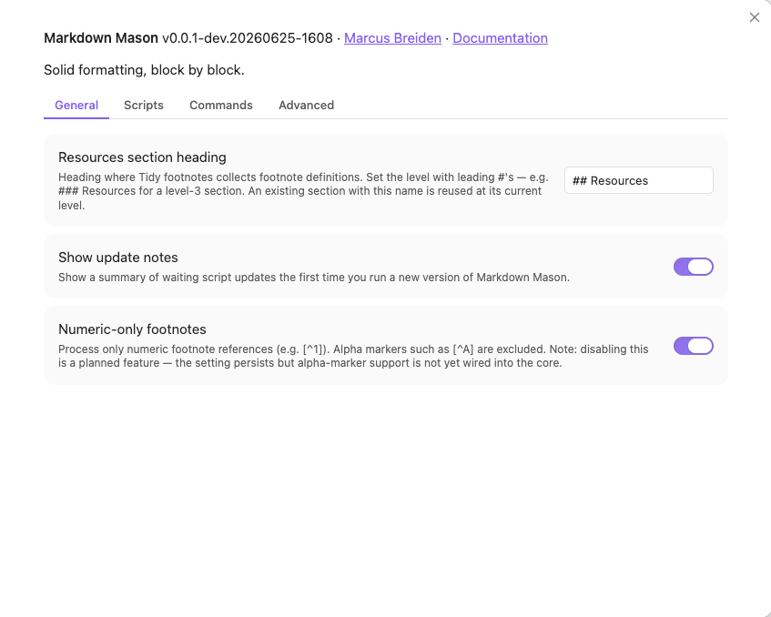
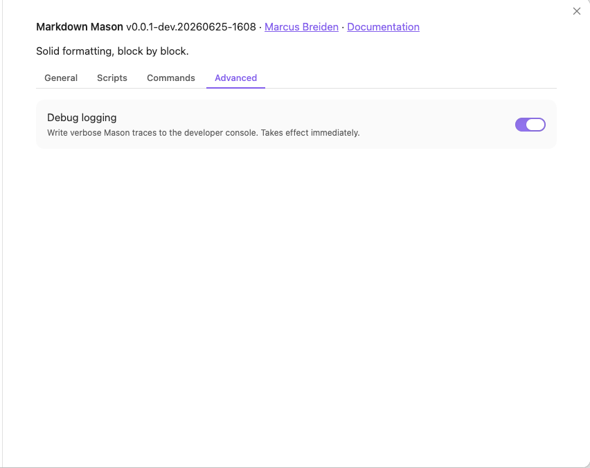
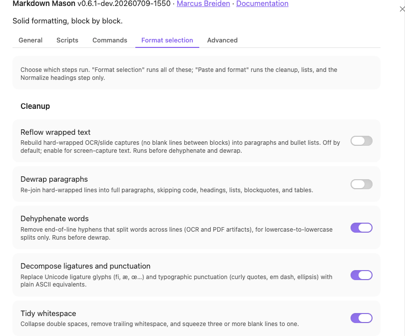
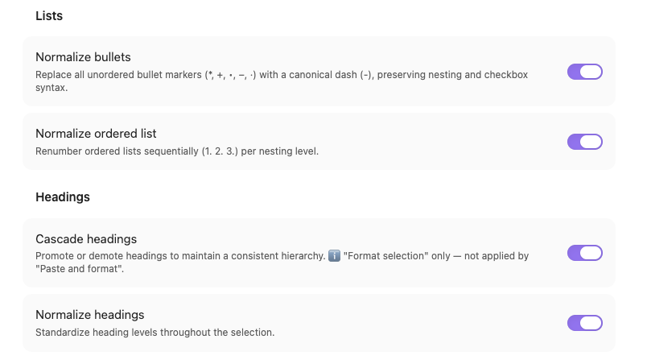
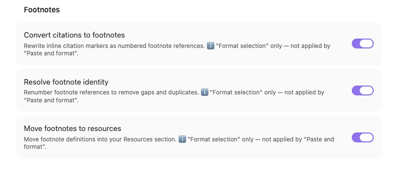

# Configuration

Markdown Mason is configured entirely from its settings tab inside Obsidian — there is no
separate config file to edit by hand. Changes you make to a control are saved immediately,
and most take effect right away.

## Where settings live

Open **Settings → Community plugins → Markdown Mason** (or click the options/gear icon next
to the plugin). The settings are organised into five segments:

- **General** — the everyday options: Resources section heading, Show update notes,
  Numeric-only footnotes, and Fit paste to list context.
- **Scripts** — install, enable, disable, update, and remove curated or imported scripts
  (see [Usage](usage.md) for the script lifecycle).
- **Commands** — turn individual scripts into command-palette commands and launch a script
  on demand.
- **Format selection** — the 12 step toggles for the *Format selection* command (one, *Reflow
  wrapped text*, is opt-in/off by default). The cleanup/list/heading-normalize steps among
  them also govern **Paste and format** (see below); the other four steps are *Format
  selection* only.
- **Advanced** — Debug logging.

Your choices are stored in the plugin's `data.json` file
(`<vault>/.obsidian/plugins/markdown-mason/data.json`), alongside the script library. You
should not normally need to edit this file directly — use the settings tab instead.

## Format selection steps

The **Format selection** segment has twelve toggles — eleven on by default, plus *Reflow
wrapped text* which is **off by default** (opt-in) — arranged under four sub-groups:
**Cleanup** (reflow wrapped text, dewrap paragraphs, dehyphenate words, decompose ligatures
and punctuation, tidy whitespace), **Lists** (normalize bullets, normalize ordered list),
**Headings** (cascade headings, normalize headings), and **Footnotes** (convert citations to
footnotes, resolve footnote identity, move footnotes to resources).

> **Reflow wrapped text** rebuilds screen-capture OCR text (e.g. TextSniper slide captures)
> that has hard line breaks and no blank lines between blocks, turning it back into
> paragraphs and `- ` bullet lists. It is off by default because it reshapes structure more
> aggressively than the other steps — enable it when you paste OCR/slide text, or run the
> standalone **Markdown Mason: Reflow wrapped text** command on a selection. It runs before
> the other cleanup steps.

These toggles configure the *Format selection* command — and **also govern the *Paste and
format* command**, which applies the cleanup subset to the pasted text:

- **Shared by both commands:** *Reflow wrapped text* (opt-in), the other 4 Cleanup steps, the
  2 Lists steps, and *Normalize headings*. Toggling one of these off in *Format selection*
  also stops it from running during *Paste and format*.
- **Format selection only (4 steps):** *Cascade headings* and the 3 footnote steps (*Convert
  citations to footnotes*, *Resolve footnote identity*, *Move footnotes to resources*). These
  never run during *Paste and format*. Each is marked in the settings UI with
  *ℹ️ "Format selection" only — not applied by "Paste and format".*

So if you ran *Paste and format* and a particular cleanup step didn't happen, check whether
that step is toggled off here. (Steps unique to *Format selection* are expected not to run on
a paste — that is by design.)

## Pasting into a list

When your cursor sits inside a list item — an open `- ` you were about to fill in, or the
end of an item you have already typed — both paste commands fit what you paste to that
list instead of dropping it in as-is:

- every pasted paragraph becomes its own item at your current level;
- the blank lines that separated those paragraphs are dropped, so the list stays intact;
- a list that came along with the pasted text is nested one level **under** the paragraph
  that introduces it;
- an ordered list keeps counting (`3.` → `4.` → `5.`), and a task list stays a task list
  with fresh unchecked boxes.

Pasting anywhere else is unaffected — outside a list item the step does nothing at all.
Turn it off with **General → Fit paste to list context** (`pasteListContext`).

Two deliberate boundaries: the surrounding list is never renumbered or re-indented (only
the text you paste is shaped), and a paste that fails inside a converter script always
degrades to a plain, verbatim paste.

## Settings reference

Each row lists a setting's internal name (as stored in `data.json`), its type, default
value, and what it controls.

| Name | Type | Default | Description |
|------|------|---------|-------------|
| `debugLogging` | `boolean` | `false` | Enable verbose console.debug traces. Off by default. |
| `resourcesName` | `string` | `"## Resources"` | Heading where *Tidy / Move footnotes* collects footnote definitions. Carries an optional ATX level prefix (e.g. `## Resources`, `### Resources`) so you choose the heading level. An existing section with this name is reused at whatever level it already has. |
| `numericOnly` | `boolean` | `true` | When true (default), only numeric footnote references are processed; alpha markers such as [^A] are excluded. Optional to preserve backward compatibility with persisted data and existing test fixtures that do not include this field. Treated as `true` when absent. KNOWN LIMITATION (v0.1): this setting persists and threads into OperationContext.settings, but numericOnly=false is not yet honoured by the core footnote logic. The core already behaves as if numericOnly is always true (ExistingRef is defined as numeric-only; see types.ts). Wiring numericOnly=false to allow alpha markers is a planned follow-up. |
| `showUpdateSplash` | `boolean` | `true` | When true (default), a one-shot "what's new" splash is shown the first time the plugin runs after its version changes. It lists the features that release brought (taken from the release's changelog entry at build time — features only, so a bug-fix-only release shows none) and how many curated scripts have a newer catalog version waiting (scripts ride pinned plugin releases, so a plugin update is the only moment a script version can change). User-gated via General settings and the in-splash toggle. Optional for backward-compat with persisted data predating this field; treated as `true` when absent. |
| `pasteListContext` | `boolean` | `true` | When true (default), pasted content is fitted to the list item the cursor is in: each paragraph becomes its own item, the blank lines that separated them are dropped, and a pasted sub-list nests under the item that introduces it. Applies to *Paste and format* and to *Paste and run scripts* when no script recognises the clipboard. Provably a no-op when the cursor is not inside a list, hence on by default. Optional for backward-compat with persisted data predating this field; treated as `true` when absent. |
| `lastSeenVersion` | `string` | `""` | The plugin version (manifest.version) last shown to the user. Compared against the current manifest.version on load to detect an update (mirrors Excalidraw's `previousRelease`). Empty string means "never recorded" → fresh install, which is recorded silently without a splash. Optional for backward-compat; treated as `""` when absent. |

`lastSeenVersion` has no control in the settings tab — Markdown Mason manages it
automatically to decide when to show the update-notes splash. It is listed here only for
completeness.

## Override mechanism

Every General and Advanced setting maps to a control in the settings tab:

| Setting | Location | Control |
|---|---|---|
| `resourcesName` | General → Resources section heading | text field |
| `showUpdateSplash` | General → Show update notes | toggle |
| `numericOnly` | General → Numeric-only footnotes | toggle |
| `pasteListContext` | General → Fit paste to list context | toggle |
| `debugLogging` | Advanced → Debug logging | toggle |

Changing a control writes to `data.json` immediately — there is no separate Save button.
`debugLogging` applies live (traces start or stop without reloading Obsidian). Any setting
absent from `data.json` falls back to its default, so a fresh install — or a deleted key —
simply restores that default.

## Defaults and safe values

The defaults are chosen to work out of the box; a fresh install needs no configuration.

- **`resourcesName`** (`"## Resources"`) — the heading that *Tidy / Move footnotes* files
  definitions under. Add `#`s to choose the level (e.g. `### Resources` for a level-3
  section); an existing section with this name is reused at its current level.
- **`numericOnly`** (`true`) — leave enabled. Disabling it is a planned feature: the setting
  persists, but alpha footnote markers such as `[^A]` are not yet honoured by the core, so
  turning it off currently has no effect.
- **`showUpdateSplash`** (`true`) — leave enabled to see what a new version brought and a
  summary of waiting script updates after a plugin upgrade; turn it off if you prefer no
  post-update splash.
- **`pasteListContext`** (`true`) — leave enabled. It only ever acts when the cursor is
  inside a list item; turn it off if you want a paste to land exactly as copied even
  mid-list.
- **`debugLogging`** (`false`) — leave off for normal use. Enable it only when diagnosing a
  problem or filing a bug report; it writes verbose traces to the developer console.
