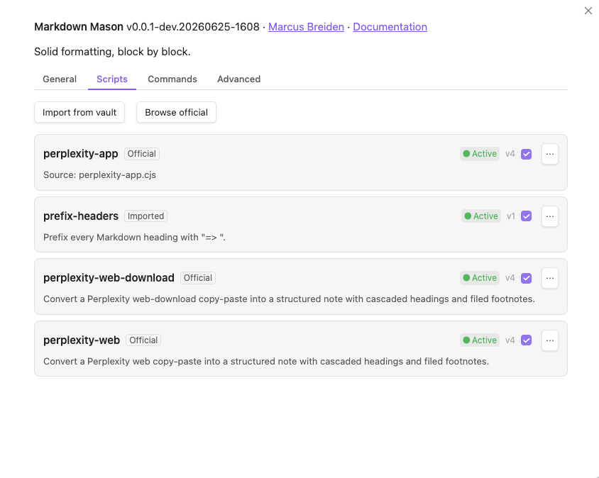

# Usage

Markdown Mason reshapes pasted or selected text to fit the structure of your note —
cascading heading levels and filing citations as deduplicated footnotes. The work is done
by small **scripts** you enable from the plugin's settings; nothing runs until you turn a
script on.

## First use

Out of the box, no scripts are active. Enable one, then run it:

1. Open **Settings → Community plugins → Markdown Mason → Scripts**.
2. Click **Browse official** to see the curated library (currently three Perplexity
   formatters).
3. **Enable** the one you want. The first time, a disclosure modal explains that scripts
   run with full plugin permissions — confirm to consent. The script becomes **Active**.
4. Run it from the command palette: **Markdown Mason: Paste and run scripts** transforms
   whatever is on your clipboard with your enabled converter scripts, or **Markdown Mason:
   Run script…** lets you pick an Active script to run. (To paste plain text and just clean
   it up — no script needed — use **Markdown Mason: Paste and format**; see below.)

## Common workflows

- **Paste and run scripts from the clipboard.** Copy text (e.g. a Perplexity answer), place
  your cursor where it should land, and run **Markdown Mason: Paste and run scripts**. Enabled
  paste-converter scripts transform the clipboard text and insert it at the cursor. If no
  script matches or one errors, Mason falls back to a plain paste so you never lose the
  content; an empty clipboard just shows a notice. *(This command was previously named "Paste
  and format".)*
- **Paste and format (clean up pasted text).** Run **Markdown Mason: Paste and format** to
  paste the clipboard and immediately tidy *just the pasted text* — no script required. It
  applies a 7-step cleanup recipe as a single undo: dewrap paragraphs, dehyphenate words,
  decompose ligatures and punctuation, tidy whitespace, normalize bullets, normalize the
  ordered list, and normalize headings. It does **not** run converter scripts, cascade
  headings, or the footnote steps. Use it when you just want clean Markdown from a plain
  copy-paste.
- **Format selection (full recipe).** Already have text in the note? Select it (or nothing,
  for the whole note) and run **Markdown Mason: Format selection** for the full 11-step
  recipe — the same 7 cleanup steps **plus** cascade headings and the 3 footnote steps.
- **Run a script on a selection (format-in-place).** Select text already in your note, run
  **Markdown Mason: Run script…**, and pick a script — the selected text is transformed *in place*.
  With nothing selected, the script runs on the whole note instead.
- **Turn a script into its own command.** In **Settings → Commands**, toggle *Create
  command* for a script. It then appears in the palette as its own entry, so you can run or
  hotkey it directly without the Run script… picker.

**Which paste/format command?** Pasting from the clipboard and want a converter script (e.g.
Perplexity → Markdown) to run? → **Paste and run scripts**. Pasting plain text you just want
cleaned up? → **Paste and format** (7 steps). Cleaning up text *already in the note*, including
heading cascade and footnotes? → **Format selection** (11 steps).

## Tips and shortcuts

- **Assign your own hotkeys.** Mason ships no default hotkeys. Add them in **Settings →
  Hotkeys** (search "Mason") for *Paste and run scripts*, *Paste and format*, *Format
  selection*, *Run script…*, or any per-script command.
- **Safe by default.** On any script error or timeout, Mason leaves your text raw — a normal
  paste, or your selection untouched. It never writes a partial edit.
- **Manage the library from the Scripts tab.** Enable, disable (a kill-switch), update when a
  newer catalog version is waiting (the **Scripts** badge shows how many), import your own
  from the vault, or remove. See [Configuration](configuration.md) for settings and
  [Writing a Markdown Mason script](SCRIPT_AUTHORING.md) to build your own.
- **Debug logging** (Advanced segment) is for diagnosing problems only — leave it off
  otherwise.

## Examples

The curated library ships three Perplexity formatters, one per copy surface. Each converts
a Perplexity copy-paste into a structured note with cascaded headings and filed footnotes:

| Script | Enable it for |
|--------|---------------|
| **Perplexity app** | Text copied from the Perplexity app |
| **Perplexity web** | Text copied from Perplexity in the browser |
| **Perplexity web download** | Perplexity web "download" exports |

Enable the one matching how you copied, then run **Markdown Mason: Paste and run scripts**.
More formats may be added to the catalog over time.
